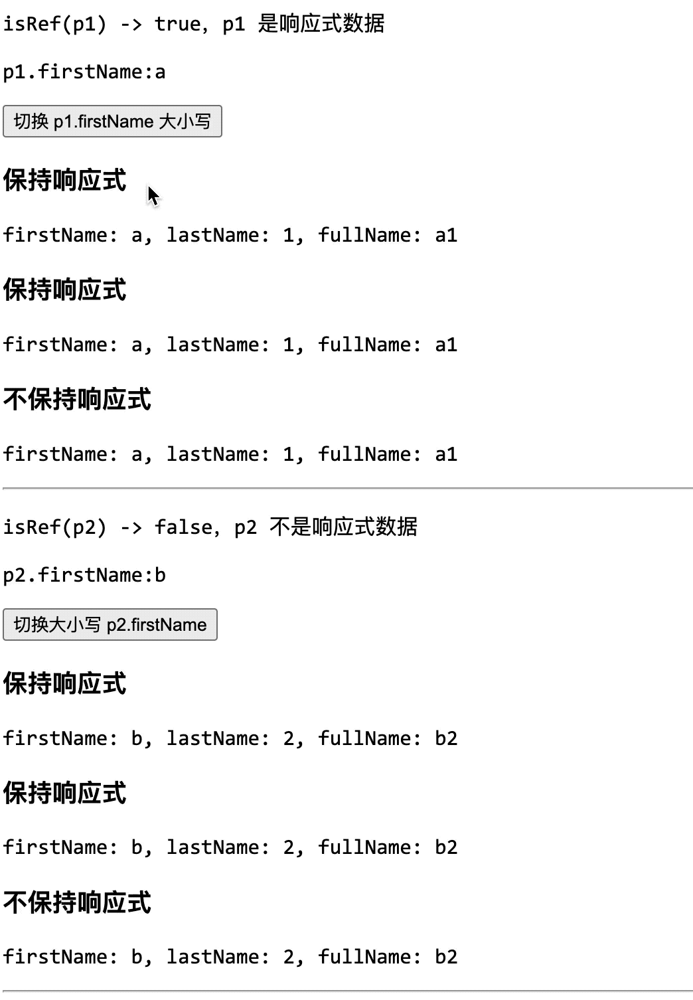

# [0001. 组件属性（Props）](https://github.com/tnotesjs/TNotes.vue/tree/main/notes/0001.%20%E7%BB%84%E4%BB%B6%E5%B1%9E%E6%80%A7%EF%BC%88Props%EF%BC%89)

<!-- region:toc -->

::: details 📚 相关资源

- [📂 TNotes.yuque（笔记附件资源）](https://www.yuque.com/tdahuyou/tnotes.yuque/)
  - [TNotes.yuque.vue.0001](https://www.yuque.com/tdahuyou/tnotes.yuque/vue.0001)

:::

- [1. 本节内容](#1-本节内容)
- [2. 评价](#2-评价)
- [3. Props 是什么？父组件如何把数据传给子组件？](#3-props-是什么父组件如何把数据传给子组件)
- [4. Props 应该如何声明？](#4-props-应该如何声明)
  - [4.1. `defineProps()`](#41-defineprops)
  - [4.2. 结合 TypeScript](#42-结合-typescript)
- [5. 什么是“运行时声明”（runtime props declarations）、“基于类型的声明”（type-based props declarations）？](#5-什么是运行时声明runtime-props-declarations基于类型的声明type-based-props-declarations)
  - [5.1. “运行时声明”（runtime props declarations）](#51-运行时声明runtime-props-declarations)
  - [5.2. “基于类型的声明”（type-based props declarations）](#52-基于类型的声明type-based-props-declarations)
- [6. `defineProps()` 宏中的参数为什么不能使用 `<script setup>` 中定义的其他变量？](#6-defineprops-宏中的参数为什么不能使用-script-setup-中定义的其他变量)
  - [6.1. `<script setup>` 编译后的大致结构](#61-script-setup-编译后的大致结构)
  - [6.2. 编译器的检查逻辑](#62-编译器的检查逻辑)
  - [6.3. 一些例外](#63-一些例外)
    - [`LITERAL_CONST` 是例外](#literal_const-是例外)
    - [`import` 的变量也是例外](#import-的变量也是例外)
- [7. 父组件如何传递不同类型的 props？静态 props、动态 props 分别是什么？v-bind 的特殊用法是？](#7-父组件如何传递不同类型的-props静态-props动态-props-分别是什么v-bind-的特殊用法是)
  - [7.1. 静态 props、动态 props](#71-静态-props动态-props)
  - [7.2. 传递不同的值类型](#72-传递不同的值类型)
  - [7.3. v-bind 绑定整个对象](#73-v-bind-绑定整个对象)
- [8. Prop 命名规范是？](#8-prop-命名规范是)
  - [8.1. 声明时 - camelCase](#81-声明时---camelcase)
  - [8.2. 在模板中使用时 - camelCase](#82-在模板中使用时---camelcase)
- [9. 为什么说 props 是单向数据流？子组件应该如何正确使用 props？](#9-为什么说-props-是单向数据流子组件应该如何正确使用-props)
  - [9.1. 单向数据流](#91-单向数据流)
  - [9.2. 错误做法](#92-错误做法)
  - [9.3. 子组件可以基于 prop 定义自身的局部状态或计算属性](#93-子组件可以基于-prop-定义自身的局部状态或计算属性)
  - [9.4. 引用类型问题](#94-引用类型问题)
  - [9.5. 小结](#95-小结)
- [10. Props 如何设置默认值和校验？](#10-props-如何设置默认值和校验)
  - [10.1. 设置默认值和校验](#101-设置默认值和校验)
  - [10.2. 为什么 Vue 中的 Props 校验器不是“强约束”？](#102-为什么-vue-中的-props-校验器不是强约束)
- [11. Boolean prop 有什么需要注意的特殊转换规则？](#11-boolean-prop-有什么需要注意的特殊转换规则)
- [12. 响应式 Props 解构有哪些注意事项？](#12-响应式-props-解构有哪些注意事项)
  - [12.1. Vue 3.5 之前：解构会丢失响应式](#121-vue-35-之前解构会丢失响应式)
    - [当时的解决方案：toRefs](#当时的解决方案torefs)
  - [12.2. Vue 3.5+：解构自动保持响应式](#122-vue-35解构自动保持响应式)
    - [编译器做了什么？](#编译器做了什么)
    - [核心源码](#核心源码)
  - [12.3. watch 和 watchEffect（3.5+）](#123-watch-和-watcheffect35)
    - [核心源码：`watch()` 是如何识别响应式数据源的？](#核心源码watch-是如何识别响应式数据源的)
  - [12.4. 不同场景对比](#124-不同场景对比)
- [13. demos.1 - 属性声明 - type-based - 使用泛型声明 props](#13-demos1---属性声明---type-based---使用泛型声明-props)
- [14. demos.2 - 属性声明 - type-based - 使用泛型声明可选的 props](#14-demos2---属性声明---type-based---使用泛型声明可选的-props)
- [15. demos.3 - 属性声明 - type-based - 使用类型别名声明 props](#15-demos3---属性声明---type-based---使用类型别名声明-props)
- [16. demos.4 - 属性声明 - type-based - 使用接口声明 props](#16-demos4---属性声明---type-based---使用接口声明-props)
- [17. demos.5 - 属性声明 - runtime - 使用对象式声明 props](#17-demos5---属性声明---runtime---使用对象式声明-props)
- [18. demos.6 - 属性声明 - runtime - 使用对象简写声明 props](#18-demos6---属性声明---runtime---使用对象简写声明-props)
- [19. demos.7 - 属性声明 - runtime - 使用数组简写声明 props](#19-demos7---属性声明---runtime---使用数组简写声明-props)
- [20. demos.16 - 属性声明 - runtime - 为单个 prop 指定多种可能的类型](#20-demos16---属性声明---runtime---为单个-prop-指定多种可能的类型)
- [21. demos.11 - 属性声明 - runtime - 属性默认值](#21-demos11---属性声明---runtime---属性默认值)
- [22. demos.12 - 属性声明 - type-based - 属性默认值](#22-demos12---属性声明---type-based---属性默认值)
- [23. demos.8 - 属性访问 - 在 `<script setup>` 中访问使用 defineProps 定义的 props](#23-demos8---属性访问---在-script-setup-中访问使用-defineprops-定义的-props)
- [24. demos.17 - 属性访问 - 在非 `<script setup>` 中访问 props](#24-demos17---属性访问---在非-script-setup-中访问-props)
- [25. demos.14 - 属性校验 - type-based - Prop 校验 - 自定义校验函数](#25-demos14---属性校验---type-based---prop-校验---自定义校验函数)
- [26. demos.15 - 属性校验 - runtime - Prop 校验 - 走 validator 配置](#26-demos15---属性校验---runtime---prop-校验---走-validator-配置)
- [27. demos.9 - runtime - 需要使用 `PropType<T>` 工具类型实现属性类型细化](#27-demos9---runtime---需要使用-proptypet-工具类型实现属性类型细化)
- [28. demos.10 - type-based - 无需使用 `PropType<T>` 工具类型 - 天然支持标注复杂类型的功能](#28-demos10---type-based---无需使用-proptypet-工具类型---天然支持标注复杂类型的功能)
- [29. demos.13 - toRefs 保持属性的响应式状态 - toRefs 保持响应式](#29-demos13---torefs-保持属性的响应式状态---torefs-保持响应式)
- [30. 引用](#30-引用)

<!-- endregion:toc -->

## 1. 本节内容

- Props 声明
  - 运行时声明（runtime declarations）
  - 基于类型的声明（type-based declarations）
- Prop 命名规范
- v-bind 传递整个对象
- 动态传值
- 单向数据流
- Prop 校验
- 布尔转换
- 响应式解构
- demos
  - demos => 属性声明
    - 使用泛型声明 props
    - 可选属性
    - 属性默认值（runtime declarations）配置 default
    - 属性默认值（type-based declarations）编译宏 withDefaults
    - 使用类型别名声明 props
    - 使用接口声明 props
    - 使用对象式声明 props
    - 使用对象简写声明 props
    - 使用数组简写声明 props
    - 声明多个 props
    - 为单个 prop 指定多种可能的类型
    - 使用 v-bind 一次性传递多个 prop
  - demos => 属性访问
    - 在 script setup 中访问使用 defineProps 定义的 props
    - 在非 script setup 中访问 props
    - 在模板 template 中访问使用 defineProps 定义的 props
  - demos => 属性校验
    - prop 校验
    - validator 配置
    - watch
  - demos => PropType 细化类型
    - 使用 PropType 在运行时声明（runtime declarations）中细化类型
  - demos => toRefs 保持属性的响应式状态
    - 直接解构 props，会导致响应式丢失
    - 在解构 props 时，可以使用 toRefs 保持属性的响应式状态

## 2. 评价

props 的相关笔记写得有些多，props 也是日常开发中使用频率最高的知识点。还有一些 props 的细节没有记录到笔记中，遇到具体问题的时候可以结合着官方文档一起瞅瞅。

demos 的讲解，可以参考 TNotes.yuque 中记录的早期（24.07）录制的一些视频。

## 3. Props 是什么？父组件如何把数据传给子组件？

简单来说，props 可以理解成「组件对外公开的输入参数」。父组件通过 props 把数据传给子组件，子组件再根据这些输入去决定自己渲染什么。

基本规则：

- 子组件负责声明自己接收哪些数据
- 父组件负责提供数据
- 未被声明的 attribute 不会自动变成 prop，而是会按透传 attribute 规则处理

示例：

::: code-group

```html [App.vue]
<template>
  <UserCard name="Abc" :age="18" :is-vip="true" :tags="['Vue', 'TypeScript']" />
  <!-- 
   父组件在调用子组件 UserCard 的时候传递 props：
   name => 字符串 "Abc"
   age => 数字 18
   isVip => 布尔值 true
   tags => 字符串数组 ['Vue', 'TypeScript']
    -->
</template>

<script setup>
  import UserCard from './UserCard.vue'
</script>
```

```html [UserCard.vue]
<template>
  <article class="card">
    <!-- 子组件可以在模板中访问父组件传递过来的 props -->
    <h3>{{ props.name }}</h3>
    <p>年龄：{{ props.age }}</p>
    <p>会员：{{ props.isVip ? '是' : '否' }}</p>
    <p>标签：{{ props.tags.join('、') }}</p>
  </article>
</template>

<script setup>
  // 子组件通过 defineProps 声明自己需要哪些 props：
  const props = defineProps({
    name: String,
    age: Number,
    isVip: Boolean,
    tags: Array,
  })
</script>
```

:::


## 4. Props 应该如何声明？

- 在 Vue 3 的 `<script setup>` 中，最常见的声明方式是使用编译宏 `defineProps()` 来声明属性
- 在早期的 Vue 2 版本的写法，也就是选项式 API 中，则是通过组件的 `props` 选项来声明属性

### 4.1. `defineProps()`

最简单的 `defineProps()` 写法是字符串数组：

```html
<script setup>
  // 声明了两个 prop：title 和 author，类型默认为 any
  // 这是最简单的声明方式，但缺点是没有类型约束、默认值和校验规则。
  // 适合快速演示，但不推荐在真实项目里使用。
  const props = defineProps(['title', 'author'])
</script>
```

在真实项目里更推荐对象写法，因为它可以顺手把类型、是否必填、默认值和校验规则都写清楚：

```html
<script setup>
  const props = defineProps({
    title: {
      type: String,
      required: true,
    },
    author: {
      type: String,
      default: '匿名',
    },
    pageSize: {
      type: Number,
      default: 10,
    },
    status: {
      type: String,
      validator(value) {
        return ['draft', 'published', 'archived'].includes(value)
      },
    },
  })
</script>
```

### 4.2. 结合 TypeScript

如果你在用 TypeScript，也可以直接用类型声明：

```html
<script setup lang="ts">
  interface Props {
    title: string
    author?: string
    pageSize?: number
  }

  const props = defineProps<Props>()
</script>
```

如果是可选属性，还想给默认值，通常会配合 `withDefaults()`：

```html
<script setup lang="ts">
  interface Props {
    title: string
    author?: string
    tags?: string[]
  }

  const props = withDefaults(defineProps<Props>(), {
    author: '匿名',
    tags: () => [],
  })
</script>
```

## 5. 什么是“运行时声明”（runtime props declarations）、“基于类型的声明”（type-based props declarations）？

### 5.1. “运行时声明”（runtime props declarations）

```html
<script setup lang="ts">
  const props = defineProps({
    foo: { type: String, required: true },
    bar: Number,
  })

  props.foo // string
  props.bar // number | undefined
</script>
<!--
上述写法被称之为“运行时声明”（runtime props declarations）
因为传递给 defineProps() 的参数会作为运行时的 props 选项使用。
-->
```

### 5.2. “基于类型的声明”（type-based props declarations）

```html
<script setup lang="ts">
  const props = defineProps<{
    foo: string
    bar?: number
  }>()
</script>
<!--
上述写法被称之为“基于类型的声明”（type-based props declarations）
编译器会尽可能地尝试根据类型参数推导出等价的运行时选项。

在这种场景下
该例子中编译出的运行时选项和上一个是完全一致的
即，两种写法是等效的

这两种声明方式，在本节的 demos 中都会介绍。
如果想要更好地结合 TS 的类型系统，让方便类型被更好地复用，
type-based props declarations 是更好的选择。
-->
```

由此可见，type-based 是定义属性的另一种写法，它和 runtime 式写法都是一样的，都是用来声明 props，并没有扩展任何额外的功能，因为 type-based 式写法，最终是会被编译器推断为 runtime 式写法。

## 6. `defineProps()` 宏中的参数为什么不能使用 `<script setup>` 中定义的其他变量？

`defineProps()` 宏中的参数不可以访问 `<script setup>` 中定义的其他变量，根本原因在于 `defineProps()` 的参数会被「提升（hoist）到 `setup()` 函数外部」，成为组件选项对象的一部分，而 `<script setup>` 中定义的局部变量只存在于 `setup()` 函数内部，在模块作用域中根本不存在。

示例：

```html
<script setup>
  let bar = 1 // 只存在于 setup() 内部
  defineProps({
    foo: { default: () => bar }, // ← 这段会被提升到 setup() 外部
  }) //   bar 在那里不存在，报错
</script>
```

这不是 Vue 的任意限制，而是编译输出的结构决定的：`defineProps` 的参数最终成为组件选项对象的一部分，生命周期早于 `setup()` 的执行，自然无法访问 `setup()` 内部的局部变量。

### 6.1. `<script setup>` 编译后的大致结构

```js
// 模块作用域（setup() 外部）
export default defineComponent({
  props: {
    /* ⬅️ defineProps() 的参数被提升到这里 */
  },
  setup(__props) {
    // setup() 内部
    let bar = 1 // ⬅️ <script setup> 中定义的变量在这里
    // ...
  },
})
```

`defineProps({ foo: { default: () => bar } })` 中的参数会被提取出来放到组件选项的 `props:` 字段，而 `bar` 只在 `setup()` 内部存在，在模块作用域中根本访问不到。

### 6.2. 编译器的检查逻辑

编译器在处理完所有声明之后，会调用 `checkInvalidScopeReference` 来检查 `defineProps` 的参数是否引用了 `setup` 作用域内的变量：

```ts
// github.com/vuejs/core/packages/compiler-sfc/src/compileScript.ts

function checkInvalidScopeReference(node: Node | undefined, method: string) {
  if (!node) return
  walkIdentifiers(node, (id) => {
    const binding = setupBindings[id.name]
    if (binding && binding !== BindingTypes.LITERAL_CONST) {
      ctx.error(
        `\`${method}()\` in <script setup> cannot reference locally ` +
          `declared variables because it will be hoisted outside of the ` +
          `setup() function. If your component options require initialization ` +
          `in the module scope, use a separate normal <script> to export ` +
          `the options instead.`,
        id,
      )
    }
  })
}

// 4. check macro args to make sure it doesn't reference setup scope
// variables
checkInvalidScopeReference(ctx.propsRuntimeDecl, DEFINE_PROPS)
checkInvalidScopeReference(ctx.propsRuntimeDefaults, DEFINE_PROPS)
checkInvalidScopeReference(ctx.propsDestructureDecl, DEFINE_PROPS)
checkInvalidScopeReference(ctx.emitsRuntimeDecl, DEFINE_EMITS)
```

`checkInvalidScopeReference` 遍历参数的 AST，对每个标识符检查它是否在 `setupBindings` 中有记录，且类型不是 `LITERAL_CONST`。如果是，就报错：“`defineProps()` in `<script setup>` cannot reference locally declared variables because it will be hoisted outside of the `setup()` function.”。

### 6.3. 一些例外

#### `LITERAL_CONST` 是例外

注意检查条件是 `binding !== BindingTypes.LITERAL_CONST`。`const bar = 1` 这样的字面量常量（`LITERAL_CONST`）是被允许的，因为编译器会将它们也提升（hoist）到模块作用域，所以在 `props:` 字段中引用它们是安全的。

#### `import` 的变量也是例外

从外部 `import` 的绑定（如 `import { propsModel } from './props'`）本身就在模块作用域，不在 `setupBindings` 中，所以不会被 `checkInvalidScopeReference` 拦截，可以正常使用。

```ts
// github.com/vuejs/core/packages/compiler-sfc/__tests__/compileScript/defineProps.spec.ts

test('w/ external definition', () => {
  const { content } = compile(`
    <script setup>
    import { propsModel } from './props'
    const props = defineProps(propsModel)
    </script>
      `)
  assertCode(content)
  expect(content).toMatch(`export default {
  props: propsModel,`)
})
```

## 7. 父组件如何传递不同类型的 props？静态 props、动态 props 分别是什么？v-bind 的特殊用法是？

### 7.1. 静态 props、动态 props

Props 在模板里既可以传静态值，也可以传动态值。

- 静态 props 就是纯字符串，可以直接写
- 动态 props 就是 JS 表达式，需要使用 `v-bind`，也就是 `:`，通过它我们可以传递不同数据类型的 props

```html
<template>
  <BlogPost
    title="静态标题"
    :likes="42"
    :is-published="true"
    :comment-ids="[1, 2, 3]"
    :author="{ name: 'Ada' }"
  />
</template>

<!-- 
静态 props => title
动态 props => likes、is-published、comment-ids、author
-->
```

这里看起来 `42`、`true`、数组、对象都是常量，但它们本质上仍然是 JS 表达式，不是普通字符串，所以也要加 `:`。

### 7.2. 传递不同的值类型

```html
<!-- Number -->
<!-- 虽然 42 是个常量，我们还是需要使用 v-bind -->
<!-- 因为这是一个 JavaScript 表达式而不是一个字符串 -->
<BlogPost :likes="42" />

<!-- 根据一个变量的值动态传入 -->
<BlogPost :likes="post.likes" />

<!-- Boolean -->
<!-- 仅写上 prop 但不传值，会隐式转换为 true -->
<BlogPost is-published />

<!-- 虽然 false 是静态的值，我们还是需要使用 v-bind -->
<!-- 因为这是一个 JavaScript 表达式而不是一个字符串 -->
<BlogPost :is-published="false" />

<!-- 根据一个变量的值动态传入 -->
<BlogPost :is-published="post.isPublished" />

<!-- Array -->
<!-- 虽然这个数组是个常量，我们还是需要使用 v-bind -->
<!-- 因为这是一个 JavaScript 表达式而不是一个字符串 -->
<BlogPost :comment-ids="[234, 266, 273]" />

<!-- 根据一个变量的值动态传入 -->
<BlogPost :comment-ids="post.commentIds" />

<!-- Object -->
<!-- 虽然这个对象字面量是个常量，我们还是需要使用 v-bind -->
<!-- 因为这是一个 JavaScript 表达式而不是一个字符串 -->
<BlogPost
  :author="{
    name: 'Veronica',
    company: 'Veridian Dynamics'
  }"
/>

<!-- 根据一个变量的值动态传入 -->
<BlogPost :author="post.author" />
```

### 7.3. v-bind 绑定整个对象

如果你已经有一个对象，并且它的字段名正好和子组件 props 对应，还可以直接使用 `v-bind` 绑定整个对象：

```html
<script setup>
  // 示例
  const post = {
    id: 1,
    title: 'My Journey with Vue',
  }

  // 如果你想要将一个对象的所有属性都当作 props 传入，
  // 你可以使用没有参数的 v-bind，
  // 即只使用 v-bind 而非 :prop-name。
</script>
<template>
  <!-- 写法 1（更简洁） -->
  <BlogPost v-bind="post" />
  <!-- 写法 2 -->
  <BlogPost :id="post.id" :title="post.title" />

  <!-- 写法 1 和 写法 2 是等效的-->
</template>
```

## 8. Prop 命名规范是？

- 子组件定义 props 的时候，属性名建议采用小驼峰式写法，比如 `greetingMessage`。
- 父组件在调用子组件并传递 props 时，属性名建议和 HTML 的 attribute 写法对齐，采用中划线式写法，比如 `greeting-message`。

```ts
defineProps({
  greetingMessage: String,
})
// 如果一个 prop 的名字很长，应使用 camelCase 形式，
// 它们是合法的 JS 标识符
// 可以直接在模板的表达式中使用
// 也可以避免在作为属性 key 名时必须加上引号

// 在模板中
// <span>{{ greetingMessage }}</span>

// 虽然理论上你也可以在向子组件传递 props 时使用 camelCase 形式
// 但实际上为了和 HTML attribute 对齐，我们通常会将其写为 kebab-case 形式

// 在父组件中:
// <MyComponent greeting-message="hello" />

// 对于组件名我们推荐使用 PascalCase，因为这提高了模板的可读性，能帮助我们区分 Vue 组件和原生 HTML 元素。

// 然而对于传递 props 来说，使用 camelCase 并没有太多优势，因此我们推荐更贴近 HTML 的书写风格。
```

### 8.1. 声明时 - camelCase

prop 名在声明时通常使用 camelCase：

```js
const { greetingMessage } = defineProps({
  greetingMessage: String,
})
```

### 8.2. 在模板中使用时 - camelCase

但在模板上传递时则更推荐使用 kebab-case：（官方建议）

```html
<WelcomeCard :greeting-message="greetingMessage" />
```

如果你想要使用 Vue 3.4+ 提供的同名简写语法糖，在模板中也可以保持 camelCase：（个人建议）

```html
<WelcomeCard :greetingMessage />
```

## 9. 为什么说 props 是单向数据流？子组件应该如何正确使用 props？

### 9.1. 单向数据流

Props 遵循的是单向数据流，也就是「父传子」，数据是父组件生产的，子组件作为消费方只有读的份儿，数据的维护权在父组件。

- 所有的 props 都遵循着「单向绑定」原则，props 因父组件的更新而变化，自然地将新的状态向下流往子组件，而不会逆向传递。这避免了子组件意外修改父组件的状态的情况，不然应用的数据流将很容易变得混乱而难以理解。
- 另外，每次父组件更新后，所有的子组件中的 props 都会被更新到最新值，这意味着你不应该在子组件中去更改一个 prop。若你这么做了，Vue 会在控制台上向你抛出警告。

### 9.2. 错误做法

下面这种写法就是不对的：

```html
<script setup>
  const props = defineProps(['foo'])
  // ❌ 错误做法：视图直接修改父组件传递过来的 props
  // ⚠️ 警告！prop 是只读的！
  props.foo = 'bar'
  // props 是来自父组件的数据，作为子组件，你只有读的份。
  // 虽然 JS 的引用传值的特性让你拥有修改来自父组件数据的能力。
  // 但是这种能力最好不要在这里去用，否则会破坏单向数据流。
</script>
```

Vue 会把 prop 视为只读数据，在开发环境下如果检查到你修改了 prop，会给出警告。

### 9.3. 子组件可以基于 prop 定义自身的局部状态或计算属性

当你想要更改一个 prop 时，通常来源于以下两种场景：

- 场景 1：prop 被用于传入初始值；而子组件想在之后将其作为一个局部数据属性。在这种情况下，最好是新定义一个局部数据属性，从 props 上获取初始值即可。
- 场景 2：需要对传入的 prop 值做进一步的转换。在这种情况中，最好是基于该 prop 值定义一个计算属性。

```html
<script setup>
  // 虽然你无法直接修改 props
  // 但你可以在子组件里基于 prop 创建一个本地状态来维护它的值
  // 或者用计算属性来对 prop 做一次格式化或派生计算

  import { computed, ref } from 'vue'

  const props = defineProps({
    initialCount: Number,
    size: String,
  })

  // 场景 1
  // ✅ 正确做法：在子组件里基于 prop 创建一个本地状态来维护它的值
  // 修改 localCount 不会影响到 props.initialCount 的值
  const localCount = ref(props.initialCount)

  // 场景 2
  // ✅ 正确做法：用计算属性对 prop 做一次格式化或派生计算
  // 当 props.size 变更时计算属性也会自动更新
  const normalizedSize = computed(() => {
    return props.size?.trim().toLowerCase()
  })

  // 注意：场景 1 的写法
  // ref() 只在创建时取一次值
  // 如果父组件后续更新了 initialCount，localCount 不会跟着变
  // 如果需要“既能接收父组件更新，又能本地修改”，常见的做法是配合 watch：
  /* const localCount = ref(props.initialCount)

  watch(
    () => props.initialCount,
    (newVal) => { localCount.value = newVal }
  ) */
</script>
```

在上面的示例中：

- 子组件没有直接修改来自父组件的 `props.initialCount`，而是创建了一个新的响应式变量 `localCount` 来维护它的值。
- 计算属性 `normalizedSize` 也没有修改 `props.size`，而是基于它进行了一些处理来得到一个新的值。

这样的做法是符合单向数据流原则的，同时也避免了直接修改 props 导致的潜在问题。

### 9.4. 引用类型问题

当对象或数组作为 props 被传入时，虽然子组件无法更改 props 绑定（1），但子组件仍然可以更改对象或数组内部的值（2）。这是因为 JS 的对象和数组是按「引用」传递，对 Vue 来说，阻止这种更改需要付出的代价异常昂贵（因为要深度递归每一个成员）。

1. `props = xxx` => 子组件直接替换 props，也就是直接给 props 重新赋值的行为会被 Vue 监听到
2. `props.obj.xxx = xxx` => 这种赋值行为 Vue 不会阻止

对于（2）这种更改的主要缺陷是它允许了子组件以某种不明显的方式影响父组件的状态，可能会使数据流在将来变得更难以理解。在最佳实践中，你应该尽可能避免这样的更改，除非父子组件在设计上本来就需要紧密耦合。在大多数场景下，子组件应该抛出一个事件来通知父组件做出改变。

::: tip

「背后的原因」

Vue 对 `props` 做的是浅层 Proxy（类似 `shallowReactive`），只拦截 props 对象第一层的读写（只做浅层代理以避免性能开销）。访问 `props.obj` 返回的是原始对象，不是 `Proxy`，后续对原始对象的内部修改不经过 Vue 的拦截层。

---

「显式 readonly」

虽然 Vue 没有自动帮你做对象 props 的深度拦截，但 Vue 提供了一个 `readonly()` 工具函数，你可以在父组件网子组件传递数据的时候手动包裹一层 `readonly()` 实现运行时的写拦截行为。需要注意的是，`readonly()` 的深度代理同样会带来额外的性能开销，所以它是可选的“安全增强”，不是默认行为。

:::

### 9.5. 小结

无论是什么场景，始终记得不要去破坏单向数据流。对于不同的场景有不同的处理方案，其核心思想在于：

- 如果你确实有修改属性值的需求，请「拷贝」一份数据出来再去修改。
- 或者将改动行为封装成一个「事件」，通过通知父组件的方式来触发值的修改（在子组件中通知，值的修改还是发生在父组件中）。

## 10. Props 如何设置默认值和校验？

### 10.1. 设置默认值和校验

使用对象写法来定义 Props 最大的好处之一，就是可以把 prop 的约束写得更加完整。

- 默认值可以通过 `default` 字段设置
- 校验规则可以通过 `validator()` 函数设置

```html
<script setup>
  const props = defineProps({
    id: {
      type: [String, null],
      required: true,
    },
    pageSize: {
      type: Number,
      default: 20,
    },
    tags: {
      type: Array,
      default: () => [],
    },
    config: {
      type: Object,
      default: () => ({
        theme: 'light',
      }),
    },
    status: {
      type: String,
      validator(value, props) {
        return ['draft', 'published', 'archived'].includes(value)
      },
    },
  })
</script>
```

基本规则：

- 所有 prop 默认都是可选的，除非你写了 `required: true`
- 数组和对象的默认值必须通过工厂函数返回
  - 背后原因：因为引用类型共享地址，工厂函数创建独立副本，这么做可以防止多个组件实例之间互相污染
- `validator()` 返回 `true` 表示校验通过，当校验失败时，Vue 会在开发环境给出控制台警告
  - 注意：`validator()` 是哨兵，而不是门卫
  - 即便 `validator()` 验证失败，并不会影响传值，只是控制台多了条警告而已
  - Vue 的 `validator()` 定位是开发阶段的辅助提醒，而不是运行时的拦截器
- `defineProps()` 里的运行时配置不能访问 `<script setup>` 里后面定义的局部变量
  - 背后原因：因为 `defineProps()` 这个宏会在编译阶段被提升处理

### 10.2. 为什么 Vue 中的 Props 校验器不是“强约束”？

::: tip

Vue 中的属性和事件在声明时，都提供了 validator 的逻辑，你可以为对应的属性或者事件添加校验逻辑。

无论是属性还是事件，Vue 提供的校验器特点都类似：

- 开发阶段传错时给警告
- 让读组件代码的人知道这个 prop / emit 有额外约束

对于“保障生产环境数据正确性”这个目标，validator 就很鸡肋了，有它或没有它，最终效果都是一样的。

:::

主要原因是：框架很难决定“不合法”时应该怎么处理。

比如 prop 不合法时：

```html
<!-- 比如使用 validator 对 score 进行约束：
 1. score 必须是数字类型
 2. 范围必须是 0-100 的整数 -->
<ScoreBar :score="120" />
```

Vue 应该怎么办？

- 阻止组件渲染？
- 抛异常？
- 使用默认值？
- 把值改成 `100`？
- 忽略这个 prop？
- 仍然传进去但警告？

不同业务的答案完全不一样。

再比如 emits：

```ts
emit('change', 120)
```

如果 validator 返回 false，Vue 应该阻止事件吗？

有些人希望阻止，有些人希望只是提示。为了避免隐式改变业务行为，Vue 选择了最保守的方式：“开发环境警告，不改变运行结果”。

如果某个值没有通过校验，可能互导致系统严重 BUG，出现这种真正需要“强约束”的情况时，要自己处理，比如：

```ts
const props = defineProps<{
  score: number
}>()

if (props.score < 0 || props.score > 100) {
  // 出错时直接抛出错误
  throw new Error('score must be between 0 and 100')
  // 或者给出提示，直接 return，终止后续流程的执行
}
```

## 11. Boolean prop 有什么需要注意的特殊转换规则？

如果一个 prop 被声明成 `Boolean`，Vue 会尽量让它的行为接近原生布尔属性。

```js
defineProps({
  disabled: Boolean,
})
```

这时：

```html
<!-- 相当于 :disabled="true"，此时传递的是 true -->
<MyButton disabled />
<!-- 相当于 :disabled="false"，此时传递的是 false -->
<MyButton />
<!-- 如果你显式写成 :disabled="false"，此时传递的是 false -->
<MyButton :disabled="false" />
```

当 Boolean 和 String 一起出现在联合类型里时，还要注意顺序问题：

```js
defineProps({
  disabled: [Boolean, String],
  // <MyButton disabled /> 更倾向于按 Boolean 规则处理，相当于传递了 true
})

defineProps({
  disabled: [String, Boolean],
  // <MyButton disabled /> 更倾向于按 String 规则处理，相当于传递了空字符串 ""
})
```

## 12. 响应式 Props 解构有哪些注意事项？

这个问题需要分 Vue 版本来看，不同版本情况截然不同。

先说结论：Vue 3.5 之前解构会丢响应式，Vue 3.5 及之后的版本不会了。因为在 Vue 3.5 的编译器层面在帮你做了兜底处理，如果你还在用 3.4 或更早版本，需要手动 `toRefs`。

### 12.1. Vue 3.5 之前：解构会丢失响应式

```js
// ❌ 这样写会丢失响应式
const { title, likes } = defineProps({
  title: String,
  likes: Number,
})
```

`defineProps` 返回的是一个响应式 Proxy 对象，但 JS 的解构赋值本质上是取值操作：

```js
// 解构等价于将 props 的 getter 提前触发了
// 拿到的是当时的 Proxy 的快照值，和 Proxy 对象之间就断开联系了
const {
  title, // 拿到的是一个普通字符串
  likes, // 拿到的是一个普通数字
} = defineProps({
  title: String,
  likes: Number,
})
```

你拿到的是那一刻的快照值，和原始响应式对象断开了联系。父组件后续更新 `likes`，子组件里解构出来的 `likes` 不会跟着变。

#### 当时的解决方案：toRefs

```js
// ✅ 手动保持响应式
const props = defineProps({ title: String, likes: Number })
const { title, likes } = toRefs(props)
```

`toRefs` 把每个属性转成 `ref`，解构后依然保持响应式连接。

### 12.2. Vue 3.5+：解构自动保持响应式

从 Vue 3.5 开始，以下写法不再有问题：

```js
// ✅ Vue 3.5+ 编译器自动处理
const { title, likes } = defineProps({
  title: String,
  likes: Number,
})
```

这不是 JS 行为变了，而是 Vue 的编译器在背后做了转换。

#### 编译器做了什么？

你写的代码：

```js
const { title, likes } = defineProps({ title: String, likes: Number })
```

编译器实际生成的（简化示意）：

```js
const __props = defineProps({ title: String, likes: Number })

// 编译器并不是真的执行解构赋值
// 而是在所有使用 title / likes 的地方（模板、computed、watchEffect 等）
// 将它们重写为 __props.title / __props.likes 的访问
// 从而让每次使用都经过 Proxy，保持响应式
```

编译器把“一次性取值”变成了惰性访问，在模板中使用时自然就具备了响应式。

#### 核心源码

```ts
// github.com/vuejs/core/packages/compiler-sfc/src/script/definePropsDestructure.ts
// x --> __props.x
ctx.s.overwrite(
  id.start! + ctx.startOffset!,
  id.end! + ctx.startOffset!,
  genPropsAccessExp(propsLocalToPublicMap[id.name]),
)

// github.com/vuejs/core/packages/shared/src/general.ts
export function genPropsAccessExp(name: string): string {
  return identRE.test(name)
    ? `__props.${name}`
    : `__props[${JSON.stringify(name)}]`
}
```

### 12.3. watch 和 watchEffect（3.5+）

- `watch` 需要包成 getter
- `watchEffect` 可以直接使用解构变量

在 Vue 3.5+ 里，`defineProps()` 解构出来的变量在同一个 `<script setup>` 代码块中是具备响应式语义的：

```html
<script setup>
  const { foo } = defineProps(['foo'])

  // watchEffect 写法
  watchEffect(() => {
    console.log(foo)
  })
  // watchEffect 中直接访问 foo 不会丢失响应式，根本原因是因为回调的执行时机是滞后的（在定义 watchEffect 之后）

  // watch 写法
  watch(
    () => foo,
    (value) => {
      console.log(value)
    },
  )
  // watch 的第一个参数如果直接写 foo 的话，会立刻取值（在定义 watch 的同时完成取值），这时就会丢失响应式，所以需要包成 getter
</script>
```

这段代码在 3.5+ 中会随着 `foo` 变化而重新执行，因为编译器会把这里的 `foo` 转回 `props.foo` 来追踪依赖。

如果把解构得到的 prop 直接传给 `watch()` 之类需要「响应式数据源」的函数时，依然应该包成 getter：

```html
<script setup>
  import { watch, toRef } from 'vue'
  const { foo } = defineProps(['foo'])

  // ❌ 直接传属性值
  watch(
    foo, // 如果你把 foo 直接传进去，传过去的只是当前值，不是一个可追踪的响应式来源。
    (value) => {
      console.log(value)
    },
  )

  // 正确做法：

  // ✅ 使用 getter 包装属性值
  watch(
    () => foo, // 把 foo 包成一个 getter 传进去，这样 watch 内部就能正确追踪到 foo 的变化。
    (value) => {
      console.log(value)
    },
  )

  // 其它可行的方式：

  // ✅ 使用 toRef 包装 props 对象里的属性
  watch(
    toRef(props, 'foo'), // toRef 会返回一个 ref 对象，watch 内部可以正确追踪到它的变化。
    (value) => {
      console.log(value)
    },
  )

  // ✅ 传整个响应式对象
  watch(props, (newProps) => {
    console.log(newProps.foo)
  })
</script>
```

watch 的第一个参数必须是可追踪的响应式数据源，如果你直接传一个普通值（比如解构出来的 `foo`），它就无法追踪到变化了。

#### 核心源码：`watch()` 是如何识别响应式数据源的？

`watch()` 的内部逻辑只接受以下几种类型作为数据源：

- `isRef(source)` -> 追踪 `.value`
- `isReactive(source)` -> 追踪整个对象
- `isArray(source)` -> 追踪数组中的每个元素
- `isFunction(source)` -> 作为 getter 执行，在执行过程中收集依赖

```ts
// github.com/vuejs/core/packages/reactivity/src/watch.ts
if (isRef(source)) {
  getter = () => source.value
  forceTrigger = isShallow(source)
} else if (isReactive(source)) {
  getter = () => reactiveGetter(source)
  forceTrigger = true
} else if (isArray(source)) {
  isMultiSource = true
  forceTrigger = source.some((s) => isReactive(s) || isShallow(s))
  getter = () =>
    source.map((s) => {
      if (isRef(s)) {
        return s.value
      } else if (isReactive(s)) {
        return reactiveGetter(s)
      } else if (isFunction(s)) {
        return call ? call(s, WatchErrorCodes.WATCH_GETTER) : s()
      } else {
        __DEV__ && warnInvalidSource(s)
      }
    })
} else if (isFunction(source)) {
  if (cb) {
    // getter with cb
    getter = call
      ? () => call(source, WatchErrorCodes.WATCH_GETTER)
      : (source as () => any)
  } else {
    // no cb -> simple effect
    getter = () => {
      if (cleanup) {
        pauseTracking()
        try {
          cleanup()
        } finally {
          resetTracking()
        }
      }
      const currentEffect = activeWatcher
      activeWatcher = effect
      try {
        return call
          ? call(source, WatchErrorCodes.WATCH_CALLBACK, [boundCleanup])
          : source(boundCleanup)
      } finally {
        activeWatcher = currentEffect
      }
    }
  }
} else {
  getter = NOOP
  __DEV__ && warnInvalidSource(source)
}
```

一个普通的原始值（如字符串、数字）不属于以上任何一种，会走到最后的 `else` 分支，触发 `warnInvalidSource` 警告，并且 getter 被设为 `NOOP`（空函数），永远不会触发。

现在再来看这个问题 => 「为什么 `() => foo` 可以工作」，背后的原理自然也就更加清晰了。

1. 当你写 `watch(() => foo, ...)` 时，编译器将其转换为 `watch(() => __props.foo, ...)`。
2. `() => __props.foo` 是一个函数，会进入 `if (isFunction(source)) { ... }` 分支。
3. `watch` 会将其作为 getter 执行。每次 getter 运行时，它会访问 `__props.foo` => 而 `__props` 是一个响应式对象，访问其属性会建立响应式依赖追踪。
4. 追踪关系建立滞后，当 `props.foo` 变化时，getter 返回新值，watcher 就会触发。

### 12.4. 不同场景对比

| 子组件访问 props 的不同场景 | 是否响应式 | 原因 |
| --- | --- | --- |
| `props.title` 直接访问（3.5+、3.4-） | 是 | Proxy 对象始终响应式 |
| `const { title } = defineProps(...)`（3.5+） | 是 | 编译器转换为 getter |
| `const { title } = defineProps(...)`（3.4-） | 否 | JS 解构断开了引用 |
| `const { title } = toRefs(props)`（3.5+、3.4-） | 是 | ref 保持响应式 |
| `watch(() => title, ...)`（3.5+） | 是 | getter 内部被编译器重写 |

## 13. demos.1 - 属性声明 - type-based - 使用泛型声明 props

::: code-group

```html [App.vue]
<script setup lang="ts">
  import Comp from './Comp.vue'
</script>

<template>
  <Comp msg="Hello World!" />
</template>
```

```html [Comp.vue]
<script setup lang="ts">
  defineProps<{ msg: string }>()
  // 约束
  // msg 是 string 类型
  // msg 是必填的

  // 这种方式利用 TypeScript 的泛型来定义 props 的类型，简单直观。
  // 适合简单类型的 props 定义，写起来比较简洁，且属性类型清晰。
</script>

<template>
  <h1>msg: {{ msg }}</h1>
  <!-- 在模板中可以直接访问 msg -->
</template>
```

:::


## 14. demos.2 - 属性声明 - type-based - 使用泛型声明可选的 props

::: code-group

```html [App.vue]
<script setup lang="ts">
  import Comp from './Comp.vue'
</script>

<template>
  <Comp />
  <hr />
  <Comp msg="Hello World!" />
</template>
```

```html [Comp.vue]
<script setup lang="ts">
  defineProps<{ msg?: string }>()
  // 约束
  // msg 是 string 类型

  // defineProps<{ msg: string }>()
  // 这种写法，相当于定义了一个必填的 msg 属性，并且要求类型为 string。
  // 如果想要表达这是一个可选属性，和 TS 中的做法是一样的，只需要加一个问号即可。
</script>

<template>
  <h1>值：{{ msg }}</h1>
  <h1>类型：{{ typeof msg }}</h1>
</template>
```

:::


## 15. demos.3 - 属性声明 - type-based - 使用类型别名声明 props

::: code-group

```html [App.vue]
<script setup lang="ts">
  import Comp from './Comp.vue'
</script>

<template>
  <Comp msg="Hello World!" />
</template>
```

```html [Comp.vue]
<script setup lang="ts">
  type Props = {
    msg: string
  }
  defineProps<Props>()
  // 约束
  // msg 是 string 类型
  // msg 是必填的

  // 类型别名提供了一种结构化的方式来定义 props 类型。
  // 适合需要复用类型定义的情况，可以定义复杂的类型结构，便于复用。
</script>

<template>
  <h1>msg: {{ msg }}</h1>
</template>
```

:::


## 16. demos.4 - 属性声明 - type-based - 使用接口声明 props

::: code-group

```html [App.vue]
<script setup lang="ts">
  import Comp from './Comp.vue'
</script>

<template>
  <Comp msg="Hello World!" />
</template>
```

```html [Comp.vue]
<script setup lang="ts">
  interface Props {
    msg: string
  }
  defineProps<Props>()
  // 约束
  // msg 是 string 类型
  // msg 是必填的

  // 接口声明类似于类型别名，但更适用于面向对象编程风格。
  // 适合复杂类型的定义和继承，支持接口继承和扩展，结构更清晰。
  // 如果想要使用 TS 中接口的一些特性，比较适合使用这种声明方式。
</script>

<template>
  <h1>msg: {{ msg }}</h1>
</template>
```

:::


## 17. demos.5 - 属性声明 - runtime - 使用对象式声明 props

::: code-group

```html [App.vue]
<script setup lang="ts">
  import Comp from './Comp.vue'
</script>

<template>
  <Comp msg="Hello World!" />
</template>
```

```html [Comp.vue]
<script setup lang="ts">
  defineProps({
    msg: {
      type: String,
      required: true,
    },
  })
  // 约束
  // msg 是 string 类型
  // msg 是必填的

  // 对象式声明提供了更详细的配置选项，如类型、默认值和验证规则等配置项。
  // 在需要详细配置 props 的场景下，这种写法是特别常见的。
  // 相对于其它写法，对象式声明 props 支持更多选项，灵活性高。
  // 对象声明也有简化版，只需要写明一个类型信息即可，比如 defineProps({ msg: String })
</script>

<template>
  <h1>msg: {{ msg }}</h1>
</template>
```

:::


## 18. demos.6 - 属性声明 - runtime - 使用对象简写声明 props

::: code-group

```html [App.vue]
<script setup lang="ts">
  import Comp from './Comp.vue'
</script>

<template>
  <Comp />
  <hr />
  <Comp msg="Hello World!" />
</template>
```

```html [Comp.vue]
<script setup lang="ts">
  // 写法 1
  defineProps({
    msg: String,
  })
  // 写法 2（等效）
  // defineProps({
  //   msg: {
  //     type: String
  //   },
  // })

  // 约束
  // msg 是 string 类型

  // 这是对象简写形式是对象式声明的简化版。
  // 适用于简单类型的快速声明。
  // 相较于写法 2，写法 1 更加简洁明了，代码量更少。

  // 注意
  // key 键是 prop 的名称；
  // val 值是该 prop 预期类型的构造函数，不要误将 String 写为 string。
</script>

<template>
  <h1>值：{{ msg }}</h1>
  <h1>类型：{{ typeof msg }}</h1>
</template>
```

:::


## 19. demos.7 - 属性声明 - runtime - 使用数组简写声明 props

::: code-group

```html [App.vue]
<script setup lang="ts">
  import Comp from './Comp.vue'
</script>

<template>
  <Comp a="Hello World!" b="123" c="true" />
  <!-- 可以传递任意类型 -->
  <Comp :a="'Hello World!'" :b="123" :c="true" />
  <!-- 可以只传部分值 -->
  <Comp :a="{msg: 'Hello World!'}" :b="['1', 2, 3]" />
  <!-- 可以啥都不传 -->
  <Comp />
  <!-- 可以使用 v-bind 来简化 -->
  <Comp v-bind="{a: {msg: 'Hello World!'}, b: 123, c: false}" />
</template>
```

```html [Comp.vue]
<script setup lang="ts">
  defineProps(['a', 'b', 'c'])
  // 无约束
  // 这些属性可有可无，可以是任意类型。

  // 上述写法相当于：
  // 声明了 3 个属性分别是 a、b、c
  // 它们都是 any 类型
  // 如果没有传递值的话，那么它们将是 undefined

  // 数组简写形式是最简单的 props 声明方式。
  // 适用于不需要类型检查的小型项目或快速开发。
  // 这种声明方式缺乏类型信息。
  // a、b、c 可以是任意类型
  // 传啥类型都 ok
  // a、b、c 是可选的属性
  // 若在使用该组件时没有传递 msg 属性，是不会报错的。
</script>

<template>
  <p>a - 值：{{ a }}，类型：{{ typeof a }}</p>
  <p>b - 值：{{ b }}，类型：{{ typeof b }}</p>
  <p>c - 值：{{ c }}，类型：{{ typeof c }}</p>
  <hr />
</template>
```

:::


## 20. demos.16 - 属性声明 - runtime - 为单个 prop 指定多种可能的类型

::: code-group

```html [App.vue]
<script setup lang="ts">
  import Comp from './Comp.vue'
</script>

<template>
  <Comp a="1" :b="true" />
  <Comp :a="1" :b="2" />
</template>
```

```html [Comp.vue]
<script setup lang="ts">
  // type-based declaration
  // interface Props {
  //   a: number | string, // a 可以是 number 或者 string
  //   b: boolean | number // b 可以是 boolean 或者 number
  // }
  // defineProps<Props>()

  // runtime declaration
  defineProps({
    a: {
      type: [Number, String],
      required: true,
    },
    b: {
      type: [Boolean, Number],
      required: true,
    },
  })

  // 上述两种写法是等效的。
</script>

<template>
  <div>a 值：{{ a }}，类型：{{ typeof a }}</div>
  <div>b 值：{{ b }}，类型：{{ typeof b }}</div>
</template>
```

:::


## 21. demos.11 - 属性声明 - runtime - 属性默认值

::: code-group

```html [App.vue]
<script setup lang="ts">
  import Comp from './Comp.vue'
</script>

<template>
  <Comp />
  <Comp msg="Hello World!" />
</template>
```

```html [Comp.vue]
<script setup lang="ts">
  defineProps({
    msg: {
      type: String,
      default: 'hello',
      // 一旦设置了 default 值
      // 就意味着 msg 是可选的
      // 如果 msg 没有被传递
      // 那么 msg 将为 default 设置的值

      required: true,
      // 即便再去设置 required 为 true 也是无效的
      // 可以认为一个属性如果有默认值，那么它一定是可选的
    },
  })
</script>

<template>
  <p>msg: {{ msg }}</p>
</template>
```

:::


## 22. demos.12 - 属性声明 - type-based - 属性默认值

::: code-group

```html [App.vue]
<script setup lang="ts">
  import Comp from './Comp.vue'
  import { Props } from './Comp.vue'
  const p1: Props = {
    msg: 'Hello Vue 3.0!',
  }
  const p2: Props = {
    msg: 'Hello Vue 3.0!',
    labels: ['1', '2'],
  }
</script>

<template>
  <Comp />
  <Comp msg="Hello World!" />
  <Comp msg="123" :labels="['one']" />
  <Comp v-bind="p1" />
  <Comp v-bind="p2" />
</template>
```

```html [Comp.vue]
<script setup lang="ts">
  export interface Props {
    msg?: string
    labels?: string[]
  }
  // type-based-props-declaration
  // defineProps<Props>()
  // 当使用基于类型的声明时，我们失去了为 props 声明默认值的能力。
  // 这可以通过 withDefaults 编译器宏解决。
  const props = withDefaults(defineProps<Props>(), {
    msg: 'hello',
    labels: () => ['one', 'two'],
  })
  // 这将被编译为等效的运行时 props default 选项。
  // 此外，withDefaults 帮助程序为默认值提供类型检查，
  // 并确保返回的 props 类型删除了已声明默认值的属性的可选标志。

  console.log('[props.msg]', props.msg)
  console.log('[props.labels]', props.labels)
  console.log('------------------------------')
</script>

<template>
  <p>msg: {{ msg }}</p>
  <pre>{{ labels }}</pre>
  <hr />
</template>
```

:::


## 23. demos.8 - 属性访问 - 在 `<script setup>` 中访问使用 defineProps 定义的 props

::: code-group

```html [App.vue]
<script setup lang="ts">
  import Comp from './Comp.vue'
</script>

<template>
  <Comp msg="Hello World!" />
</template>
```

```html [Comp.vue]
<script setup lang="ts">
  const props = defineProps<{ msg: string }>()
  console.log('props.msg:', props.msg)
  debugger
  // 定义一个变量 props 接收 defineProps 的返回值
  // props 变量中存放的就是父组件使用时传入的 msg
  // props 是一个 Proxy 类型
  // 访问这个 Proxy 的 msg 字段，可以获取到父组件传递过来的属性值
</script>

<template>
  <h1>msg: {{ props.msg }}</h1>
</template>
```

:::


## 24. demos.17 - 属性访问 - 在非 `<script setup>` 中访问 props

::: code-group

```html [App.vue]
<script setup lang="ts">
  import Comp from './Comp.vue'
</script>

<template>
  <Comp msg="Hello World!" />
</template>
```

```html [Comp.vue]
<script lang="ts">
  // 如果不使用 script setup 的方式来声明 props
  export default {
    props: {
      msg: {
        type: String,
        required: true,
      },
    },
    setup(props) {
      console.log(props.msg)
    },
  }
</script>

<template>
  <h1>msg: {{ msg }}</h1>
</template>
```

:::


## 25. demos.14 - 属性校验 - type-based - Prop 校验 - 自定义校验函数

::: code-group

```html [App.vue]
<script setup lang="ts">
  import { ref } from 'vue'
  import Comp from './Comp.vue'
  import type { Props } from './Comp.vue'
  const prop = ref<Props>({
    firstName: '1',
    lastName: 'a',
    age: 18,
  })
  // 传入无法通过校验的字段
  function updatePropsError() {
    prop.value.firstName = ''
    prop.value.lastName = ''
    prop.value.age = 1.1
  }
  // 传入可以通过校验的字段
  function updatePropsCorrect() {
    prop.value.firstName = '2'
    prop.value.lastName = 'b'
    prop.value.age = 28
  }
  function resetProp() {
    prop.value.firstName = '1'
    prop.value.lastName = 'a'
    prop.value.age = 18
  }
</script>

<template>
  <p><button @click="resetProp">resetProp</button></p>
  <p><button @click="updatePropsError">Error Update</button></p>
  <p><button @click="updatePropsCorrect">Correct Update</button></p>
  <Comp v-bind="prop" />
</template>
```

```html [Comp.vue]
<script setup lang="ts">
  import { computed, defineProps, toRefs, watch } from 'vue'

  // 定义 Props 类型
  export interface Props {
    firstName: string
    lastName: string
    age?: number
  }

  // 定义 Props
  const props = defineProps<Props>()

  // 使用 toRefs 保持响应性
  const { firstName, lastName, age } = toRefs(props)

  // 将响应式数据绑定到全局对象身上，以便在控制台访问，检查数据是否有变更
  // @ts-ignore
  window.firstName = firstName
  // @ts-ignore
  window.lastName = lastName
  // @ts-ignore
  window.age = age

  // 自定义验证函数
  function validateProps() {
    if (!firstName.value || firstName.value.length === 0) {
      throw new Error('First name is required and should not be empty')
      // 异步报错
      // 以防响应式数据变更，因为立刻抛出 error 导致视图更新行为异常
      // setTimeout(() => {
      //   throw new Error('First name is required and should not be empty')
      // }, 1000);
    }
    if (!lastName.value || lastName.value.length === 0) {
      throw new Error('Last name is required and should not be empty')
      // setTimeout(() => {
      //   throw new Error('Last name is required and should not be empty')
      // }, 1000);
    }
    if (
      age.value !== undefined &&
      (!Number.isInteger(age.value) || age.value <= 0)
    ) {
      throw new Error('Age should be a positive integer if provided')
      // setTimeout(() => {
      //   throw new Error('Age should be a positive integer if provided')
      // }, 1000)
    }
  }

  // 调用验证函数
  validateProps()

  watch(
    () => [props.firstName, props.lastName, props.age],
    () => {
      // 当 Props 更新时重新验证
      validateProps()
    },
    { immediate: true },
  )

  // 计算 fullName
  const fullName = computed(() => `${firstName.value} ${lastName.value}`)
</script>

<template>
  <p>First Name: {{ firstName }}</p>
  <p>Last Name: {{ lastName }}</p>
  <p>Age: {{ age }}</p>
  <p>Full Name: {{ fullName }}</p>
</template>
```

:::


## 26. demos.15 - 属性校验 - runtime - Prop 校验 - 走 validator 配置

::: code-group

```html [App.vue]
<script setup lang="ts">
  import { ref } from 'vue'
  import Comp from './Comp.vue'
  const prop = ref({
    firstName: '1',
    lastName: 'a',
    age: 18,
  })
  // @ts-ignore
  window.prop = prop

  // 传入无法通过校验的字段
  function updatePropsError() {
    prop.value.firstName = ''
    prop.value.lastName = ''
    prop.value.age = 1.1
  }
  // 传入可以通过校验的字段
  function updatePropsCorrect() {
    prop.value.firstName = '2'
    prop.value.lastName = 'b'
    prop.value.age = 28
  }
  function resetProp() {
    prop.value.firstName = '1'
    prop.value.lastName = 'a'
    prop.value.age = 18
  }
</script>

<template>
  <p><button @click="resetProp">resetProp</button></p>
  <p><button @click="updatePropsError">Error Update</button></p>
  <p><button @click="updatePropsCorrect">Correct Update</button></p>
  <Comp v-bind="prop" />
</template>
```

```html [Comp.vue]
<script setup lang="ts">
  import { reactive, computed, watch } from 'vue'

  const props = defineProps({
    firstName: {
      type: String,
      required: true,
      validator: (value: string) => value.length > 0,
      // 使用 validator 字段可以帮助你在【开发阶段】捕获潜在的问题，
      // 确保组件接收到的 props 数据是符合预期的。
    },
    lastName: {
      type: String,
      required: true,
      validator: (value: string) => value.length > 0,
    },
    age: {
      type: Number,
      required: false,
      validator: (value: number) => Number.isInteger(value) && value > 0,
    },
  })

  // 将 props 拷贝一份出来，以防破坏单向数据流。
  // 将 props 转为响应式数据
  const state = reactive({
    firstName: props.firstName,
    lastName: props.lastName,
    age: props.age,
  })

  // @ts-ignore
  window.state = state

  watch(
    () => props,
    (newProps) => {
      console.log(newProps)
      state.firstName = newProps.firstName
      state.lastName = newProps.lastName
      state.age = newProps.age
    },
    { immediate: true, deep: true },
  )

  const fullName = computed(() => `${state.firstName}${state.lastName}`)
</script>

<template>
  <p>First Name: {{ state.firstName }}</p>
  <p>Last Name: {{ state.lastName }}</p>
  <p>Age: {{ state.age }}</p>
  <p>Full Name: {{ fullName }}</p>
</template>
```

:::


更新错误的数据，控制台会报警告提示：


## 27. demos.9 - runtime - 需要使用 `PropType<T>` 工具类型实现属性类型细化

::: code-group

```html [App.vue]
<script setup lang="ts">
  import { ref } from 'vue'
  import type { Book } from './Comp.vue'
  import Comp from './Comp.vue'
  const book = ref<Book>({
    title: '123',
    author: 'abc',
    year: 2024,
  })
</script>

<template>
  <Comp :book="book" />
  <Comp :book='{ title: "456", author: "ABC", year: 2025 }' />

  <!--
    如果将 book 的类型约束设置为 Object
    那么下面这种也是 ok 的
    如果 book 的类型约束设置为 Object as PropType<Book>
    那么下面这种就会报错
  -->
  <!-- <Comp :book='{a: 1, b: 2}' /> -->
</template>
```

```html [Comp.vue]
<script setup lang="ts">
  import type { PropType } from 'vue'
  // Used to annotate a prop with more advanced types
  // when using runtime props declarations.
  // 当使用运行时属性声明的时候
  // 用来标注一个更加复杂的属性类型
  // 通常用来精细化一个约束比较宽泛的类型

  export interface Book {
    title: string
    author: string
    year: number
  }

  defineProps({
    book: {
      // ❌ 错误写法：
      // type: Book
      // 不能直接这么写，会报错
      // 因为 Book 是一个接口，而不是一个 JS 的构造函数

      // ❌ 错误写法：
      // type: {
      //   title: String,
      //   author: String,
      //   year: Number
      // },
      // 这么写也是不允许的，会报错
      // 不满足 defineProps 的语法规则

      // ⚠️ 不推荐写法：
      // type: Object,
      // 虽然可以写 Object，并且不会报错
      // 但是 Object 约束不明确
      // 只要是一个对象类型就可以传

      // ✅ 正确写法：
      type: Object as PropType<Book>,
      // 使用类型工具 PropType<Book>
      // 可以进一步约束属性 book 的类型为 Book

      required: true,
    },
  })
</script>

<template>
  <pre>{{ book }}</pre>
</template>
```

:::


## 28. demos.10 - type-based - 无需使用 `PropType<T>` 工具类型 - 天然支持标注复杂类型的功能

::: code-group

```html [App.vue]
<script setup lang="ts">
  import { ref } from 'vue'
  import type { Book } from './Comp.vue'
  import Comp from './Comp.vue'
  const book = ref<Book>({
    title: '123',
    author: 'abc',
    year: 2024,
  })
</script>

<template>
  <Comp :book="book" />
  <Comp :book='{ title: "456", author: "ABC", year: 2025 }' />
</template>
```

```html [Comp.vue]
<script setup lang="ts">
  export interface Book {
    title: string
    author: string
    year: number
  }

  defineProps<{ book: Book }>()
  // type-based props declarations
  // 通过基于类型的声明，一个 prop 可以像使用其他任何类型一样使用一个复杂类型。

  // 对比 runtime props declarations
  // type-based props declarations 的语法更简洁
</script>

<template>
  <pre>{{ book }}</pre>
</template>
```

:::


## 29. demos.13 - toRefs 保持属性的响应式状态 - toRefs 保持响应式

::: code-group

```html [App.vue]
<script setup lang="ts">
  import Comp from './Comp.vue'
  import { Props } from './Comp.vue'
  import { ref, isRef } from 'vue'
  const p1 = ref<Props>({
    firstName: 'a',
    lastName: '1',
  })
  const p2: Props = {
    firstName: 'b',
    lastName: '2',
  }
  // @ts-ignore
  window.p2 = p2

  const isP1Ref = isRef(p1)
  const isP2Ref = isRef(p2)
</script>

<template>
  <p>isRef(p1) -> {{ isP1Ref }}，p1 是响应式数据</p>
  <p>p1.firstName:{{ p1.firstName }}</p>
  <p>
    <button @click="p1.firstName = p1.firstName === 'A' ? 'a' : 'A'">
      切换 p1.firstName 大小写
    </button>
  </p>
  <Comp v-bind="p1" />

  <p>isRef(p2) -> {{ isP2Ref }}，p2 不是响应式数据</p>
  <p>p2.firstName:{{ p2.firstName }}</p>
  <p>
    <button @click="p2.firstName = p2.firstName === 'B' ? 'b' : 'B'">
      切换大小写 p2.firstName
    </button>
  </p>
  <Comp v-bind="p2" />
</template>
```

```html [Comp.vue]
<script setup lang="ts">
  import { toRefs, computed } from 'vue'

  export interface Props {
    firstName: string
    lastName: string
  }
  const props = defineProps<Props>()

  // 如果 props 是响应式数据，那么使用 toRefs 解构可以保持响应式
  // 如果 props 本身就不是一个响应式数据，那么跟直接解构无异
  const { firstName: f1, lastName: l1 } = toRefs(props)
  const full1 = computed(() => `${f1.value}${l1.value}`)

  // 直接解构，会失去响应式
  const { firstName: f2, lastName: l2 } = props
  const full2 = computed(() => `${f2}${l2}`)
</script>

<template>
  <h3>保持响应式</h3>
  <p>firstName: {{ f1 }}, lastName: {{ l1 }}, fullName: {{ full1 }}</p>
  <h3>保持响应式</h3>
  <p>
    firstName: {{ props.firstName }}, lastName: {{ props.lastName }}, fullName:
    {{ props.firstName + props.lastName }}
  </p>
  <h3>不保持响应式</h3>
  <p>firstName: {{ f2 }}, lastName: {{ l2 }}, fullName: {{ full2 }}</p>
  <hr />
</template>
```

:::



## 30. 引用

- [Vue.js 官方文档 - Props][1]
- [Vue.js 官方文档 - TypeScript 工具类型][2]
- [Vue.js 官方文档 - TypeScript 与组合式 API][3]

[1]: https://cn.vuejs.org/guide/components/props.html
[2]: https://cn.vuejs.org/api/utility-types.html
[3]: https://cn.vuejs.org/guide/typescript/composition-api
