# [0020. 术语](https://github.com/tnotesjs/TNotes.vue/tree/main/notes/0020.%20%E6%9C%AF%E8%AF%AD)

<!-- region:toc -->

- [1. 📝 summary](#1--summary)
- [2. 💡 mindmap](#2--mindmap)
- [3. 🔗 links](#3--links)

<!-- endregion:toc -->

## 1. 📝 summary

- 了解术语 i18n、l10n、g11n

## 2. 💡 mindmap

```mermaid
mindmap
  i18n 术语
    国际化 - i18n
        internationalization
        18 意味着“internationalization”这个单词中，i 和 n 之间有 18 个字母
    本地化 - l10n
        localization
        10 意味着“localization”这个单词中，l 和 n 之间有 10 个字母
    全球化 - g11n
        globalization
        11 意味着“globalization”这个单词中，g 和 n 之间有 11 个字母
```

## 3. 🔗 links

- https://www.w3.org/International/i18n-drafts/nav/about.zh-hans.html
  - W3C 文章 - 关于国际化
- https://www.w3.org/International/questions/qa-i18n
  - W3C 文章 - 本地化与国际化有什么关系？
- https://zh.wikipedia.org/zh-cn/%E5%9B%BD%E9%99%85%E5%8C%96%E4%B8%8E%E6%9C%AC%E5%9C%B0%E5%8C%96
  - wiki - 国际化与本地化
