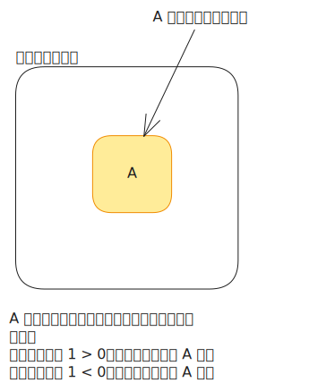

# [0030. 条件渲染](https://github.com/tnotesjs/TNotes.vue/tree/main/notes/0030.%20%E6%9D%A1%E4%BB%B6%E6%B8%B2%E6%9F%93)

<!-- region:toc -->

- [1. 🎯 本节内容](#1--本节内容)
- [2. 🫧 评价](#2--评价)
- [3. 🤔 条件渲染是什么？](#3--条件渲染是什么)
- [4. 🤔 v-if、v-else-if、v-else 如何使用？](#4--v-ifv-else-ifv-else-如何使用)
  - [4.1. 基本用法](#41-基本用法)
  - [4.2. v-if、v-else-if、v-else 组合使用时的注意事项](#42-v-ifv-else-ifv-else-组合使用时的注意事项)
  - [4.3. 在 template 标签上使用条件渲染指令](#43-在-template-标签上使用条件渲染指令)
  - [4.4. v-if 的惰性特性](#44-v-if-的惰性特性)
- [5. 🤔 v-show 和 v-if 有什么区别？该如何选择？](#5--v-show-和-v-if-有什么区别该如何选择)
  - [5.1. 实现原理层面的差异](#51-实现原理层面的差异)
  - [5.2. 性能层面的差异](#52-性能层面的差异)
  - [5.3. 其它差异点](#53-其它差异点)
  - [5.4. v-if 和 v-show 的选择策略](#54-v-if-和-v-show-的选择策略)

<!-- endregion:toc -->

## 1. 🎯 本节内容

- 条件渲染的概念与原理
- v-if、v-else-if、v-else 的使用
- v-show 与 v-if 的区别与性能考量

## 2. 🫧 评价

条件渲染是 Vue 中非常基础但又非常重要的概念，使用起来也非常简单，同时也是使用频率极高的知识点。

## 3. 🤔 条件渲染是什么？

条件渲染是指根据某个表达式的真假值，来决定是否渲染某个元素或组件。



简单理解就是 UI 页面上的某一坨东西是否渲染（也就是是否可见）需要根据某个条件来决定。比如：

- 一个登录按钮，只有当用户未登录时才显示
- 一个错误提示框，只有当发生错误时才显示
- 一个管理员面板，只有当用户具有管理员权限时才显示

先理解条件渲染的概念，再来看看 Vue 中是如何实现条件渲染的，以及不同的条件渲染指令之间有什么区别和适用场景。

Vue 提供了两组指令来实现条件渲染：`v-if` / `v-else-if` / `v-else` 和 `v-show`。

两者的核心区别在于：

- `v-if` 是「真正的」条件渲染，条件为 false 时元素完全不会存在于 DOM 中
- `v-show` 只是切换 CSS 的 `display` 属性，元素始终存在于 DOM 中

下面分别详细介绍它们的使用方式和适用场景。

## 4. 🤔 v-if、v-else-if、v-else 如何使用？

v-if、v-else-if、v-else 是 Vue 中用于条件渲染的指令组合。它们的工作方式与 JavaScript 中的 if、else if、else 语句类似 => 根据表达式的真假值来决定是否渲染某个元素或元素块。当条件为 false 时，对应的元素不仅不会显示，而且根本不会出现在 DOM 中，也不会执行相关的组件初始化逻辑。

### 4.1. 基本用法

```html
<template>
  <div>
    <!-- 单独使用 v-if -->
    <p v-if="isLoggedIn">欢迎回来，{{ username }}！</p>

    <!-- v-if 和 v-else 配合使用 -->
    <button v-if="!isLoggedIn" @click="login">登录</button>
    <button v-else @click="logout">退出</button>

    <!-- v-if / v-else-if / v-else 完整链 -->
    <div v-if="score >= 90">优秀</div>
    <div v-else-if="score >= 80">良好</div>
    <div v-else-if="score >= 60">及格</div>
    <div v-else>不及格</div>
  </div>
</template>

<script setup>
  import { ref } from 'vue'

  const isLoggedIn = ref(false)
  const username = ref('张三')
  const score = ref(85)

  const login = () => (isLoggedIn.value = true)
  const logout = () => (isLoggedIn.value = false)
</script>
```

::: swiper


:::

通过查看上面的 DOM 结构不难发现，v-if 控制的条件渲染，是「真正」地控制元素的创建和销毁，当元素不可见时，它对应的 DOM 结构是不存在的，而当元素可见时，Vue 会创建对应的 DOM 结构并插入到页面中。

### 4.2. v-if、v-else-if、v-else 组合使用时的注意事项

v-else 和 v-else-if 必须紧跟在 v-if 或 v-else-if 元素的后面，中间不能插入其他元素，否则 Vue 无法识别它们的条件链关系：

```html
<template>
  <!-- ✅ 正确 -->
  <div v-if="type === 'a'">A</div>
  <div v-else-if="type === 'b'">B</div>
  <div v-else>C</div>

  <!-- ❌ 错误：v-else 和 v-if 之间插入了其他元素 -->
  <!-- <div v-if="type === 'a'">A</div>
  <p>这个元素会打断条件链</p>
  <div v-else>C</div> -->

  <!-- 上述片段无法正常工作，会报错：
  v-else/v-else-if has no adjacent v-if or v-else-if.
  错误信息表示：v-else 或 v-else-if 没有紧挨着的 v-if 或 v-else-if 元素
  这会导致 Vue 无法正确解析条件链关系 -->
</template>

<script setup>
  import { ref } from 'vue'

  const type = ref('a')
</script>
```

### 4.3. 在 template 标签上使用条件渲染指令

当你需要根据条件渲染多个元素，但又不想引入额外的包裹元素时，可以在 template 标签上使用 v-if。template 标签是一个不可见的包裹元素，不会渲染到最终的 DOM 中：

```html
<template>
  <template v-if="isAdmin">
    <h2>管理面板</h2>
    <nav>
      <a href="/users">用户管理</a>
      <a href="/settings">系统设置</a>
      <a href="/logs">操作日志</a>
    </nav>
    <hr />
  </template>

  <template v-else>
    <h2>普通用户</h2>
    <p>您没有管理权限</p>
  </template>
</template>

<script setup>
  import { ref } from 'vue'

  const isAdmin = ref(false)
</script>
```

最终渲染的真实 DOM 结构：


你会发现，template 标签本身并没有出现在 DOM 中，它只是一个逻辑容器，Vue 根据 v-if 的条件来决定是否渲染它内部的内容。

### 4.4. v-if 的惰性特性

v-if 是“惰性”的。如果初始条件为 false，Vue 不会做任何事，也就是说条件块中的组件不会被创建、生命周期钩子不会被调用。只有当条件首次变为 true 时，Vue 才会开始渲染条件块中的内容。当条件再次变为 false 时，条件块中的组件会被销毁（触发 unmounted 钩子），所有状态都会丢失。

这种特性在某些场景下很有用，比如一些初始化开销很大的组件，你可以用 v-if 来延迟它的创建。但在需要频繁切换的场景下，反复的创建和销毁会带来性能开销，此时应该考虑使用 v-show。

## 5. 🤔 v-show 和 v-if 有什么区别？该如何选择？

v-show 和 v-if 都可以用来控制元素的显示与隐藏，但它们的实现方式完全不同，适用场景也不一样。理解它们的区别是编写高性能 Vue 应用的基础。

### 5.1. 实现原理层面的差异

v-if 是「真正的」条件渲染。当条件为 false 时，元素及其子元素完全不会被创建，不存在于 DOM 中。当条件从 false 变为 true 时，Vue 会重新创建元素和组件，执行完整的初始化流程（包括生命周期钩子）。当条件从 true 变为 false 时，元素和组件会被销毁。

v-show 只是简单地切换元素的 CSS display 属性。无论条件是 true 还是 false，元素始终会被渲染并保留在 DOM 中。当条件为 false 时，Vue 会给元素添加 `display: none` 样式来隐藏它：

```html
<template>
  <!-- v-if：条件为 false 时，元素完全不在 DOM 中 -->
  <p v-if="showA">这是 v-if 控制的内容</p>

  <!-- v-show：条件为 false 时，元素在 DOM 中但不可见 -->
  <p v-show="showB">这是 v-show 控制的内容</p>

  <button @click="showA = !showA">切换 v-if</button>
  <button @click="showB = !showB">切换 v-show</button>
</template>

<script setup>
  import { ref } from 'vue'
  const showA = ref(true)
  const showB = ref(true)
</script>
```

当 showA 和 showB 都为 false 时，查看 DOM 结构的差异：

```html
<!-- v-if 为 false：DOM 中完全没有这个元素 -->
<!-- (空) -->

<!-- v-show 为 false：元素存在但被隐藏 -->
<p style="display: none;">这是 v-show 控制的内容</p>
```

### 5.2. 性能层面的差异

v-if 有更高的切换开销。每次条件变化时，都需要销毁旧的元素/组件并创建新的。这包括 DOM 操作、组件的初始化、响应式数据的设置、生命周期钩子的调用等。但 v-if 在条件为 false 时完全没有渲染成本（既不创建 DOM 节点也不初始化组件）。

v-show 有更高的初始渲染开销。不管初始条件是什么，元素和组件都会被完整地渲染和初始化。但后续的切换只是修改一个 CSS 属性值，开销几乎可以忽略。

```html
<template>
  <!-- 场景一：标签页切换（频繁切换）—— 用 v-show -->
  <div>
    <button v-for="tab in tabs" :key="tab.id" @click="activeTab = tab.id">
      {{ tab.name }}
    </button>

    <div v-show="activeTab === 'overview'">概览内容...</div>
    <div v-show="activeTab === 'details'">详情内容...</div>
    <div v-show="activeTab === 'reviews'">评价内容...</div>
  </div>

  <!-- 场景二：权限控制（很少切换）—— 用 v-if -->
  <AdminPanel v-if="user.isAdmin" />

  <!-- 场景三：错误提示（偶尔显示）—— 用 v-if -->
  <ErrorDialog v-if="error" :error="error" @close="error = null" />
</template>

<script setup>
  import { ref, reactive } from 'vue'

  const tabs = [
    { id: 'overview', name: '概览' },
    { id: 'details', name: '详情' },
    { id: 'reviews', name: '评价' },
  ]
  const activeTab = ref('overview')
  const user = reactive({ isAdmin: false })
  const error = ref(null)
</script>
```

### 5.3. 其它差异点

v-show 不支持在 template 标签上使用，也不能与 v-else 配合。如果你需要条件分支逻辑，必须使用 v-if：

```html
<template>
  <!-- ❌ 错误：v-show 不能用在 template 上 -->
  <template v-show="condition">
    <p>内容 1</p>
    <p>内容 2</p>
  </template>

  <!-- ✅ 正确：v-if 可以用在 template 上 -->
  <template v-if="condition">
    <p>内容 1</p>
    <p>内容 2</p>
  </template>
</template>
```

v-if 切换时，内部组件的状态会被重置。这在某些场景下是你想要的行为（如表单重置），但在其他场景下可能不是。如果需要保持组件状态，可以使用 keep-alive 包裹：

```html
<template>
  <!-- 不使用 keep-alive：切换时组件状态丢失 -->
  <ComponentA v-if="showA" />

  <!-- 使用 keep-alive：切换时组件状态保持 -->
  <KeepAlive>
    <ComponentA v-if="showA" />
    <ComponentB v-else />
  </KeepAlive>
</template>
```

### 5.4. v-if 和 v-show 的选择策略

- 如果组件需要频繁切换显示/隐藏，使用 v-show
- 如果条件在运行时很少改变，或者初始条件为 false 时不希望产生渲染开销，使用 v-if

在不确定的情况下，v-if 通常是更安全的默认选择。
