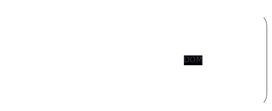

# [0074. 列表渲染（v-for）](https://github.com/tnotesjs/TNotes.vue/tree/main/notes/0074.%20%E5%88%97%E8%A1%A8%E6%B8%B2%E6%9F%93%EF%BC%88v-for%EF%BC%89)

<!-- region:toc -->

- [1. 本节内容](#1-本节内容)
- [2. 评价](#2-评价)
- [3. 列表渲染是什么？](#3-列表渲染是什么)
- [4. v-for 如何使用？](#4-v-for-如何使用)
  - [4.1. 基本用法](#41-基本用法)
  - [4.2. 遍历对象](#42-遍历对象)
  - [4.3. 遍历整数范围和字符串](#43-遍历整数范围和字符串)
  - [4.4. 在 template 标签上遍历](#44-在-template-标签上遍历)
  - [4.5. 注意：v-for 和 v-if 同时使用的优先级问题](#45-注意v-for-和-v-if-同时使用的优先级问题)
- [5. v-for 数据源可以是哪些值？](#5-v-for-数据源可以是哪些值)
- [6. v-for 中的 key 属性和虚拟 DOM 的 diff 算法是什么关系？](#6-v-for-中的-key-属性和虚拟-dom-的-diff-算法是什么关系)
- [7. 数组更新检测有哪些注意事项？](#7-数组更新检测有哪些注意事项)

<!-- endregion:toc -->

## 1. 本节内容

- 列表渲染的概念
- v-for 的常见用法，包括数组、对象、整数范围、字符串与 template 遍历
- v-for 数据源的类型与判断方式
- v-for 和 v-if 同时使用时的优先级问题
- v-for 中的 key 属性与虚拟 DOM 的 diff 算法
- 数组更新检测与注意事项

## 2. 评价

列表渲染是 Vue 中使用频率极高的特性，只要是非静态 UI，几乎都会用到。它本身的使用并不难，但理解 `key` 的作用原理和数组更新的检测机制会有些难度，不过这属于 diff 算法层面的内容（感兴趣可以去趴趴这部分的实现原理），对日常开发功能来说只需要大概了解它的工作机制即可 => 也就是说要理解为何需要 `key` 并且 `key` 要求稳定且唯一的原因。

## 3. 列表渲染是什么？

列表渲染是指根据一个数组或对象中的每一条数据，循环生成一组相同结构的 DOM 元素。比如：

- 一个商品列表页面，需要把后端返回的商品数组逐个渲染成卡片
- 一个导航菜单，需要根据菜单配置数组生成对应的菜单项
- 一个表格，需要把用户数据逐行渲染出来



简单来说，只要 UI 上出现「同一结构重复多次、只是数据不同」的情况，就是列表渲染的用武之地。

Vue 通过 `v-for` 指令来实现列表渲染。`v-for` 可以遍历数组、对象、整数范围甚至字符串。配合 `:key` 属性，Vue 的虚拟 DOM diff 算法可以高效地更新列表，避免不必要的 DOM 操作。

下面从 `v-for` 的基本用法开始，逐步深入到 `key` 的作用原理和数组更新检测的注意事项。

## 4. v-for 如何使用？

v-for 是 Vue 中用于列表渲染的指令，它可以基于数组、对象、数字范围甚至字符串来渲染一组元素。v-for 使用 `item in items` 的语法形式，其中 items 是源数据，item 是迭代的别名。

### 4.1. 基本用法

遍历数组是 v-for 最常见的用法：

```html
<template>
  <h2>1. 基本数组遍历</h2>
  <ul>
    <li v-for="fruit in fruits" :key="fruit">{{ fruit }}</li>
  </ul>

  <h2>2. 带索引的数组遍历</h2>
  <ul>
    <li v-for="(fruit, index) in fruits" :key="index">
      {{ index + 1 }}. {{ fruit }}
    </li>
  </ul>

  <h2>3. 遍历对象数组</h2>
  <div v-for="user in users" :key="user.id">
    <h3>{{ user.name }}</h3>
    <p>年龄：{{ user.age }}</p>
    <p>城市：{{ user.city }}</p>
  </div>

  <h2>4. 解构对象数组</h2>
  <ul>
    <li v-for="{ id, name, price } in products" :key="id">
      {{ name }} - ¥{{ price }}
    </li>
  </ul>

  <h2>5. 带索引的解构</h2>
  <ul>
    <li v-for="({ name, price }, index) in products" :key="index">
      {{ index + 1 }}. {{ name }}（¥{{ price }}）
    </li>
  </ul>
</template>

<script setup>
  import { ref } from 'vue'

  const fruits = ref(['苹果', '香蕉', '橙子', '葡萄'])

  const users = ref([
    { id: 1, name: '张三', age: 25, city: '北京' },
    { id: 2, name: '李四', age: 30, city: '上海' },
    { id: 3, name: '王五', age: 28, city: '广州' },
  ])

  const products = ref([
    { id: 1, name: '笔记本电脑', price: 6999 },
    { id: 2, name: '无线鼠标', price: 129 },
    { id: 3, name: '机械键盘', price: 599 },
  ])
</script>
```


### 4.2. 遍历对象

遍历对象时，v-for 可以接收三个参数：值、键名和索引：

```html
<template>
  <h2>1. 只获取值</h2>
  <div v-for="value in userInfo" :key="value">{{ value }}</div>

  <h2>2. 获取值和键名</h2>
  <div v-for="(value, key) in userInfo" :key="key">{{ key }}: {{ value }}</div>

  <h2>3. 获取值、键名和索引</h2>
  <div v-for="(value, key, index) in userInfo" :key="key">
    {{ index }}. {{ key }}: {{ value }}
  </div>

  <h2>4. 实际应用：渲染表单字段</h2>
  <form>
    <div v-for="(value, key) in formData" :key="key">
      <label>{{ fieldLabels[key] || key }}</label>
      <input :value="value" @input="formData[key] = $event.target.value" />
    </div>
  </form>
</template>

<script setup>
  import { reactive } from 'vue'

  const userInfo = reactive({
    name: '张三',
    age: 25,
    email: 'zhangsan@example.com',
    city: '北京',
  })

  const formData = reactive({
    username: '',
    email: '',
    phone: '',
  })

  const fieldLabels = {
    username: '用户名',
    email: '邮箱',
    phone: '手机号',
  }
</script>
```


### 4.3. 遍历整数范围和字符串

v-for 也可以遍历整数范围和字符串：

```html
<template>
  <h2>遍历整数范围</h2>
  <span v-for="n in 5" :key="n">{{ n }} </span>
  <!-- 输出：1 2 3 4 5 -->

  <h2>遍历字符串</h2>
  <span v-for="(char, index) in 'Hello'" :key="index">
    {{ char }}<span v-if="index < 4">-</span>
  </span>
  <!-- 输出：H-e-l-l-o -->
</template>
```


### 4.4. 在 template 标签上遍历

v-for 也可以在 template 标签上使用，用于渲染多个元素而不引入额外的包裹节点：

```html
<template>
  <table>
    <thead>
      <tr>
        <th>姓名</th>
        <th>邮箱</th>
      </tr>
    </thead>
    <tbody>
      <template v-for="user in users" :key="user.id">
        <tr>
          <td>{{ user.name }}</td>
          <td>{{ user.email }}</td>
        </tr>
        <tr v-if="user.showDetails">
          <td colspan="2">{{ user.details }}</td>
        </tr>
      </template>
    </tbody>
  </table>
</template>

<script setup>
  import { ref } from 'vue'

  const users = ref([
    {
      id: 1,
      name: '张三',
      email: 'zhangsan@example.com',
      showDetails: true,
      details: '前端开发工程师',
    },
    {
      id: 2,
      name: '李四',
      email: 'lisi@example.com',
      showDetails: false,
      details: '后端开发工程师',
    },
    {
      id: 3,
      name: '王五',
      email: 'wangwu@example.com',
      showDetails: true,
      details: '全栈开发工程师',
    },
  ])
</script>

<style>
  table {
    margin: 1rem;
    border-collapse: collapse;
    width: 300px;
  }

  td,
  th {
    border: 1px solid #ddd;
    padding: 8px;
  }
</style>
```


### 4.5. 注意：v-for 和 v-if 同时使用的优先级问题

v-for 和 v-if 同时使用在同一个元素上时需要特别注意。在 Vue 3 中，当 v-if 和 v-for 同时存在于一个元素上时，v-if 的优先级更高。这意味着 v-if 中无法访问 v-for 的变量：

```html
<template>
  <!-- Vue 3 中这样写会报错：item 在 v-if 中不可用 ❌ -->
  <!-- <li v-for="item in items" v-if="item.isActive" :key="item.id">
    {{ item.name }}
  </li> -->
  <!-- 
  错误提示：
  Cannot read properties of undefined (reading 'isActive')
  报错分析：
  因为 v-if 的优先级更高，会先执行，但是 item 变量是 v-for 生产的
  所以在 v-if 中访问 item 时 item 还是 undefined
  调用 item.isActive 就会报错无法从 undefined 中读取属性 isActive
  -->

  <!-- 正确方式 1：在外层 template 上使用 v-for -->
  <template v-for="item in items" :key="item.id">
    <li v-if="item.isActive">{{ item.name }}</li>
  </template>

  <!-- 正确方式 2：使用计算属性预过滤 -->
  <li v-for="item in activeItems" :key="item.id">{{ item.name }}</li>
</template>

<script setup>
  import { ref, computed } from 'vue'

  const items = ref([
    { id: 1, name: '苹果', isActive: true },
    { id: 2, name: '香蕉', isActive: false },
    { id: 3, name: '橙子', isActive: true },
  ])

  // 推荐方式：使用计算属性过滤
  const activeItems = computed(() =>
    items.value.filter((item) => item.isActive),
  )
</script>
```

## 5. v-for 数据源可以是哪些值？

v-for 的数据源可以是以下几种类型：

- 数组
- 对象
- 整数范围
- 字符串
- 实现了迭代器协议的值，例如 Set、Map

需要注意：普通对象和整数范围本身并不是 JavaScript 中的可迭代对象，它们是 Vue 额外支持的遍历形式。

可以直接用下面这段代码做快速判断：

```js
function explainVForSource(value) {
  if (typeof value === 'string') {
    return '可以作为 v-for 数据源：字符串'
  }

  if (Array.isArray(value)) {
    return '可以作为 v-for 数据源：数组'
  }

  if (typeof value === 'number') {
    return Number.isInteger(value) && value >= 0
      ? '可以作为 v-for 数据源：整数范围'
      : '不建议作为 v-for 数据源：数字范围应为非负整数'
  }

  if (value !== null && typeof value === 'object') {
    if (typeof value[Symbol.iterator] === 'function') {
      return '可以作为 v-for 数据源：可迭代对象'
    }

    return '可以作为 v-for 数据源：普通对象，Vue 会按 Object.keys(value) 的结果遍历'
  }

  return '不适合作为 v-for 数据源'
}

console.log(explainVForSource(['a', 'b']))
console.log(explainVForSource(new Set([1, 2, 3])))
console.log(explainVForSource({ a: 1, b: 2 }))
console.log(explainVForSource(5))
console.log(explainVForSource(true))
```

::: tip 提示：数组是最常见的数据源

其实不需要有过多的心理负担，我们在使用列表渲染时，最常用的还是数组类型的数据源。

非数组类型的其它类型数据源的使用频率相对较低，在实际项目中很少见到，这里之所以要介绍它们，更多是为了做一个扩展知识点来介绍，以便对 v-for 的适用范围有一个全面的认识，知道它不仅仅局限于数组，还可以处理对象、字符串等多种类型的数据源。

:::

## 6. v-for 中的 key 属性和虚拟 DOM 的 diff 算法是什么关系？

key 是 v-for 中一个看似简单但极其重要的属性。它是 Vue 虚拟 DOM diff 算法能够正确高效工作的关键。理解 key 的作用原理，需要先了解 Vue 的虚拟 DOM 更新机制。

当 Vue 需要更新一个通过 v-for 渲染的列表时，默认会采用「就地更新」策略（in-place patch）。也就是说，如果列表数据的顺序发生了变化，Vue 不会移动已有的 DOM 元素，而是就地更新每个元素的内容，使之与新的数据顺序匹配。

这种默认策略在某些场景下会导致问题。考虑以下例子：

```html
<template>
  <div>
    <div v-for="item in items">
      <span>{{ item.name }}</span>：
      <input />
    </div>
    <button @click="shuffle">打乱顺序</button>
  </div>
</template>

<script setup>
  import { ref } from 'vue'

  const items = ref([
    { id: 1, name: '张三' },
    { id: 2, name: '李四' },
    { id: 3, name: '王五' },
  ])

  const shuffle = () =>
    (items.value = items.value.sort(() => Math.random() - 0.5))
</script>
```

::: swiper


:::

在没有 key 的情况下，当你在输入框中输入了一些内容然后点击「打乱顺序」，你会发现名字的顺序变了，但输入框中的内容没有跟着变。

输入框仍然保留在原来的位置。这是因为 Vue 复用了已有的 DOM 元素，只是更新了 span 中的文本内容。

添加 key 之后，Vue 可以根据 key 来识别每个节点的身份，正确地移动、添加或删除节点：

```html
<template>
  <div>
    <!-- 添加 key 后，每个节点有了唯一标识 -->
    <div v-for="item in items" :key="item.id">
      <span>{{ item.name }}</span>
      <input />
    </div>
    <button @click="shuffle">打乱顺序</button>
  </div>
</template>
```

::: swiper


:::

现在当你打乱顺序时，输入框会跟着对应的名字一起移动，因为 Vue 知道每个 div 的身份（通过 key），会使用 DOM 的 insertBefore 等操作来移动节点，而不是就地更新内容。

Vue 的 diff 算法在比较新旧两组子节点时，会按以下策略工作：

当没有 key 时，Vue 使用简单的遍历比较 => 按照位置逐个比较新旧节点。如果位置相同的节点类型相同，就复用该 DOM 节点并更新其属性和内容。这种方式在列表顺序不变的情况下非常高效，但在列表重新排序时会做很多不必要的更新。

当有 key 时，Vue 使用一种更智能的算法来最小化 DOM 操作。简化流程如下：

```
旧列表：[A, B, C, D, E]
新列表：[A, C, E, B, D]

1. 双端比较（这种比较方式更符合列表更新的真实分布规律，先优化最常见的情况）：
  - 头头比较：A === A，匹配，跳过（下面几次比较是基于 A === A 匹配并跳过之后的指针位置）
  - 尾尾比较：E !== D，不匹配
  - 头尾比较：B !== D，不匹配
  - 尾头比较：E !== C，不匹配

2. 对无法匹配的部分，建立旧节点的 key -> index 映射表

3. 遍历新列表中的未处理节点，通过 key 在映射表中查找对应的旧节点

4. 移动复用的节点，删除不再需要的节点，创建新增的节点

核心原则：能复用的 DOM 尽量复用，从而避免昂贵的 DOM 操作。
```

选择合适的 key 值至关重要。key 应该满足以下条件：

- 唯一性 => 同一层级的兄弟节点之间，key 值不能重复
- 稳定性 => 同一数据项在不同渲染周期中应该始终拥有相同的 key

最佳选择是数据本身的唯一标识符，如数据库 ID：

```html
<template>
  <!-- 推荐：使用唯一 ID -->
  <li v-for="user in users" :key="user.id">{{ user.name }}</li>

  <!-- 不推荐：使用索引（在排序、过滤、删除等操作时可能出错） -->
  <li v-for="(user, index) in users" :key="index">{{ user.name }}</li>
</template>
```

使用数组索引作为 key 的问题在于，当列表发生插入、删除或重排操作时，索引与数据项的对应关系会发生变化，导致 Vue 错误地复用节点。

## 7. 数组更新检测有哪些注意事项？

在 Vue 中使用数组作为响应式数据时，需要了解 Vue 能够检测哪些数组操作并触发视图更新，以及在不同的 Vue 版本中存在哪些差异。

Vue 3 使用 Proxy 来实现响应式，可以检测到几乎所有类型的数组操作，包括：

```html
<script setup>
  import { ref } from 'vue'

  const items = ref(['苹果', '香蕉', '橙子'])

  // 以下操作在 Vue 3 中都能触发更新

  // 变异方法（直接修改原数组）
  items.value.push('葡萄') // 添加到末尾
  items.value.pop() // 移除末尾元素
  items.value.shift() // 移除第一个元素
  items.value.unshift('芒果') // 添加到开头
  items.value.splice(1, 1, '西瓜') // 替换元素
  items.value.sort() // 排序
  items.value.reverse() // 反转

  // 通过索引直接修改（Vue 2 中不可行，Vue 3 可以）
  items.value[0] = '新水果'

  // 直接修改 length（Vue 2 中不可行，Vue 3 可以）
  items.value.length = 2
</script>
```

Vue 2 中，由于 Object.defineProperty 的限制，以下操作无法被自动检测到：

```js
// Vue 2 的限制（Vue 3 已不存在这些问题）

// 无法检测：通过索引直接设置
this.items[0] = '新值' // 不会触发更新
// 解决方案
this.$set(this.items, 0, '新值')
// 或
this.items.splice(0, 1, '新值')

// 无法检测：修改数组长度
this.items.length = 0 // 不会触发更新
// 解决方案
this.items.splice(0)
```

在实际开发中，处理数组数据最常见的模式是使用非变异方法（返回新数组的方法）配合直接替换。filter、map、concat、slice 等方法不会修改原数组，而是返回一个新数组。在 Vue 中使用这些方法时，直接将返回的新数组赋值给响应式变量即可：

```html
<template>
  <div>
    <input v-model="filterText" placeholder="搜索..." />
    <ul>
      <li v-for="item in filteredItems" :key="item.id">
        {{ item.name }} - ¥{{ item.price }}
      </li>
    </ul>
    <button @click="sortByPrice">按价格排序</button>
    <button @click="removeExpensive">移除高价商品</button>
    <button @click="addItem">添加商品</button>
  </div>
</template>

<script setup>
  import { ref, computed } from 'vue'

  const filterText = ref('')
  let nextId = 4

  const items = ref([
    { id: 1, name: '苹果', price: 5 },
    { id: 2, name: '香蕉', price: 3 },
    { id: 3, name: '葡萄', price: 12 },
  ])

  const filteredItems = computed(() => {
    if (!filterText.value) return items.value
    return items.value.filter((item) => item.name.includes(filterText.value))
  })

  function sortByPrice() {
    // slice 创建副本后排序，避免直接修改原数组
    items.value = items.value.slice().sort((a, b) => a.price - b.price)
  }

  function removeExpensive() {
    items.value = items.value.filter((item) => item.price < 10)
  }

  function addItem() {
    items.value.push({
      id: nextId++,
      name: '新水果',
      price: Math.floor(Math.random() * 20),
    })
  }
</script>
```

使用非变异方法替换数组时，你可能会担心性能问题 => 整个列表不是都要重新渲染吗？实际上并非如此。Vue 的虚拟 DOM diff 算法非常智能，即使你替换了整个数组引用，Vue 也会通过比较新旧虚拟 DOM 树来找出最小的 DOM 变更集，尽可能地复用已有的 DOM 节点。

嵌套数组和对象数组的更新也需要注意。在 Vue 3 中，reactive 和 ref 都会对嵌套的对象进行深度响应式处理，因此修改数组中对象的属性是可以被检测到的：

```html
<script setup>
  import { ref } from 'vue'

  const users = ref([
    { id: 1, name: '张三', scores: [85, 92, 78] },
    { id: 2, name: '李四', scores: [90, 88, 95] },
  ])

  // 修改对象属性 => 可以触发更新
  users.value[0].name = '张三丰'

  // 修改嵌套数组 => 可以触发更新
  users.value[0].scores.push(100)

  // 添加新属性 => 在 Vue 3 中可以触发更新
  users.value[0].email = 'zhangsan@example.com'
</script>
```

对于大型列表的性能优化建议：

- 避免在计算属性或模板中对大数组执行开销大的操作（如多次 sort、filter 链式调用）
- 使用 Object.freeze 冻结不需要响应式的大型静态数据
- 对于渲染超过数百项的列表，考虑使用虚拟滚动（Virtual Scrolling）技术来优化性能，只渲染可视区域内的元素
