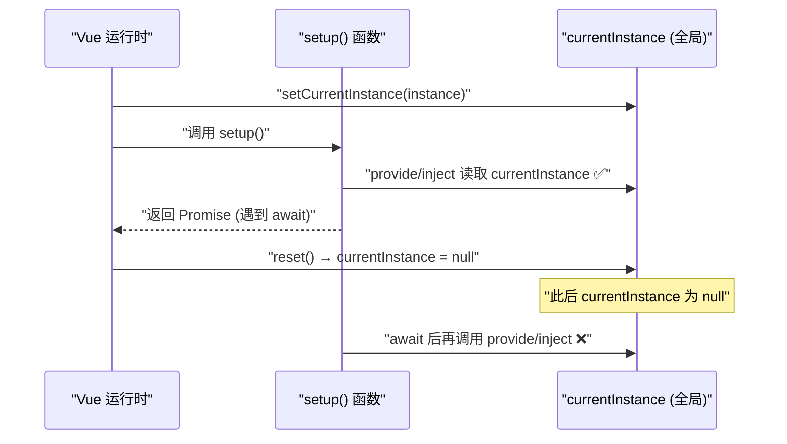

# [0085. 依赖注入](https://github.com/tnotesjs/TNotes.vue/tree/main/notes/0085.%20%E4%BE%9D%E8%B5%96%E6%B3%A8%E5%85%A5)

<!-- region:toc -->

- [1. 🎯 本节内容](#1--本节内容)
- [2. 🫧 评价](#2--评价)
- [3. 🤔 `provide` / `inject` 主要解决什么问题？](#3--provide--inject-主要解决什么问题)
- [4. 🤔 如何在组件中 `provide` 和 `inject`？](#4--如何在组件中-provide-和-inject)
  - [4.1. 示例](#41-示例)
  - [4.2. 对比 props 逐级传递](#42-对比-props-逐级传递)
  - [4.3. 一些注意事项](#43-一些注意事项)
- [5. 🤔 什么是应用层 Provide？](#5--什么是应用层-provide)
- [6. 🤔 注入不到值时怎么办？默认值怎么写？](#6--注入不到值时怎么办默认值怎么写)
- [7. 🤔 `provide` / `inject` 和响应式数据应该如何配合？实际开发时的最佳实践是？](#7--provide--inject-和响应式数据应该如何配合实际开发时的最佳实践是)
  - [7.1. 最佳实践](#71-最佳实践)
- [8. 🤔 为什么推荐用 `Symbol` 作为注入名？](#8--为什么推荐用-symbol-作为注入名)
- [9. 🤔 为什么 provide 和 inject 需要同步调用？【深入原理】](#9--为什么-provide-和-inject-需要同步调用深入原理)
  - [9.1. 前置知识：`provide` 如何使用 `currentInstance`](#91-前置知识provide-如何使用-currentinstance)
  - [9.2. 前置知识：`inject` 如何使用 `currentInstance`](#92-前置知识inject-如何使用-currentinstance)
  - [9.3. 前置知识：`currentInstance` 的生命周期](#93-前置知识currentinstance-的生命周期)
  - [9.4. 为什么异步调用会失败](#94-为什么异步调用会失败)
    - [时序图](#时序图)
- [10. 💻 demos.1 - provide/inject 基本用法（跨层级共享）](#10--demos1---provideinject-基本用法跨层级共享)
- [11. 💻 demos.2 - 响应式共享与最佳实践（readonly + setter）](#11--demos2---响应式共享与最佳实践readonly--setter)
- [12. 💻 demos.3 - inject 默认值](#12--demos3---inject-默认值)
- [13. 💻 demos.4 - Symbol 作为注入名](#13--demos4---symbol-作为注入名)
- [14. 💻 demos.5 - 应用层 Provide](#14--demos5---应用层-provide)
- [15. 💻 demos.6 - 为什么 provide/inject 必须同步调用](#15--demos6---为什么-provideinject-必须同步调用)
- [16. 🔗 引用](#16--引用)

<!-- endregion:toc -->

## 1. 🎯 本节内容

- 逐级透传
- Provide
- Inject
- 默认值
- 响应式共享
- Symbol 键

## 2. 🫧 评价

`provide` / `inject` 主要解决跨层传值的问题。在使用的时候需要注意不能丢到异步回调里，否则会导致无法正常工作。

## 3. 🤔 `provide` / `inject` 主要解决什么问题？

当一个较深层的后代组件需要祖先组件里的数据时，如果只靠 props 往下一级一级传，就会出现典型的 prop 逐级透传问题。也就是说：

- 真正需要数据的是深层组件
- 中间很多组件其实根本不用这份数据
- 但这些中间组件仍然要被迫接收并继续向下传

这种链路一长，组件接口就会被很多「只是路过」的 props 污染，维护起来也很烦。

`provide` / `inject` 就是用来解决上面这个问题的。

- 祖先组件负责「提供」`provide` 一份依赖
- 任意深度的后代组件都可以按 key 把它「注入」`inject` 进来

所以它本质上是一种跨层级依赖共享机制，不需要中间组件层层转手。

## 4. 🤔 如何在组件中 `provide` 和 `inject`？

在 Vue 3 里，最常见的写法是直接在 `<script setup>` 中使用 `provide()` 和 `inject()`。

### 4.1. 示例

假设存在两个组件：`Root.vue` 和 `DeepChild.vue`，它们之间隔了好几层组件，但 `DeepChild.vue` 需要用到 `Root.vue` 里提供的数据。我们可以：

- 在 `Root.vue` 里利用 `provide()` 把数据提供出来
- 在 `DeepChild.vue` 里用 `inject()` 获取这份数据

::: code-group

```html [Root.vue]
<script setup>
  import { provide } from 'vue'

  provide('theme', 'dark')
</script>
<!--
基础规则：
provide() 的第一个参数是注入名，第二个参数是值
注入名可以是字符串类型，也可以是 Symbol 类型
一个组件可以多次 provide() 不同依赖
-->
```

```html [DeepChild.vue]
<script setup>
  import { inject } from 'vue'

  const theme = inject('theme')
</script>

<template>
  <p>当前主题：{{ theme }}</p>
</template>
<!--
基础规则：
inject() 会沿着父组件链向上查找，取最近的那个提供者
-->
```

:::

### 4.2. 对比 props 逐级传递

如果走传统的 props 来实现深层组件之间的数据传递，需要逐层传递：


如果使用 `provide` / `inject`，就可以直接在暴露数据的组件 `provide`，在需要消费的深层组件里注入 `inject`：


### 4.3. 一些注意事项

- 如果没有使用 `<script setup>`，`provide()` 和 `inject()` 也都应该在 `setup()` 里同步调用，不要放到异步回调里。
- 如果提供的是一个 ref，注入方拿到的仍然是这个 ref 对象，而不会自动解包。这样做的好处是，供给方和注入方之间可以保持响应式连接。

## 5. 🤔 什么是应用层 Provide？

除了在具体组件里 provide 之外，你还可以直接在应用实例上提供依赖：

```js
import { createApp } from 'vue'
import App from './App.vue'

const app = createApp(App)

app.provide('apiBaseUrl', 'https://example.com/api')

app.mount('#app')
```

这样，当前应用内的任意组件都可以注入这份数据。

这种方式特别适合：

- 插件安装时注入配置
- 应用级共享服务
- 不依赖具体组件层级的全局配置

换句话说，组件级 provide 更像「某棵子树内共享」，应用级 provide 更像「整个应用作用域内共享」。

## 6. 🤔 注入不到值时怎么办？默认值怎么写？

默认情况下，如果你 `inject()` 的 key 没有被任何祖先提供，Vue 会给出运行时警告。

如果这个依赖本身就是可选的，你应该给它一个默认值：

```js
const locale = inject('locale', 'zh-CN')
```

如果默认值的创建成本比较高，还可以使用工厂函数：

```js
const service = inject('service', () => createService(), true)
```

这里第三个参数 `true` 的意思是：把第二个参数当成工厂函数，而不是把函数本身当作默认值。

所以默认值这一块你可以记成：

- 简单值，直接传
- 昂贵对象或类实例，用工厂函数

## 7. 🤔 `provide` / `inject` 和响应式数据应该如何配合？实际开发时的最佳实践是？

依赖注入最常见的真实用法，不是传一个普通字符串，而是传一份响应式状态。

```html
<script setup>
  import { provide, ref } from 'vue'

  const count = ref(0)

  provide('count', count)
</script>
```

后代组件拿到后，和供给方会共享同一个 ref。

### 7.1. 最佳实践

常见做法是把「状态修改的方法」 setter 也一起 provide 出去，这样可以让数据流更加清晰：

- 如果消费方（后代组件）只需要读取状态的值，那么只需要导入状态本身即可
- 如果消费方还需要修改状态，那么就同时导入状态和修改状态的方法 setter

数据生产者：

```html
<script setup>
  import { provide, ref, readonly } from 'vue'

  // 「状态定义」和「状态修改规则」仍然内聚在提供者一侧，代码更容易维护
  const location = ref('North Pole')

  function updateLocation() {
    location.value = 'South Pole'
  }

  provide('locationContext', {
    location: readonly(location), // 只读导出，防止消费方误改
    updateLocation,
  })
</script>
```

数据消费者：

```html
<script setup>
  import { inject } from 'vue'

  // 按需消费，数据流清晰
  // 只读导 - location
  // 读写导 - location + updateLocation
  const { location, updateLocation } = inject('locationContext')
</script>

<template>
  <button @click="updateLocation">{{ location }}</button>
</template>
```

## 8. 🤔 为什么推荐用 `Symbol` 作为注入名？

小项目里用字符串 key 没什么问题：

```js
provide('theme', theme)
const theme = inject('theme')
```

但如果项目比较大、依赖比较多，或者你在写组件库，字符串 key 就可能撞名。

这时更稳妥的方式是使用 `Symbol`：

```js
// keys.js
export const themeKey = Symbol('theme')
```

```js
// provider
import { provide } from 'vue'
import { themeKey } from './keys'

provide(themeKey, 'dark')
```

```js
// consumer
import { inject } from 'vue'
import { themeKey } from './keys'

const theme = inject(themeKey)
```

这样做的主要价值不是「写法更高级」，而是避免 key 冲突，让依赖关系更稳定、更适合复用和跨文件维护。

## 9. 🤔 为什么 provide 和 inject 需要同步调用？【深入原理】

一句话解释：根本原因是 `provide` 和 `inject` 都依赖一个「模块级全局变量」 `currentInstance`，而这个变量只在 `setup()` 同步执行期间被设置为当前组件实例。

必要的前置知识：

- 了解 `provide` 内部实现，重点关注对 `currentInstance` 的写入逻辑
- 了解 `inject` 内部实现，重点关注对 `currentInstance` 的读取逻辑
- 了解 `currentInstance` 的生命周期，特别是它在 `setup()` 前后是如何被设置和重置的

### 9.1. 前置知识：`provide` 如何使用 `currentInstance`

`provide` 直接读取模块级的 `currentInstance`，把值写入该实例的 `provides` 对象：

```js
// packages/runtime-core/src/apiInject.ts
export function provide(key, value) {
  if (!currentInstance || currentInstance.isMounted) {
    warn(`provide() can only be used inside setup().`)
  }
  // 写入 currentInstance.provides
  if (currentInstance) {
    let provides = currentInstance.provides
    // ...
    provides[key as string] = value
  }
}
```

### 9.2. 前置知识：`inject` 如何使用 `currentInstance`

`inject` 通过 `getCurrentInstance()` 获取当前实例，然后沿原型链向上查找父组件的 `provides`。

```js
// packages/runtime-core/src/apiInject.ts
export function inject(
  key: InjectionKey<any> | string
) {
  const instance = getCurrentInstance()

  // 读 provides[key] ...
  if (instance || currentApp) {
    let provides = instance.parent.provides

    if (provides && (key as string | symbol) in provides) {
      return provides[key as string]
    }
  }
}
```

### 9.3. 前置知识：`currentInstance` 的生命周期

在 `setupStatefulComponent` 中，Vue 在调用 `setup()` 前后分别设置和重置 `currentInstance`：

```js
// packages/runtime-core/src/component.ts
const reset = setCurrentInstance(instance)   // ← 设置 currentInstance = 当前组件
const setupResult = callWithErrorHandling(setup, ...)
resetTracking()
reset()                                       // ← 立即重置 currentInstance = null
```

`setCurrentInstance` 本身的实现也很直接，它只是把全局变量指向当前实例，并返回一个“重置函数”。

### 9.4. 为什么异步调用会失败

JavaScript 是单线程的，`await` 之后的代码是在「新的微任务」中执行的。此时 `setup()` 的同步部分早已执行完毕，`reset()` 也已经把 `currentInstance` 置回 `null`。

```js
async setup() {
  provide('key', val)   // ✅ 同步，currentInstance = 当前组件
  await someAsyncOp()   // setup() 同步部分到此结束，reset() 被调用
  inject('key')         // ❌ currentInstance = null，找不到实例
}
```

#### 时序图



## 10. 💻 demos.1 - provide/inject 基本用法（跨层级共享）

::: code-group

```html [App.vue]
<script setup>
  import { provide } from 'vue'
  import MiddleComp from './MiddleComp.vue'

  // 祖先组件 provide 数据，后代组件无论嵌套多深都可直接 inject
  provide('theme', 'dark')
</script>

<template>
  <h3>App（祖先）— 提供了 theme = 'dark'</h3>
  <MiddleComp />
</template>
```

```html [MiddleComp.vue]
<script setup>
  import DeepChild from './DeepChild.vue'
  // 中间组件完全不需要 theme，不参与传递，接口不会被污染
</script>

<template>
  <div style="margin-left: 1em;">
    <h4>MiddleComp（中间层，不感知 theme）</h4>
    <DeepChild />
  </div>
</template>
```

```html [DeepChild.vue]
<script setup>
  import { inject } from 'vue'

  // 沿父组件链向上查找，取最近的 provide('theme', ...)
  const theme = inject('theme')
</script>

<template>
  <div style="margin-left: 1em;">
    <h4>DeepChild（深层后代）</h4>
    <p>inject 获取到 theme: {{ theme }}</p>
  </div>
</template>
```

:::


## 11. 💻 demos.2 - 响应式共享与最佳实践（readonly + setter）

::: code-group

```html [App.vue]
<script setup>
  import { provide, ref, readonly } from 'vue'
  import Child from './Child.vue'

  const location = ref('North Pole')

  function updateLocation(newLoc) {
    location.value = newLoc
  }

  // 最佳实践：
  // - readonly 包裹状态，防止消费方直接修改
  // - 同时 provide setter，让修改逻辑内聚在提供方
  provide('locationContext', {
    location: readonly(location),
    updateLocation,
  })
</script>

<template>
  <h3>App — 当前 location: {{ location }}</h3>
  <Child />
</template>
```

```html [Child.vue]
<script setup>
  import { inject } from 'vue'

  // 消费方按需取出状态和方法，数据流清晰
  const { location, updateLocation } = inject('locationContext')
</script>

<template>
  <div style="margin-left: 1em;">
    <h4>Child</h4>
    <p>location: {{ location }}</p>
    <button @click="updateLocation('South Pole')">切换到 South Pole</button>
  </div>
</template>
```

:::

## 12. 💻 demos.3 - inject 默认值

::: code-group

```html [App.vue]
<script setup>
  import { provide } from 'vue'
  import Child from './Child.vue'

  provide('theme', 'dark')
  // 故意不提供 locale，演示默认值生效
</script>

<template>
  <h3>App</h3>
  <p>提供了 theme，未提供 locale</p>
  <Child />
</template>
```

```html [Child.vue]
<script setup>
  import { inject } from 'vue'

  // 简单默认值：key 存在则取 provide 的值，否则用默认值
  const theme = inject('theme', 'light') // 'dark'（来自 provide）
  const locale = inject('locale', 'zh-CN') // 'zh-CN'（默认值）

  // 工厂函数默认值：第三个参数 true 表示「把第二个参数当工厂函数执行」
  // 适用于默认值创建成本较高的场景（如大对象、类实例等）
  const config = inject('config', () => ({ debug: false, version: 1 }), true)
</script>

<template>
  <div style="margin-left: 1em;">
    <h4>Child</h4>
    <p>theme: {{ theme }}</p>
    <p>locale: {{ locale }}</p>
    <p>config: {{ config }}</p>
  </div>
</template>
```

:::

## 13. 💻 demos.4 - Symbol 作为注入名

::: code-group

```js [keys.js]
// 统一管理注入名：Symbol 天然唯一，避免大型项目中 key 冲突
export const ThemeKey = Symbol('theme')
export const LocaleKey = Symbol('locale')
```

```html [App.vue]
<script setup>
  import { provide } from 'vue'
  import { ThemeKey, LocaleKey } from './keys.js'
  import Child from './Child.vue'

  provide(ThemeKey, 'dark')
  provide(LocaleKey, 'zh-CN')
</script>

<template>
  <h3>App</h3>
  <Child />
</template>
```

```html [Child.vue]
<script setup>
  import { inject } from 'vue'
  import { ThemeKey, LocaleKey } from './keys.js'

  // 从共享模块导入同一个 Symbol 实例，保证 provide/inject 匹配
  const theme = inject(ThemeKey)
  const locale = inject(LocaleKey)
</script>

<template>
  <div style="margin-left: 1em;">
    <h4>Child</h4>
    <p>theme: {{ theme }}</p>
    <p>locale: {{ locale }}</p>
  </div>
</template>
```

:::

## 14. 💻 demos.5 - 应用层 Provide

::: code-group

```js [main.js]
import { createApp } from 'vue'
import App from './App.vue'

const app = createApp(App)

// 应用层 provide — 适合插件配置、全局服务等不依赖组件层级的共享数据
// 应用内任意组件都可以 inject
app.provide('apiBaseUrl', 'https://api.example.com')
app.provide('appName', 'MyApp')

app.mount('#app')
```

```html [App.vue]
<script setup>
  import Child from './Child.vue'
</script>

<template>
  <h3>App</h3>
  <Child />
</template>
```

```html [Child.vue]
<script setup>
  import { inject } from 'vue'

  // 无需祖先组件逐层 provide，直接注入应用层提供的数据
  const appName = inject('appName')
  const apiBaseUrl = inject('apiBaseUrl')
</script>

<template>
  <div style="margin-left: 1em;">
    <h4>Child</h4>
    <p>appName: {{ appName }}</p>
    <p>apiBaseUrl: {{ apiBaseUrl }}</p>
  </div>
</template>
```

:::

## 15. 💻 demos.6 - 为什么 provide/inject 必须同步调用

::: code-group

```html [App.vue]
<script setup>
  import { provide } from 'vue'
  import Child from './Child.vue'

  provide('theme', 'dark')
</script>

<template>
  <h3>App</h3>
  <Child />
</template>
```

```html [Child.vue]
<script setup>
  import { inject, ref } from 'vue'

  // ✅ 同步调用 — setup() 执行期间 currentInstance 存在，正常注入
  const theme = inject('theme')

  const asyncResult = ref('尚未尝试')

  function tryAsyncInject() {
    setTimeout(() => {
      // ❌ 异步调用 — setup() 已执行完毕，currentInstance 被置为 null
      // inject 无法定位当前组件实例，返回默认值并在控制台输出 warning
      asyncResult.value = String(inject('theme', '⚠️ undefined'))
    }, 0)
  }
</script>

<template>
  <div style="margin-left: 1em;">
    <h4>Child</h4>
    <p>同步 inject theme: <b>{{ theme }}</b></p>
    <p>异步 inject 结果: <b>{{ asyncResult }}</b></p>
    <button @click="tryAsyncInject">尝试在 setTimeout 中 inject</button>
  </div>
</template>
```

:::

## 16. 🔗 引用

- [Vue.js 官方文档 - 依赖注入][1]

[1]: https://cn.vuejs.org/guide/components/provide-inject.html
