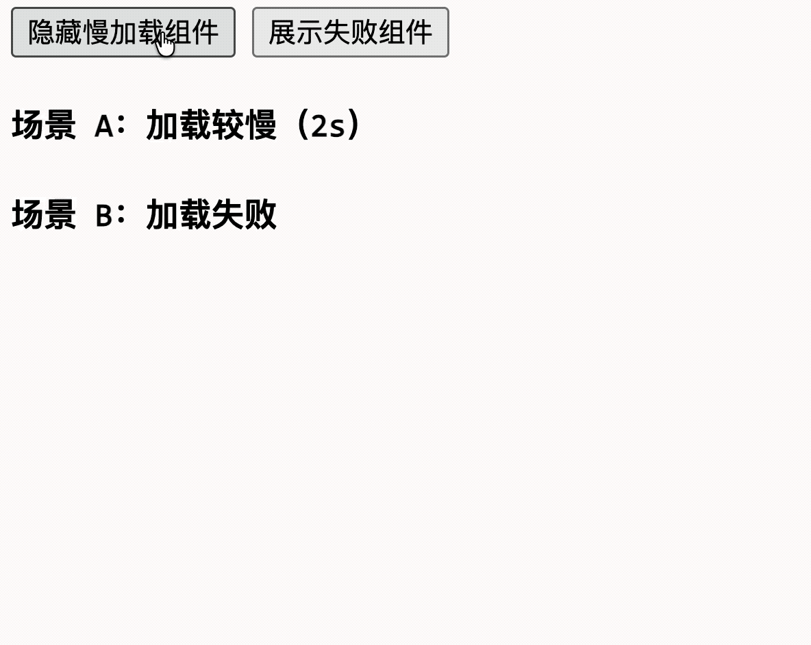

# [0086. 异步组件](https://github.com/tnotesjs/TNotes.vue/tree/main/notes/0086.%20%E5%BC%82%E6%AD%A5%E7%BB%84%E4%BB%B6)

<!-- region:toc -->

- [1. 🎯 本节内容](#1--本节内容)
- [2. 🫧 评价](#2--评价)
- [3. 🤔 “异步组件”是什么？](#3--异步组件是什么)
  - [3.1. 异步组件](#31-异步组件)
  - [3.2. 代码分割](#32-代码分割)
- [4. 🤔 `defineAsyncComponent()` 是什么？](#4--defineasynccomponent-是什么)
  - [4.1. `defineAsyncComponent()`](#41-defineasynccomponent)
  - [4.2. 如何配置异步组件的「加载状态」和「错误状态」](#42-如何配置异步组件的加载状态和错误状态)
- [5. 🤔 异步组件的真正加载时机是什么？](#5--异步组件的真正加载时机是什么)
  - [5.1. 异步组件的加载时机](#51-异步组件的加载时机)
  - [5.2. Vue Router 懒加载配置](#52-vue-router-懒加载配置)
- [6. 🤔 异步组件的 loader 是否有缓存？【深入原理】](#6--异步组件的-loader-是否有缓存深入原理)
  - [6.1. 异步组件首先显示的时候会触发 loader，非首次显示还会触发 loader 吗？](#61-异步组件首先显示的时候会触发-loader非首次显示还会触发-loader-吗)
  - [6.2. 核心源码位置](#62-核心源码位置)
  - [6.3. 缓存机制](#63-缓存机制)
  - [6.4. `load()` 函数的去重逻辑](#64-load-函数的去重逻辑)
  - [6.5. `setup()` 中的短路逻辑](#65-setup-中的短路逻辑)
  - [6.6. 注意事项](#66-注意事项)
- [7. 🤔 Vue 3.5+ 的惰性激活是什么？【SSR】](#7--vue-35-的惰性激活是什么ssr)
- [8. 🤔 异步组件和 `<Suspense>` 是什么关系？](#8--异步组件和-suspense-是什么关系)
  - [8.1. `<Suspense>` 简介](#81-suspense-简介)
  - [8.2. 两者之间的关系](#82-两者之间的关系)
  - [8.3. 配合使用](#83-配合使用)
  - [8.4. 错误处理的最佳实践 - 外层用 `onErrorCaptured` 兜底](#84-错误处理的最佳实践---外层用-onerrorcaptured-兜底)
  - [8.5. 小结](#85-小结)
- [9. 💻 demos.1 - 基本用法：按需加载](#9--demos1---基本用法按需加载)
- [10. 💻 demos.2 - 加载状态与错误状态](#10--demos2---加载状态与错误状态)
- [11. 💻 demos.3 - loader 缓存机制](#11--demos3---loader-缓存机制)
- [12. 💻 demos.4 - 与 Suspense 配合使用](#12--demos4---与-suspense-配合使用)
- [13. 💻 demos.5 - 加载失败重试机制](#13--demos5---加载失败重试机制)
- [14. 🔗 引用](#14--引用)

<!-- endregion:toc -->

## 1. 🎯 本节内容

- 异步加载
- 异步定义
- 加载时机
- Vue Router 懒加载配置
- 加载状态
- 错误状态
- 惰性激活
- Suspense

## 2. 🫧 评价

异步组件就是“只有在真正需要渲染它时，才去加载它的组件实现”，构建工具通常会把它识别成天然的代码分割点，将一些大型组件拆分成独立的代码块 chunk，从主 chunk 中分离出来，从而减少主 chunk 的体积。

对于大型项目来说，合理使用异步组件可以显著降低首屏加载体积，提升用户体验。配合 Vue 的 `<Suspense>` 还可以统一管理多个异步组件的加载状态。

## 3. 🤔 “异步组件”是什么？

### 3.1. 异步组件

异步组件，简单来说，就是“只有在真正需要渲染它时，才去加载它的组件实现”。

在大型项目里，页面和组件越来越多，如果所有组件都在首屏一次性打进主包里，首屏加载体积会变大，用户一开始就要下载很多暂时根本用不到的代码。

异步组件的目标就是把组件变成按需加载：

- 先只加载当前必须用到的代码
- 某个组件真正被渲染时，再去请求它对应的代码块

### 3.2. 代码分割

所以它的核心价值是和构建工具的代码分割能力配合，降低首包压力。

```bash
# 不使用代码分割
dist/
  assets/
    index-abc123.js # 2MB（包含所有组件的代码）

# 使用代码分割
dist/
  assets/
    index-abc123.js         # 800KB（主包）
    Dashboard-def456.js     # 200KB（按需加载的异步组件）
    UserProfile-ghi789.js   # 150KB（按需加载的异步组件）
    HeavyChart-jkl012.js    # 300KB（按需加载的异步组件）
    ...                     # 其他按需加载的脚本或静态资源
```

::: tip 代码分割（Code Splitting）

代码分割（Code Splitting）是现代打包工具（如 Vite、Webpack）的核心功能之一。当你使用动态 `import()` 语法时，打包工具会将被导入的模块及其依赖分割成一个独立的文件（chunk）。在运行时，只有当这个模块真正被需要时，浏览器才会发起网络请求去下载它。

:::

## 4. 🤔 `defineAsyncComponent()` 是什么？

### 4.1. `defineAsyncComponent()`

`defineAsyncComponent()` 是 Vue 提供的一个函数，用来定义异步组件。

`defineAsyncComponent()` 接收一个返回 Promise 的加载函数，你可以通过传入的配置对象，自定义这个 Promise 的不同阶段（加载中、加载成功、加载失败）所加载的组件。

- 如果这个 Promise 还在 pending 状态，异步组件就会进入加载中分支，如果你配置了 loading 组件，就会渲染 loading 组件。
- 如果这个 Promise 最终 reject，异步组件就会进入失败分支，如果你配置了错误组件，就会渲染错误组件。
- 如果这个 Promise 最终 resolve，异步组件就会进入成功分支，渲染真正的组件内容。

示例：

```js
import { defineAsyncComponent } from 'vue'

// 定义一个异步组件
const AsyncPanel = defineAsyncComponent(
  () => import('./components/AsyncPanel.vue'),
)
// 最常见的写法就是结合动态导入 import()
// 因为 Vite、Webpack 这类构建工具会把它识别成天然的代码分割点
```

然后它的使用方式和普通组件没有区别：

```html
<template>
  <AsyncPanel />
</template>
```

异步组件和普通组件一样，可以局部注册也可以全局注册：

::: code-group

```html [局部注册]
<script setup>
  import { defineAsyncComponent } from 'vue'

  const AdminPage = defineAsyncComponent(
    () => import('./components/AdminPage.vue'),
  )
</script>
```

```js [全局注册]
app.component(
  'AdminPage',
  defineAsyncComponent(() => import('./components/AdminPage.vue')),
)
```

:::

异步组件只是“外面包了一层加载器”的包装组件，它接收到的 props 和 slots 最终都会继续传给真正加载出来的内部组件。这意味着你可以相对无缝地把普通组件替换成异步版本，通常只需要使用 `defineAsyncComponent()` 包裹一下就好了。

### 4.2. 如何配置异步组件的「加载状态」和「错误状态」

实际在使用异步组件时，异步组件的加载一定会遇到两个现实问题：

- 问题1. 组件还没加载完时显示什么？
- 问题2. 组件加载失败时显示什么？

`defineAsyncComponent()` 最基础的用法就是传入一个参数 => loader 函数（传 `AsyncComponentLoader`），这个函数返回一个 Promise，Promise resolve 的结果就是组件的定义：

```js
// AsyncComponentLoader 示例：
const AsyncPanel = defineAsyncComponent(
  () => import('./components/AsyncPanel.vue'),
)
```

但是从 `defineAsyncComponent()` 的类型定义来看，直接传入一个 loader 其实只是它的一种简化写法。以下是关于 `defineAsyncComponent()` 的类型定义：

```ts
function defineAsyncComponent(
  source: AsyncComponentLoader | AsyncComponentOptions,
): Component

type AsyncComponentLoader = () => Promise<Component>

interface AsyncComponentOptions {
  loader: AsyncComponentLoader // 返回 Promise 的异步组件加载函数
  loadingComponent?: Component // 加载过程中显示的占位组件 - 解决上述提到的问题 1
  errorComponent?: Component // 加载失败时显示的错误组件 - 解决上述提到的问题 2
  delay?: number // loadingComponent 显示前的延迟时间（ms），默认 200
  // 200ms 是一个相对合理的值，网络快的时候，如果 loading 一闪而过，视觉上反而会有闪屏的感觉
  // 你可以先试试 200ms 是否满足需求，效果不太行再结合项目实际应用场景来调整
  // 验证：github vuejs/core => packages/runtime-core/src/apiAsyncComponent.ts 搜 delay
  timeout?: number // 加载超时时间（ms），超时后显示 errorComponent
  suspensible?: boolean // 是否支持 Suspense，默认 true（Vue 3.2+）
  // 加载出错时的回调，可决定重试或失败
  onError?: (
    error: Error,
    retry: () => void, // 调用后重新尝试加载
    fail: () => void, // 调用后标记为加载失败
    attempts: number, // 已重试次数
  ) => any
}
```

`defineAsyncComponent()` 还支持更完整的对象写法（传 `AsyncComponentOptions`）来处理「加载状态」和「错误状态」：

```js
import { defineAsyncComponent } from 'vue'
import LoadingCard from './LoadingCard.vue'
import ErrorCard from './ErrorCard.vue'

// 示例：AsyncComponentOptions
const AsyncChart = defineAsyncComponent({
  loader: () => import('./ChartPanel.vue'),
  loadingComponent: LoadingCard,
  errorComponent: ErrorCard,
  delay: 200,
  timeout: 3000,
})
```

这里几个配置项的含义分别是：

- `loader`：真正的异步加载函数
- `loadingComponent`：加载期间先显示的组件
- `errorComponent`：加载报错或超时时显示的组件
- `delay`：延迟多久再显示 loading，默认是 200ms
- `timeout`：超时时间，超时后会进入错误状态

## 5. 🤔 异步组件的真正加载时机是什么？

### 5.1. 异步组件的加载时机

定义异步组件时，并不会立刻去请求那个组件文件。真正的加载时机，是这个异步组件“首次被渲染”的时候。

也就是说：

```html
<template>
  <AsyncDialog v-if="visible" />
</template>
```

如果 `visible` 一直是 `false`，那它对应的 `loader` 根本不会执行。

这也是为什么异步组件特别适合下面这些场景：

- 弹窗
- 管理后台二级页面
- 大体积图表组件
- 低频使用的配置面板

这些内容天然不是首屏就必须出现，按需加载收益比较明显。

### 5.2. Vue Router 懒加载配置

实际的 Vue Router 懒加载配置也是类似的机制，需要用到的时候再去加载对应的组件：

```js
// router/index.js
const router = createRouter({
  history: createWebHistory(),
  routes: [
    {
      path: '/',
      component: () => import('../views/Home.vue'),
    },
    // 当进入到 / 页面时，加载 Home.vue 组件

    {
      path: '/dashboard',
      component: () => import('../views/Dashboard.vue'),
    },
    // 当进入到 /dashboard 页面时，加载 Dashboard.vue 组件

    {
      path: '/admin',
      component: () => import('../views/Admin.vue'),
      // 嵌套路由也可以懒加载
      children: [
        {
          path: 'users',
          component: () => import('../views/admin/Users.vue'),
        },
        // 当进入到 /admin/users 页面时，加载 Users.vue 组件
      ],
    },
    // 当进入到 /admin 页面时，加载 Admin.vue 组件
  ],
})
```

## 6. 🤔 异步组件的 loader 是否有缓存？【深入原理】

### 6.1. 异步组件首先显示的时候会触发 loader，非首次显示还会触发 loader 吗？

先说结论：

| 场景 | 是否触发 loader |
| --- | --- |
| 第一次挂载该异步组件 | ✅ 触发，`pendingRequest` 和 `resolvedComp` 均为空 |
| 加载中，同时挂载多个实例 | ❌ 不重复触发，复用同一个 `pendingRequest` |
| 加载完成后，再次挂载新实例 | ❌ 不触发，`resolvedComp` 已有缓存，直接短路返回 |
| 调用 `retry()` | ✅ 触发，`retry()` 会把 `pendingRequest` 置为 `null` 再重新 `load()` |

### 6.2. 核心源码位置

github -> vuejs/core -> `packages/runtime-core/src/apiAsyncComponent.ts`

### 6.3. 缓存机制

`defineAsyncComponent` 在闭包中声明了两个关键变量：

```js
let pendingRequest: Promise<ConcreteComponent> | null = null
let resolvedComp: ConcreteComponent | undefined
```

这两个变量被所有使用同一个异步组件定义的实例“共享”。

### 6.4. `load()` 函数的去重逻辑

`load()` 函数有两层保护：

```js
const load = (): Promise<ConcreteComponent> => {
  return (
    pendingRequest ||           // <- 如果正在加载中，复用同一个 Promise
    (thisRequest = pendingRequest = loader().then(comp => {
      resolvedComp = comp       // <- 加载完成后缓存结果
      return comp
    }))
  )
}
```

### 6.5. `setup()` 中的短路逻辑

每次组件实例挂载时都会执行 `setup()`，但第一件事就是检查 `resolvedComp`：

```js
setup() {
  // already resolved
  if (resolvedComp) {
    return () => createInnerComp(resolvedComp!, instance)  // <- 直接返回，不调用 load()
  }
  // ...
  load()  // 只有首次（resolvedComp 为空）才会走到这里
}
```

### 6.6. 注意事项

`pendingRequest` 和 `resolvedComp` 缓存是在“定义级别”（闭包），而非实例级别（就是 Vue 实例的生命周期还是会正常走，但是 load 回调不会重复跑）。缓存的生命周期与 `defineAsyncComponent(...)` 的“调用结果”绑定。通常异步组件定义是模块级别的常量，所以缓存在整个应用生命周期内都有效。如果每次渲染都调用 `defineAsyncComponent(...)` 创建新定义，则缓存不会跨定义共享。

## 7. 🤔 Vue 3.5+ 的惰性激活是什么？【SSR】

::: tip

所有策略都只在 SSR 场景下生效。如果是纯 CSR，loader 被调用时直接下载 + 渲染，不存在“惰性激活”这个概念。

:::

如果你正在使用 SSR，Vue 3.5+ 还为异步组件提供了惰性激活能力。这里的重点已经不是“什么时候下载组件代码”，而是“什么时候让服务端输出的 HTML 真正完成客户端激活”。

这里可以这么理解：

- 下载 => 下载 chunk => 组件代码什么时候从服务器获取到浏览器内存中
- 激活 => 执行 chunk => 组件什么时候真正被 Vue 运行起来，变成响应式、可交互的状态

官方提供了几种内置的激活策略：

- 空闲时激活：`hydrateOnIdle()`
- 可见时激活：`hydrateOnVisible()`
- 媒体查询匹配时激活：`hydrateOnMediaQuery()`
- 交互时激活：`hydrateOnInteraction()`

这些内置策略都需要按需导入，这样在没有使用时才能被 tree-shake 掉。

惰性激活本质上控制的是“何时触发激活流程”：

```
hydrateOnIdle
页面加载完成，浏览器空闲了
  -> 浏览器触发条件
  -> 下载 chunk（下载可能前置，也可能跟着激活一起，取决于 loader 在代码中的引用位置）
  -> 执行激活

hydrateOnVisible
用户还没滚动到组件区域
  -> 不下载 chunk
  -> 不激活
用户滚动到了
  -> 触发条件
  -> 下载 chunk（loader 被调用）
  -> 拿到组件代码
  -> 执行激活

hydrateOnMediaQuery
用户的设备不满足某个媒体查询条件
  -> 不下载 chunk
  -> 不激活
用户的设备满足了媒体查询条件
  -> 触发条件
  -> 下载 chunk（loader 被调用）
  -> 拿到组件代码
  -> 执行激活

hydrateOnInteraction
用户还没和页面发生交互
  -> 不下载 chunk
  -> 不激活
用户发生了交互（点击、滚动、输入等）
  -> 触发条件
  -> 下载 chunk（loader 被调用）
  -> 拿到组件代码
  -> 执行激活
```

上述四种策略的本质区别在于触发时机不同，以及chunk 下载是否可能提前发生：

| API         | 激活触发时机 | 下载可能提前吗 |
| ----------- | ------------ | -------------- |
| idle        | 浏览器空闲   | 可能           |
| visible     | 进入视口     | 不会           |
| mediaQuery  | 匹配媒体查询 | 不会           |
| interaction | 用户交互     | 不会           |

示例：

```js
import { defineAsyncComponent, hydrateOnVisible } from 'vue'

const AsyncComp = defineAsyncComponent({
  loader: () => import('./Comp.vue'),
  hydrate: hydrateOnVisible({ rootMargin: '100px' }),
  // 声明激活策略：组件 DOM 进入视口 100px 范围内才激活
  // 底层是 IntersectionObserver
  // rootMargin: '100px' 表示提前 100px 触发，不要等到完全进入视口
})
```

这个能力只在 SSR 场景下才有意义。如果你是纯客户端应用（CSR），可以先把它理解成「高级性能优化选项」，知道有这回事就够了。

如果内置策略还不够，你也可以传入自定义激活策略函数，自行决定何时调用 `hydrate()`。

## 8. 🤔 异步组件和 `<Suspense>` 是什么关系？

### 8.1. `<Suspense>` 简介

`<Suspense>` 是一个内置组件（目前 `26.05` 仍为实验性功能），用来在组件树中协调对异步依赖的处理。它让我们可以在组件树上层等待下层的多个嵌套异步依赖项解析完成，并可以在等待时渲染一个加载状态。

问：Suspense 在等什么？

答：等待异步依赖。

::: details 来看看官方文档的回答：


:::

`<Suspense>` 可以等待的异步依赖有两种：

::: code-group

```js [1]
// 异步依赖可以是：
// 带有异步 setup() 钩子的组件
// 这也包含了使用 <script setup> 时有顶层 await 表达式的组件
const Comp = {
  // async setup => 这是 Suspense 关注的
  async setup() {
    const data = await fetch('/api/user') // 等数据返回
    return { data }
  },
}
```

```js [2]
// 异步依赖可以是：
// 异步组件
const AsyncComp = defineAsyncComponent(() => import('./Comp.vue'))
```

:::

Suspense 有两个插槽：default 和 fallback，分别用于显式不同状态下的内容。

在上述这个示例中，Suspense 会等这个 `await fetch('/api/user')` 完成，等待期间显示插槽 `#fallback`，完成后切换到插槽 `#default`。

使用示例：

```html
<template>
  <Suspense>
    <!-- 主要内容（可能包含异步依赖） -->
    <template #default>
      <!-- Suspense 可以嵌套多个异步组件
       它会等待所有异步依赖都解析完成后才切换到 default 内容 -->
      <div class="dashboard">
        <!-- 三个异步组件都加载完成后才会显示 -->
        <AsyncHeader />
        <AsyncSidebar />
        <AsyncMainContent />
      </div>
    </template>

    <!-- 加载中状态 -->
    <template #fallback>
      <div class="loading">
        <span class="spinner"></span>
        <p>正在加载仪表盘...</p>
      </div>
    </template>
  </Suspense>
</template>
```

Suspense 还提供了事件来监听状态变化：

```html
<template>
  <Suspense @pending="onPending" @resolve="onResolve" @fallback="onFallback">
    <AsyncComponent />
    <template #fallback>
      <LoadingIndicator />
    </template>
  </Suspense>
</template>

<script setup>
  function onPending() {
    console.log('开始加载异步依赖')
  }

  function onResolve() {
    console.log('所有异步依赖已就绪')
  }

  function onFallback() {
    console.log('正在显示 fallback 内容')
  }
</script>
```

配合 Vue Router 使用 Suspense 可以实现更好的路由级加载体验：

```html
<template>
  <router-view v-slot="{ Component }">
    <Suspense>
      <template #default>
        <component :is="Component" />
      </template>
      <template #fallback>
        <div class="page-loading">
          <LoadingBar />
        </div>
      </template>
    </Suspense>
  </router-view>
</template>
```

### 8.2. 两者之间的关系

异步组件（defineAsyncComponent）可以和 Vue 的内置组件 `<Suspense>` 配合使用。

你可以把它们理解成两层不同的职责：

- 异步组件负责「这个组件如何延迟加载」
- `<Suspense>` 负责「当子树里出现异步依赖时，整个区域如何统一显示 fallback 内容」

异步组件 => 自己管自己的加载状态：

```js
const Comp = defineAsyncComponent(() => import('./Comp.vue'))
```

`<Suspense>` => 管的是下层组件的异步依赖：

```html
<Suspense>
  <template #default><SyncComp /></template>
  <template #fallback>加载中...</template>
</Suspense>
```

### 8.3. 配合使用

```js
const AsyncComp = defineAsyncComponent({
  loader: () => import('./Comp.vue'),
  suspensible: true, // 默认值，交给 Suspense 管
})
// suspensible: true => 状态由 Suspense 统一管理
// suspensible: false => 状态由组件自己的 loadingComponent 管
```

异步组件默认就是“suspensible”的。这意味着如果组件关系链上有一个 `<Suspense>`，那么这个异步组件就会被当作这个 `<Suspense>` 的一个异步依赖。在这种情况下，加载状态是由 `<Suspense>` 控制，而该组件自己的加载、报错、延时和超时等选项都将被忽略。

```html
<Suspense>
  <template #default>
    <AsyncComp />
  </template>
  <template #fallback> 加载中... </template>
</Suspense>
```

AsyncComp 的 chunk 加载是一个异步的 Promise，所以 `<Suspense>` 会等它加载完成后再切换到 `#default`。如果 AsyncComp 内部还有 async setup，那么 `<Suspense>` 还会继续等 async setup 里的异步操作完成。

```html
<Suspense>
  <template #default>
    <AsyncComp />
    <!-- 异步组件，内部还有 async setup -->
  </template>
  <template #fallback> 加载中... </template>
</Suspense>
```

在上述这种情况下，两个阶段叠加：

1. Suspense 等 AsyncComp 的 chunk 加载完成
2. Suspense 等 AsyncComp 内部的 async setup 完成
3. 两者都完成 -> 显示 `#default` 内容

### 8.4. 错误处理的最佳实践 - 外层用 `onErrorCaptured` 兜底

Suspense 内部的异步错误（如顶层 await 的 fetch 失败）不会被异步组件的 `onError` 捕获，需要外层用 `onErrorCaptured` 兜底。

```html
<template>
  <div v-if="error">
    <p>加载失败：{{ error.message }}</p>
    <button @click="error = null">重试</button>
  </div>

  <Suspense v-else>
    <AsyncPage />
    <template #fallback>
      <LoadingSpinner />
    </template>
  </Suspense>
</template>

<script setup>
  import { ref, onErrorCaptured } from 'vue'

  const error = ref(null)

  onErrorCaptured((e) => {
    error.value = e
    return false // 阻止错误继续向上传播
  })
</script>
```

### 8.5. 小结

- 如果你的页面里只是单个低频组件想做延迟加载，通常直接用异步组件就够了
- 如果是一整片组件子树都可能进入异步等待态，`<Suspense>` 会更适合统一管理加载体验

::: tip

需要注意的是，Suspense 目前仍是实验性功能，API 可能在未来版本中发生变化。但其核心概念 => 「协调异步依赖的加载状态」在实际开发中已经被广泛使用。

:::

## 9. 💻 demos.1 - 基本用法：按需加载

::: code-group

```html [App.vue]
<script setup>
  import { defineAsyncComponent, ref } from 'vue'

  // defineAsyncComponent + import() 是最常见的异步组件用法
  // 构建工具（Vite/Webpack）会将 import() 识别为代码分割点
  // 此时组件代码不会被打进主包，只有首次渲染时才会加载
  const AsyncPanel = defineAsyncComponent(() => import('./AsyncPanel.vue'))

  const visible = ref(false)
</script>

<template>
  <div>
    <button @click="visible = !visible">
      {{ visible ? '隐藏面板' : '显示面板' }}
    </button>
    <p>勾选后才会渲染 AsyncPanel，此时才触发加载：</p>
    <AsyncPanel v-if="visible" />
    <!-- 异步组件和普通组件在使用上几乎没有区别，都是通过组件标签在模板中使用 -->
  </div>
</template>
```

```html [AsyncPanel.vue]
<script setup>
  // 模拟一个加载耗时 1s 的异步组件
  // 在实际项目中，这里可能是一个大体积的图表组件、编辑器等
  console.log('AsyncPanel 已加载并执行')

  const message = '我是异步加载的面板组件'
</script>

<template>
  <div style="margin-top: 12px; padding: 12px; border: 1px solid #ccc;">
    <p>{{ message }}</p>
  </div>
</template>
```

:::

::: swiper


:::

## 10. 💻 demos.2 - 加载状态与错误状态

::: code-group

```html [App.vue]
<script setup>
  import { defineAsyncComponent, ref } from 'vue'

  // 展示加载中的占位组件
  import LoadingComp from './LoadingComp.vue'

  // 展示加载失败的错误组件
  import ErrorComp from './ErrorComp.vue'

  // 使用对象写法配置加载/错误状态
  const SlowChart = defineAsyncComponent({
    loader: () =>
      new Promise((resolve) => {
        // 模拟 2 秒的网络延迟
        setTimeout(() => {
          import('./SlowChart.vue').then(resolve)
        }, 2000)
      }),
    loadingComponent: LoadingComp,
    errorComponent: ErrorComp,
    delay: 200,
    timeout: 5000,
  })

  // 模拟一个必定加载失败的组件
  const FailComp = defineAsyncComponent({
    loader: () =>
      new Promise((_, reject) => {
        setTimeout(() => reject(new Error('Network Error')), 500)
      }),
    loadingComponent: LoadingComp,
    errorComponent: ErrorComp,
    delay: 200,
    timeout: 5000,
  })

  const showSlow = ref(false)
  const showFail = ref(false)
</script>

<template>
  <div>
    <button @click="showSlow = !showSlow">
      {{ showSlow ? '隐藏慢加载组件' : '展示慢加载组件' }}
    </button>
    <button @click="showFail = !showFail" style="margin-left: 8px">
      {{ showFail ? '隐藏失败组件' : '展示失败组件' }}
    </button>

    <div style="margin-top: 16px">
      <h4>场景 A：加载较慢（2s）</h4>
      <SlowChart v-if="showSlow" />
    </div>

    <div style="margin-top: 16px">
      <h4>场景 B：加载失败</h4>
      <FailComp v-if="showFail" />
    </div>
  </div>
</template>
```

```html [SlowChart.vue]
<script setup>
  const data = ['Mon', 'Tue', 'Wed', 'Thu', 'Fri']
</script>

<template>
  <div style="padding: 8px; border: 1px solid #4fc08d;">
    <p>📊 图表组件加载完成</p>
    <p>数据：{{ data.join(', ') }}</p>
  </div>
</template>
```

```html [LoadingComp.vue]
<template>
  <p style="color: #888">⏳ 组件加载中...</p>
</template>
```

```html [ErrorComp.vue]
<template>
  <p style="color: red">❌ 组件加载失败！</p>
</template>
```

:::



## 11. 💻 demos.3 - loader 缓存机制

::: code-group

```html [App.vue]
<script setup>
  import { defineAsyncComponent, ref } from 'vue'

  // 全局计数器：记录 loader 实际被调用的次数
  // 在浏览器控制台观察：无论卸载/重新挂载多少次，loader 只被调用 1 次
  let loadCount = ref(0)

  const CachedComp = defineAsyncComponent(() => {
    loadCount.value++
    console.log(`[loader] 第 ${loadCount.value} 次调用`)
    return import('./CachedComp.vue')
  })

  const visible = ref(true)
  const key = ref(0)
</script>

<template>
  <div>
    <p>打开控制台，反复点击下面的按钮，观察 loader 调用次数：{{ loadCount }}</p>
    <button @click="visible = !visible">
      {{ visible ? '卸载组件' : '重新挂载' }}
    </button>
    <button @click="key++" style="margin-left: 8px;">
      强制重新渲染（改变 key）
    </button>

    <div style="margin-top: 12px;">
      <!-- key 变化会导致组件完全销毁并重建 -->
      <!-- 但 loader 不会重新调用，因为 resolvedComp 已缓存 -->
      <CachedComp v-if="visible" :key="key" />
    </div>
  </div>
</template>
```

```html [CachedComp.vue]
<script setup>
  // 每次组件实例创建时都会执行这段代码
  // 但 loader（动态 import）只会执行一次
  const now = new Date().toLocaleString()
</script>

<template>
  <div style="padding: 8px; border: 1px solid #f0ad4e">
    <p>我是 CachedComp，实例创建时间：{{ now }}</p>
    <p style="font-size: 13px; color: #888">
      组件代码只下载一次，后续挂载均使用缓存
    </p>
  </div>
</template>
```

:::


测试：不断卸载、挂载、重新渲染，你会发现 loadCount 始终都是 1，不会增加，但是时间会实时刷新。


demo 里两个按钮的作用是：

- 卸载/挂载：销毁实例再创建新实例 => 时间变了，但 loader 没重新调用
- 改变 key：强制销毁旧实例并用新实例替换 => 效果同上，进一步证明即使 Vue 认为这是一个“全新的组件”，loader 也不会重复调用

这就像你 `import` 一个模块，模块文件只下载一次（缓存），但你每次 `new` 一个类，构造函数里的代码都会重新跑（新实例）。

- `defineAsyncComponent(() => import('./CachedComp.vue'))` 里的回调函数 => 只跑了 1 次，这就是「缓存」
- 但每次你挂载 `<CachedComp />`，Vue 都会创建一个「全新的组件实例」，所以 `<script setup>` 里的 `const now = new Date()` 自然会重新执行，拿到新时间

## 12. 💻 demos.4 - 与 Suspense 配合使用

::: code-group

```html [App.vue]
<script setup>
  import { defineAsyncComponent, ref } from 'vue'

  // 异步组件默认是 "suspensible" 的
  // 被 Suspense 包裹后，自身的 loadingComponent / errorComponent / delay / timeout 均被忽略
  // 加载状态统一由 Suspense 的 #fallback 插槽控制
  const AsyncWidget = defineAsyncComponent(() => import('./AsyncWidget.vue'))

  const show = ref(true)
</script>

<template>
  <div>
    <button @click="show = !show">{{ show ? '卸载' : '重新挂载' }}</button>
    <div style="margin-top: 12px;">
      <!--
        Suspense 等待其 #default 插槽下所有异步依赖完成：
        1. AsyncWidget 的 chunk 加载（取决于网络环境，通常比较快）
        2. AsyncWidget 内部的 async setup（约 3s，这是组件内部通过 setTimeout 模拟的时间）
        两者都完成后，才展示 #default 的内容。
      -->
      <Suspense v-if="show">
        <template #default>
          <AsyncWidget />
        </template>
        <template #fallback>
          <p>⏳ Suspense 统一 loading...</p>
        </template>
      </Suspense>
    </div>
  </div>
</template>
```

```html [AsyncWidget.vue]
<script setup>
  // 异步 setup：Suspense 会等待它完成
  const res = await new Promise((resolve) => {
    setTimeout(() => resolve({ status: 'ok', data: [1, 2, 3] }), 3000)
  })
</script>

<template>
  <div style="padding: 8px; border: 1px solid #4fc08d;">
    <p>✅ 数据已就绪：{{ res.data.join(', ') }}</p>
    <p style="font-size: 13px; color: #888;">
      async setup 完成后，Suspense 才切换到 default 插槽
    </p>
  </div>
</template>
```

:::


## 13. 💻 demos.5 - 加载失败重试机制

::: code-group

```html [App.vue]
<script setup>
  import { defineAsyncComponent, ref } from 'vue'
  import ErrorComp from './ErrorComp.vue'

  // 模拟：前 2 次加载失败，第 3 次成功
  let attempt = 0
  const maxFailures = 2

  // onError 回调让你决定加载失败后的行为：
  // - 调用 retry() 重新尝试
  // - 调用 fail() 标记为失败，渲染 errorComponent
  const ResilientComp = defineAsyncComponent({
    loader: () => {
      attempt++
      console.log(`[loader] 第 ${attempt} 次尝试`)
      return new Promise((resolve, reject) => {
        setTimeout(() => {
          if (attempt <= maxFailures) {
            reject(new Error(`Attempt ${attempt} failed`))
          } else {
            resolve(import('./ResilientComp.vue'))
          }
        }, 500)
      })
    },
    errorComponent: ErrorComp,
    delay: 100,
    onError(error, retry, fail, attempts) {
      console.log(`[onError] 第 ${attempts} 次失败: ${error.message}`)
      // fail(); // 模拟首次失败就直接推向失败
      if (attempts <= maxFailures) {
        console.log(`[onError] 自动重试...`)
        retry() // 调用 retry 会重置 pendingRequest 并重新执行 loader
      } else {
        fail() // 调用 fail 渲染 errorComponent
      }
    },
  })

  const show = ref(false)
</script>

<template>
  <div>
    <button
      @click="
        show = !show;
        attempt = 0;
      "
    >
      {{ show ? '卸载' : '加载（模拟前2次失败）' }}
    </button>
    <p style="margin-top: 8px; font-size: 13px; color: #888">
      打开控制台观察重试过程：前 2 次失败后自动 retry，第 3 次成功加载
    </p>
    <div style="margin-top: 12px">
      <ResilientComp v-if="show" />
    </div>
  </div>
</template>
```

```html [ResilientComp.vue]
<template>
  <div style="padding: 8px; border: 1px solid #4fc08d;">
    <p>🎉 组件重试加载成功！</p>
  </div>
</template>
```

```html [ErrorComp.vue]
<template>
  <p style="color: red">❌ 彻底加载失败</p>
</template>
```

:::

初始状态：


点击「加载」按钮后：


控制台输出结果：

```
[loader] 第 1 次尝试
[onError] 第 1 次失败: Attempt 1 failed
[onError] 自动重试...
[loader] 第 2 次尝试
[onError] 第 2 次失败: Attempt 2 failed
[onError] 自动重试...
[loader] 第 3 次尝试
```

在 `onError` 回调中，我们可以根据失败的次数来决定是继续重试还是放弃重试，这为我们提供了一个非常灵活的错误处理机制，适用于网络不稳定等场景。

如果在失败的之后，我们决定放弃重试，直接将结果推向渲染失败，只需要调用 `fail()` 即可：

```js {3}
const ResilientComp = defineAsyncComponent({
  onError(error, retry, fail, attempts) {
    fail() // 模拟首次失败就直接推向失败
  },
})
```

这时候会直接渲染错误组件 `ErrorComp`：


## 14. 🔗 引用

- [Vue.js 官方文档 - 异步组件][1]
- [Vue.js 官方文档 - Suspense][2]

[1]: https://cn.vuejs.org/guide/components/async.html
[2]: https://cn.vuejs.org/guide/built-ins/suspense.html
