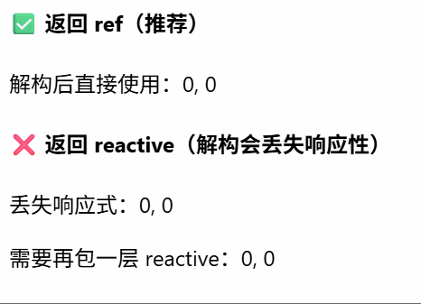
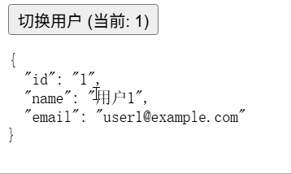

# [0088. 组合式函数](https://github.com/tnotesjs/TNotes.vue/tree/main/notes/0088.%20%E7%BB%84%E5%90%88%E5%BC%8F%E5%87%BD%E6%95%B0)

<!-- region:toc -->

- [1. 🎯 本节内容](#1--本节内容)
- [2. 🫧 评价](#2--评价)
- [3. 🤔 什么是组合式函数？](#3--什么是组合式函数)
- [4. 🤔 组合式函数（Composables）和普通工具函数（Utils）之间有什么区别？](#4--组合式函数composables和普通工具函数utils之间有什么区别)
- [5. 🤔 为什么要把逻辑提取成 composable？](#5--为什么要把逻辑提取成-composable)
- [6. 🤔 应该如何设计响应式参数让 composable 更加灵活？](#6--应该如何设计响应式参数让-composable-更加灵活)
- [7. 🤔 为什么建议 composable 返回多个 ref，而不是 reactive 对象？](#7--为什么建议-composable-返回多个-ref而不是-reactive-对象)
- [8. 🤔 composable 里可以写副作用吗？](#8--composable-里可以写副作用吗)
- [9. 🤔 composable 的调用限制是？](#9--composable-的调用限制是)
- [10. 🤔 composable 和 mixin、无渲染组件有什么区别？](#10--composable-和-mixin无渲染组件有什么区别)
  - [10.1. 和 mixin 的区别](#101-和-mixin-的区别)
  - [10.2. 和无渲染组件的区别](#102-和无渲染组件的区别)
  - [10.3. 和 React Hooks 的区别](#103-和-react-hooks-的区别)
- [11. 💻 demos.1 - 组合式函数的基本定义与使用](#11--demos1---组合式函数的基本定义与使用)
- [12. 💻 demos.2 - 组合式函数的嵌套组合](#12--demos2---组合式函数的嵌套组合)
- [13. 💻 demos.3 - 返回 ref 而非 reactive 以保留解构后的响应性](#13--demos3---返回-ref-而非-reactive-以保留解构后的响应性)
- [14. 💻 demos.4 - 响应式参数设计：toValue + watchEffect](#14--demos4---响应式参数设计tovalue--watcheffect)
- [15. 💻 demos.5 - composable 的生命周期绑定到宿主组件](#15--demos5---composable-的生命周期绑定到宿主组件)
- [16. 💻 demos.6 - TODO LIST 示例](#16--demos6---todo-list-示例)
- [17. 💻 demos.7 - composable 在 `<script setup>` 和非 `<script setup>` 中的写法差异](#17--demos7---composable-在-script-setup-和非-script-setup-中的写法差异)
- [18. 🔗 引用](#18--引用)

<!-- endregion:toc -->

## 1. 🎯 本节内容

- 概念定义
- 逻辑复用
- use 命名
- 响应式参数
- 返回 ref
- 副作用清理
- 调用限制
- 模式对比

## 2. 🫧 评价

composables 是 Vue 3 最核心的设计之一，它提供了一种全新的方式来组织和复用组件逻辑，极大地提升了代码的可维护性和可组合性。

掌握 composable 的基本写法其实不难，我们日常组件咋写，composables 就可以咋写，它里边儿能正常使用 Vue 3 的 API（包括响应式 API、生命周期钩子等），难点在于合理拆分逻辑、明确 composable 的边界设计上。

## 3. 🤔 什么是组合式函数？

在 Vue 应用的概念中，“组合式函数”(Composables) 是一个利用 Vue 的组合式 API 来封装和复用「有状态逻辑」的函数。

你可以把它理解成组件内部逻辑的抽离版本。原来某段逻辑写在组件里，现在把它提取到一个普通函数里，并在函数内部继续使用 `ref`、`computed`、`watchEffect`、生命周期钩子等组合式 API，然后把需要暴露的状态和方法返回出去。

官方约定组合式函数使用驼峰命名，并以 `use` 开头，比如 `useMouse`、`useFetch`、`useForm`。这个命名一眼就能告诉你：这不是普通函数，而是一段可复用的响应式逻辑。

## 4. 🤔 组合式函数（Composables）和普通工具函数（Utils）之间有什么区别？

组合式函数（Composables）和普通工具函数（Utils）的关键区别在于：

- 普通工具函数更适合处理无状态逻辑，比如格式化日期、拼接字符串，和 Vue 无关。
- 组合式函数更适合处理有状态逻辑，比如鼠标位置、请求状态、表单校验、滚动监听，可以和 Vue 更好地集成。

| 维度 | 工具函数（Utils） | 组合式函数（Composables） |
| --- | --- | --- |
| 本质 | 通常是纯函数，输入 → 输出 | 有状态逻辑的封装 |
| 响应式 | 不参与 Vue 响应式系统 | 可以创建并返回响应式状态（ref、reactive） |
| 生命周期 | 无 | 可以使用 onMounted、onUnmounted 等钩子 |
| 调用位置 | 任意位置 | 必须在 `<script setup>` 同步上下文中调用 |
| 职责 | 数据变换、格式化、校验等无副作用的计算 | 管理副作用：数据请求、事件监听、定时器、DOM 交互 |
| 返回值 | 计算结果 | 通常是 ref 或 reactive 封装的响应式数据，以及一些方法 |
| 典型例子 | `formatDate()`、`debounce()`、`parseQuery()` | `useMouse()`、`useFetch()`、`useScroll()`、`useForm()` |

## 5. 🤔 为什么要把逻辑提取成 composable？

最终目的：实现「高内聚、低耦合」的代码组织方式。

先看一个经典的鼠标跟踪例子：

::: code-group

```html [App.vue]
<template>
  <p>鼠标位置：{{ x }}，{{ y }}</p>
</template>

<script setup>
  import { useMouse } from './useMouse'

  const { x, y } = useMouse()
</script>
```

```js [useMouse.js]
import { ref, onMounted, onUnmounted } from 'vue'

export function useMouse() {
  const x = ref(0)
  const y = ref(0)

  const update = (event) => {
    x.value = event.pageX
    y.value = event.pageY
  }

  onMounted(() => window.addEventListener('mousemove', update))
  onUnmounted(() => window.removeEventListener('mousemove', update))

  return { x, y }
}
```

:::

如果你直接把逻辑写在组件里，一旦有其它组件要用，你就得复制一份代码过去，虽然也能工作，这会让代码变得冗余。

使用 composable 的形式来写，有两个明显好处：

- 逻辑可以在多个组件里复用
- 组件代码会更聚焦于「怎么渲染」，复杂逻辑则拆到独立文件中

官方还特别强调了一点：抽取组合式函数不只是为了复用，同时也提供了一种更好地代码组织方式。一个大组件里如果同时处理搜索、分页、拖拽、请求、权限判断，读起来会很痛苦。把这些逻辑按主题拆成多个 `useXxx()` 之后，组件会清爽很多。

::: tip 每次调用都会得到独立状态

像 `useMouse()` 这样的组合式函数，每调用一次，都会创建一份新的 `x`、`y` 状态。也就是说，不同组件之间默认不会共享状态。

如果你想跨组件共享同一份状态，那已经不是单纯的逻辑复用问题了，更接近「状态管理」。

:::

## 6. 🤔 应该如何设计响应式参数让 composable 更加灵活？

composable 的参数最好既支持普通值，也支持 `ref` 或 getter。这样调用方在不同场景下会更自由。

::: code-group

```js [1]
import { ref } from 'vue'

export function useFetch(url) {
  const data = ref(null)
  const error = ref(null)

  fetch(url)
    .then((response) => response.json())
    .then((json) => (data.value = json))
    .catch((err) => (error.value = err))

  return { data, error }
}
```

```js [2]
import { ref, toValue, watchEffect } from 'vue'

export function useFetch(url) {
  const data = ref(null)
  const error = ref(null)

  watchEffect(() => {
    data.value = null
    error.value = null

    fetch(toValue(url))
      .then((response) => response.json())
      .then((json) => (data.value = json))
      .catch((err) => (error.value = err))
  })

  return { data, error }
}

// toValue 注解：
// toValue() 是一个在 3.3 版本中新增的 API
// 它的设计目的是将 ref 或 getter 规范化为值
// 如果参数是 ref，它会返回 ref 的值
// 如果参数是函数，它会调用函数并返回其返回值
// 它的工作方式类似于 unref()，但对函数有特殊处理
```

:::

- 版本 1 的 `useFetch()` 只能接收静态 URL 字符串，如果你想传入一个响应式 URL，就得自己在外面写个 `watchEffect` 来监听变化。
- 版本 2 的 `useFetch()` 实现现在能接收静态 URL 字符串、ref 和 getter，使其更加灵活。

上述的 `useFetch()` 只是官方提供的一个示例，具体如何设计还得看我们具体项目中的业务场景。核心原则是：让调用方在使用时尽可能方便，不要强制消费者只能传入某种特定类型的参数。

## 7. 🤔 为什么建议 composable 返回多个 ref，而不是 reactive 对象？

官方推荐的做法是：组合式函数返回一个普通对象，对象里放多个 `ref`。

示例：

```js
// x 和 y 是两个 ref
const { x, y } = useMouse()
```

这样做的核心原因是「解构之后仍然保留响应性」。

如果你返回的是一个 `reactive` 对象，调用方一旦直接解构，响应性连接就可能丢失。

```js
const state = reactive({ x: 0, y: 0 })
const { x, y } = state

// 此时 x、y 只是普通值，不再和原对象保持响应式联动
```

而 `ref` 不一样，它本身就是响应式容器：

```js
const { x, y } = useMouse()

console.log(x.value)
```

如果你更喜欢对象属性访问的写法，也可以在消费端再包一层：

```js
import { reactive } from 'vue'

const mouse = reactive(useMouse())
console.log(mouse.x)
```

简单来说，返回「普通对象 + 多个 ref」兼容性最高，也最符合组合式函数的解构使用方式。

## 8. 🤔 composable 里可以写副作用吗？

::: tip 理解术语：“副作用”

副作用就是函数除了返回值之外，对外部产生的变化，比如修改 DOM、发起网络请求、改变全局变量等。

:::

可以，而且很多 composable 本来就是为了封装副作用。

比如：

- 监听 DOM 事件
- 发起异步请求
- 注册定时器
- 订阅外部数据源

但这里有两个规则必须记住：

1. 要在合适的生命周期里启动副作用
2. 要在组件卸载时清理副作用

示例：

```js
import { onMounted, onUnmounted } from 'vue'

export function useEventListener(target, event, callback) {
  onMounted(() => target.addEventListener(event, callback))
  onUnmounted(() => target.removeEventListener(event, callback))
}
```

如果你漏掉清理逻辑，就可能造成内存泄漏，或者让已经销毁的组件还在响应旧事件。

对于 SSR，也要额外注意：依赖浏览器 DOM 的代码不能在服务端执行，所以这类逻辑应该放在 `onMounted()` 这类仅浏览器端触发的钩子里。

## 9. 🤔 composable 的调用限制是？

composable 不是任何地方都能随便调。

官方给出的限制是：

- 只能在 `<script setup>` 中调用
- 或者在组件的 `setup()` 中调用
- 一般要求同步调用

这样做不是 Vue 在故意添加限制，而是因为组合式函数内部经常会注册生命周期、计算属性和侦听器。Vue 需要知道「当前正在为哪个组件实例注册这些东西」，否则这些绑定关系就无法建立。

```html
<script setup>
  import { useMouse } from './useMouse'

  const { x, y } = useMouse()
</script>
```

在 Options API 中也能使用组合式函数，但要放在 `setup()` 里：

```js
import { useMouse } from './useMouse'

export default {
  setup() {
    const { x, y } = useMouse()
    return { x, y }
  },
}
```

::: tip

`<script setup>` 是唯一在调用 `await` 之后仍可调用组合式函数的地方。编译器会在异步操作之后自动为你恢复当前的组件实例上下文。

:::

## 10. 🤔 composable 和 mixin、无渲染组件有什么区别？

::: details 看看 Vue 官方怎么描述

这部分官方主要是在回答一个问题：为什么 Vue 3 更推荐 composable ，而不是继续重度依赖老方案。


:::

### 10.1. 和 mixin 的区别

mixin 在 Vue 2 时代很常见，但它有几个老问题：

- 数据和方法的来源不清晰
- 多个 mixin 之间容易发生命名冲突
- mixin 之间可能靠约定属性名隐式耦合

composable 更像普通函数调用，依赖关系是显式的，返回什么、传入什么都写在代码上，读起来更可控。

### 10.2. 和无渲染组件的区别

无渲染组件可以通过插槽复用逻辑和部分渲染控制，但它会引入额外组件实例。

如果你只是想复用纯逻辑，composable 更轻量，因为它不会多创建组件层级。只有当你既想复用逻辑，又想复用渲染结构时，无渲染组件才更合适。

### 10.3. 和 React Hooks 的区别

composable 和 React Hooks 在「抽离逻辑」这件事上很像，但底层模型不一样。

Vue 的 composable 是建立在细粒度响应式系统上的，不依赖每次组件重渲染都重新执行整套 Hook 逻辑。所以它们在依赖追踪方式、心智负担和性能特征上都和 React Hooks 不完全相同。

你可以把它理解成：两者解决的问题很像，但 Vue 走的是响应式驱动路线，不是调用顺序驱动路线。

## 11. 💻 demos.1 - 组合式函数的基本定义与使用

::: code-group

```html [App.vue]
<script setup>
  import { useMouse } from './useMouse.js'

  // 调用组合式函数，解构获取响应式状态
  const { x, y } = useMouse()
</script>

<template>
  <!-- 模板中直接使用 ref，自动解包 -->
  <p>鼠标位置：{{ x }}, {{ y }}</p>
</template>
```

```js [useMouse.js]
import { ref, onMounted, onUnmounted } from 'vue'

// 约定：组合式函数以 use 开头，使用驼峰命名
export function useMouse() {
  // 用 ref 管理有状态逻辑
  const x = ref(0)
  const y = ref(0)

  function update(event) {
    x.value = event.pageX
    y.value = event.pageY
  }

  // 组合式函数可以挂靠在调用方的生命周期上
  onMounted(() => window.addEventListener('mousemove', update))
  onUnmounted(() => window.removeEventListener('mousemove', update))

  // 返回需要暴露的状态
  return { x, y }
}
```

:::


鼠标在视图中移动，坐标会实时更新。这个功能完全由 `useMouse()` 组合式函数提供，组件本身没有任何与鼠标事件相关的代码。

## 12. 💻 demos.2 - 组合式函数的嵌套组合

::: code-group

```html [App.vue]
<script setup>
  import { useMouse } from './useMouse.js'

  // useMouse 内部复用了 useEventListener，实现了逻辑的嵌套组合
  const { x, y } = useMouse()
</script>

<template>
  <p>鼠标位置：{{ x }}, {{ y }}</p>
</template>
```

```js [useMouse.js]
import { ref } from 'vue'
import { useEventListener } from './useEventListener.js'

export function useMouse() {
  const x = ref(0)
  const y = ref(0)

  // composable 可以调用其他 composable，像搭积木一样组合逻辑
  useEventListener(window, 'mousemove', (event) => {
    x.value = event.pageX
    y.value = event.pageY
  })

  return { x, y }
}
```

```js [useEventListener.js]
import { onMounted, onUnmounted } from 'vue'

// 将「注册 / 移除事件监听器」这个通用逻辑单独抽成 composable
export function useEventListener(target, event, callback) {
  onMounted(() => target.addEventListener(event, callback))
  onUnmounted(() => target.removeEventListener(event, callback))
}
```

:::


每个 composable 负责一个单一的功能点，composable 之间可以相互调用，形成层层嵌套的组合关系。`useMouse()` 内部复用了 `useEventListener()`，实现了事件监听逻辑的抽离和复用。

## 13. 💻 demos.3 - 返回 ref 而非 reactive 以保留解构后的响应性

::: code-group

```html [App.vue]
<script setup>
  import { reactive } from 'vue'
  import { useMouseRef } from './useMouseRef.js'
  import { useMouseReactive } from './useMouseReactive.js'

  // ✅ 正确做法：返回普通对象 + 多个 ref，解构后仍保持响应性
  const { x: rx, y: ry } = useMouseRef()

  // ❌ 错误做法：返回 reactive 对象，解构后丢失响应性
  // 用 reactive 包一层才能恢复，但已失去 composable 简洁的优势
  const { x, y } = useMouseReactive()
  const state = reactive(useMouseReactive())
</script>

<template>
  <h4>✅ 返回 ref（推荐）</h4>
  <p>解构后直接使用：{{ rx }}, {{ ry }}</p>

  <h4>❌ 返回 reactive（解构会丢失响应性）</h4>
  <p>丢失响应式：{{ x }}, {{ y }}</p>
  <p>需要再包一层 reactive：{{ state.x }}, {{ state.y }}</p>
</template>
```

```js [useMouseRef.js]
import { ref, onMounted, onUnmounted } from 'vue'

// 推荐：返回包含多个 ref 的普通对象
export function useMouseRef() {
  const x = ref(0)
  const y = ref(0)

  const update = (e) => {
    x.value = e.pageX
    y.value = e.pageY
  }
  onMounted(() => window.addEventListener('mousemove', update))
  onUnmounted(() => window.removeEventListener('mousemove', update))

  return { x, y } // 普通对象，解构后 x、y 各自是 ref，响应性不丢失
}
```

```js [useMouseReactive.js]
import { reactive, onMounted, onUnmounted } from 'vue'

// 不推荐：返回 reactive 对象
export function useMouseReactive() {
  const state = reactive({ x: 0, y: 0 })

  const update = (e) => {
    state.x = e.pageX
    state.y = e.pageY
  }
  onMounted(() => window.addEventListener('mousemove', update))
  onUnmounted(() => window.removeEventListener('mousemove', update))

  return state // 如果调用方直接 const { x, y } = useMouseReactive()，响应性就断了
}
```

:::



## 14. 💻 demos.4 - 响应式参数设计：toValue + watchEffect

::: code-group

```html [App.vue]
<script setup>
  import { ref } from 'vue'
  import { useFetch } from './useFetch.js'

  // 传入 ref，URL 变化时自动重新请求
  const userId = ref(1)
  const { data, error, loading } = useFetch(() => `/api/user/${userId.value}`)

  function nextUser() {
    userId.value++
  }
</script>

<template>
  <button @click="nextUser">切换用户 (当前: {{ userId }})</button>
  <p v-if="loading">加载中...</p>
  <p v-else-if="error">出错了：{{ error }}</p>
  <pre v-else>{{ data }}</pre>
</template>
```

```js [useFetch.js]
import { ref, watchEffect, toValue } from 'vue'

// 参数设计：同时支持 ref、getter 函数和普通字符串
export function useFetch(url) {
  const data = ref(null)
  const error = ref(null)
  const loading = ref(false)

  watchEffect(() => {
    // toValue 会自动解析 ref 或 getter，得到最终值
    // 在 watchEffect 内调用，确保依赖被正确追踪
    const resolvedUrl = toValue(url)

    loading.value = true
    data.value = null
    error.value = null

    // 用 setTimeout 模拟异步请求（实际项目中用 fetch）
    setTimeout(() => {
      // mock 数据
      const id = resolvedUrl.match(/\d+/)?.[0] ?? '0'
      data.value = { id, name: `用户${id}`, email: `user${id}@example.com` }
      loading.value = false
    }, 500)
  })

  return { data, error, loading }
}
```

:::



## 15. 💻 demos.5 - composable 的生命周期绑定到宿主组件

::: code-group

```html [App.vue]
<script setup>
  import { ref } from 'vue'
  import TimerDemo from './TimerDemo.vue'

  const show = ref(true)
</script>

<template>
  <p>
    <button @click="show = false">卸载子组件（触发 onUnmounted 清理）</button>
  </p>
  <p>
    <button @click="show = true">重新挂载（触发 onMounted 重启）</button>
  </p>
  <hr />
  <!-- v-if=false 时，TimerDemo 组件会被卸载，触发其内部 composable 的 onUnmounted -->
  <TimerDemo v-if="show" />
  <p v-else style="color: gray;">组件已卸载，定时器已清理</p>
</template>
```

```html [TimerDemo.vue]
<script setup>
  import { useTimer } from './useTimer.js'

  // composable 的生命周期钩子绑定到当前组件实例
  // 当 TimerDemo 被卸载时，onUnmounted 会自动执行清理逻辑
  const { count, pause, resume } = useTimer(1000)
</script>

<template>
  <p>计数：{{ count }}</p>
  <button @click="pause">暂停</button>
  <button @click="resume">恢复</button>
</template>
```

```js [useTimer.js]
import { ref, onUnmounted } from 'vue'

export function useTimer(interval = 1000) {
  const count = ref(0)
  let timer = null

  function resume() {
    if (timer) return
    timer = setInterval(() => {
      count.value++
    }, interval)
  }

  function pause() {
    clearInterval(timer)
    timer = null
  }

  // 关键：composable 内部的生命周期钩子绑定到调用它的组件实例
  // 当组件卸载时，Vue 自动调用此回调，清理定时器，防止内存泄漏
  onUnmounted(() => {
    clearInterval(timer)
    timer = null
  })

  // 默认启动
  resume()

  return { count, pause, resume }
}
```

:::


## 16. 💻 demos.6 - TODO LIST 示例

::: code-group

```html [App.vue]
<script setup>
  import { useTodoList } from './useTodoList.js'

  // 一个 composable 聚合了多个子 composable，组件代码非常简洁
  const { newTodo, todos, add, remove, remaining } = useTodoList()
</script>

<template>
  <div>
    <input v-model="newTodo" placeholder="输入待办..." @keyup.enter="add" />
    <button @click="add">添加</button>
  </div>
  <ul>
    <li v-for="todo in todos" :key="todo.id">
      {{ todo.text }}
      <button @click="remove(todo.id)">删除</button>
    </li>
  </ul>
  <p>剩余 {{ remaining }} 项</p>
</template>
```

```js [useTodoList.js]
import { ref, computed } from 'vue'
import { useInput } from './useInput.js'

// 聚合 composable：内部调用子 composable，把「输入」和「列表管理」分开
export function useTodoList() {
  const { value: newTodo, reset } = useInput()
  const todos = ref([
    { id: 1, text: '学习 Vue 组合式函数' },
    { id: 2, text: '写精读笔记' },
  ])

  let nextId = 3

  function add() {
    const text = newTodo.value.trim()
    if (!text) return
    todos.value.push({ id: nextId++, text })
    reset()
  }

  function remove(id) {
    todos.value = todos.value.filter((t) => t.id !== id)
  }

  const remaining = computed(() => todos.value.length)

  return { newTodo, todos, add, remove, remaining }
}
```

```js [useInput.js]
import { ref } from 'vue'

// 独立的小 composable：封装输入框的值管理和重置
export function useInput(initial = '') {
  const value = ref(initial)
  function reset() {
    value.value = initial
  }
  return { value, reset }
}
```

:::


每个 composable 负责一个单一的功能点，组件本身只关注「怎么渲染」，复杂逻辑则拆到独立文件中。这样代码更清晰，也更容易维护。

## 17. 💻 demos.7 - composable 在 `<script setup>` 和非 `<script setup>` 中的写法差异

::: code-group

```html [App.vue（setup）]
<script setup>
  import { useMouse } from './useMouse.js'

  // ✅ 在 <script setup> 中同步调用 composable
  const { x, y } = useMouse()
</script>

<template>
  <p>鼠标位置：{{ x }}, {{ y }}</p>
</template>
```

```html [App.vue（非 setup）]
<script>
  import { useMouse } from './useMouse.js'

  // Options API 中使用 composable，必须在 setup() 里调用
  // 返回值要从 setup() 中 return，才能暴露给模板和 this
  export default {
    setup() {
      const { x, y } = useMouse()
      return { x, y }
    },
    mounted() {
      // setup 暴露的属性可通过 this 访问
      console.log('Options API 中通过 this 访问：', this.x, this.y)
    },
  }
</script>

<template>
  <p>鼠标位置：{{ x }}, {{ y }}</p>
</template>
```

```js [useMouse.js]
import { ref, onMounted, onUnmounted } from 'vue'

// 标准 composable：可在 <script setup> 和 setup() 中调用
export function useMouse() {
  const x = ref(0)
  const y = ref(0)

  const update = (e) => {
    x.value = e.pageX
    y.value = e.pageY
  }
  onMounted(() => window.addEventListener('mousemove', update))
  onUnmounted(() => window.removeEventListener('mousemove', update))

  return { x, y }
}
```

:::


两种写法的最终效果都是一样的，都是在组件中使用 `useMouse()` 组合式函数来获取鼠标坐标。区别在于：

- `<script setup>` 语法更简洁，直接在顶层调用 `useMouse()`，不需要显式写 `setup()` 函数。
- 非 `<script setup>` 语法需要在 `setup()` 函数里调用 `useMouse()`，并且要把返回值通过 `return` 暴露出来，才能在模板中使用。

## 18. 🔗 引用

- [Vue.js 官方文档 - 组合式函数][1]

[1]: https://cn.vuejs.org/guide/reusability/composables.html
