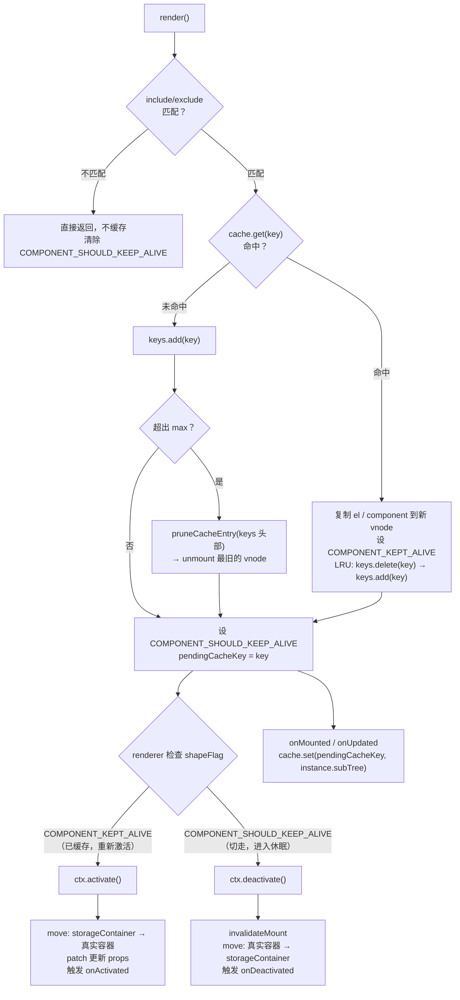

# [0093. KeepAlive 和 component](https://github.com/tnotesjs/TNotes.vue/tree/main/notes/0093.%20KeepAlive%20%E5%92%8C%20component)

<!-- region:toc -->

- [1. 🎯 本节内容](#1--本节内容)
- [2. 🫧 评价](#2--评价)
- [3. 🤔 `<keep-alive>` 是什么？](#3--keep-alive-是什么)
  - [3.1. `<keep-alive>` 简介](#31-keep-alive-简介)
  - [3.2. `<keep-alive>` 使用场景](#32-keep-alive-使用场景)
  - [3.3. `<keep-alive>` 提供的三个 props：`include`、`exclude`、`max`](#33-keep-alive-提供的三个-propsincludeexcludemax)
    - [`include`、`exclude`、`max`](#includeexcludemax)
    - [组件名匹配机制](#组件名匹配机制)
  - [3.4. 被 `<keep-alive>` 缓存的组件拥有两个独有的生命周期钩子](#34-被-keep-alive-缓存的组件拥有两个独有的生命周期钩子)
  - [3.5. 经典模式：`<keep-alive>` 配合 `<component>`、Vue Router 一起使用](#35-经典模式keep-alive-配合-componentvue-router-一起使用)
- [4. 🤔 `<component>` 是什么？](#4--component-是什么)
  - [4.1. `<component>` 简介](#41-component-简介)
  - [4.2. `<component :is>` 和 `v-if` 的区别](#42-component-is-和-v-if-的区别)
- [5. 🤔 `<keep-alive>` 到底缓存了什么？](#5--keep-alive-到底缓存了什么)
- [6. 🤔 `<keep-alive>` 的缓存原理是？【深入原理】](#6--keep-alive-的缓存原理是深入原理)
- [7. 🤔 LRU 缓存是什么？](#7--lru-缓存是什么)
- [8. 💻 demos.1 - `<component>` - 基本用法：标签页切换](#8--demos1---component---基本用法标签页切换)
- [9. 💻 demos.2 - `<component>` - 实现动态 HTML 元素](#9--demos2---component---实现动态-html-元素)
- [10. 💻 demos.3 - `<component>` - 传递 props 和监听事件](#10--demos3---component---传递-props-和监听事件)
- [11. 💻 demos.4 - `<keep-alive>` - 基本用法：缓存组件状态](#11--demos4---keep-alive---基本用法缓存组件状态)
- [12. 💻 demos.5 - `<keep-alive>` - 属性 - `include` / `exclude` / `max`](#12--demos5---keep-alive---属性---include--exclude--max)
- [13. 💻 demos.6 - `<keep-alive>` - 生命周期 - `onActivated` / `onDeactivated`](#13--demos6---keep-alive---生命周期---onactivated--ondeactivated)
- [14. 💻 demos.7 - 实战练习：结合 `<keep-alive>` + `<component>` + Vue Router 实现动态组件缓存效果](#14--demos7---实战练习结合-keep-alive--component--vue-router-实现动态组件缓存效果)
- [15. 🔗 引用](#15--引用)

<!-- endregion:toc -->

## 1. 🎯 本节内容

- 缓存实例
- 动态组件
- 状态保留
- include
- exclude
- max 限制
- 激活钩子
- 使用边界

## 2. 🫧 评价

`<keep-alive>` 很常用，尤其是标签页、动态组件和路由页面缓存。在使用的时候需要注意 `<keep-alive>` 的适用场景和边界，不能盲目缓存所有组件，否则可能会带来内存压力和状态混乱的问题。合理使用 `<keep-alive>` 可以大大提升用户体验，但不当使用反而会适得其反。

## 3. 🤔 `<keep-alive>` 是什么？

### 3.1. `<keep-alive>` 简介

keep-alive 是 Vue 的一个内置组件，用于缓存动态组件的实例而不是销毁它们。当组件在 keep-alive 中被切换时，它会被「停用」而非「销毁」，其 DOM 元素和组件状态都会被保留在内存中。当再次激活时，之前的状态会完整恢复。

- 无 keep-alive，切换 = 销毁重建，状态会自动重置
- 有 keep-alive，切换 = 存入内存/从内存取出，状态可以持久化

### 3.2. `<keep-alive>` 使用场景

| 场景                           | 是否需要 keep-alive              |
| ------------------------------ | -------------------------------- |
| 标签页切换，需保持各标签页状态 | 需要                             |
| 多步骤表单，切换步骤时保持输入 | 需要                             |
| 列表、详情页来回切换           | 需要，保持列表滚动位置和筛选条件 |

不太适合盲目缓存的场景：

- 页面很多，缓存后内存压力明显上涨
- 页面内容依赖实时数据，旧状态保留反而容易误导
- 某些组件切走后本来就应该彻底重置
- 弹窗 / 抽屉等短期展示的组件，不需要缓存，销毁重建开销小
- 大体积图表组件，只展示一次，不需要缓存，配合异步组件做懒加载更合适
- ……

`KeepAlive` 是“状态保留工具”：

- 如果你的业务场景需要在组件切走后保留状态，那么它就是一个非常合适的选择。
- 如果组件本身不适合被缓存，那么它可能就不是最佳方案了。
- 如果你真正想解决的是渲染性能问题，还得结合组件设计、懒加载、列表优化一起看，而不是见到切换就一股脑缓存。

### 3.3. `<keep-alive>` 提供的三个 props：`include`、`exclude`、`max`

#### `include`、`exclude`、`max`

`<keep-alive>` 提供三个 props 来精细化控制缓存行为：

| Prop | 作用 | 接收类型 |
| --- | --- | --- |
| `include` | 只缓存匹配的组件 | 字符串（逗号分隔）、正则、数组 |
| `exclude` | 不缓存匹配的组件 | 字符串（逗号分隔）、正则、数组 |
| `max` | 最大缓存实例数，超出时按 LRU 策略淘汰 | 数字 |

默认情况下，`<keep-alive>` 会缓存内部所有可缓存组件。但你可以通过 `include` 和 `exclude` 精细控制，它们支持多种写法：

1. 逗号分隔字符串
2. 正则表达式
3. 数组

```html
<!-- 1. 逗号分隔字符串 -->
<keep-alive include="UserPanel,MessagePanel">
  <component :is="activeComponent" />
</keep-alive>

<!-- 2. 正则表达式 -->
<keep-alive :include="/^(User|Message)Panel$/">
  <component :is="activeComponent" />
</keep-alive>

<!-- 3. 数组 -->
<keep-alive :include="['UserPanel', 'MessagePanel']">
  <component :is="activeComponent" />
</keep-alive>
```

`max` 则是一个数字，表示最多缓存多少个组件实例。一旦缓存数量即将超过上限，Vue 会把“最近最少使用”的那份缓存淘汰掉。

```html
<keep-alive :max="10">
  <!-- :max="10" 表示最多缓存 10 个组件实例，超出时按 LRU 策略淘汰 -->
  <component :is="activeComponent" />
</keep-alive>
```

#### 组件名匹配机制

这里最关键的边界是：匹配依据是组件的 `name` 选项，不是文件路径，也不是你在父组件里起的变量名。

也就是说，如果你想让某个组件按名字命中缓存规则，它必须有明确的组件名。

官方还补充了一个版本细节：在 Vue 3.2.34+ 中，使用 `<script setup>` 的单文件组件会自动根据文件名推导出组件名，因此很多时候不再需要手动写 `name`。

::: code-group

```html [script]
<script>
  // 匹配依据是组件的 name 选项
  export default { name: 'MyName' }
</script>
```

```html [script setup]
<!-- 
在 <script setup> 中，组件名默认从文件名推断
比如 CounterA.vue -> CounterA
-->
<script setup>
  // ...
</script>

<!-- 
如需显式指定，可添加一个额外的 <script> 块：
-->
<script>
  export default { name: 'MyName' }
</script>
```

:::

### 3.4. 被 `<keep-alive>` 缓存的组件拥有两个独有的生命周期钩子

被 `<keep-alive>` 缓存的组件拥有两个独有的生命周期钩子：

| 钩子 | 触发时机 | 使用场景 |
| --- | --- | --- |
| 激活钩子：`onActivated` | 首次挂载时 + 每次从缓存中被激活时 | 如果某个页面被缓存后需要在重新显示时刷新局部数据、恢复订阅、重建轮询，通常就放在 `onActivated()` 里处理 |
| 停用钩子：`onDeactivated` | 组件最终卸载时 + 从 DOM 移除、进入缓存时 | 如果切走时要暂停轮询、解绑非必要监听，可以放在 `onDeactivated()` |

```html
<script setup>
  import { onActivated, onDeactivated } from 'vue'

  onActivated(() => {
    console.log('组件被激活')
    // 在 onActivated 主要实现状态恢复逻辑，比如：刷新数据或恢复轮询
  })

  onDeactivated(() => {
    console.log('组件被停用')
    // 在 onDeactivated 主要实现清理逻辑，比如：停止定时器或取消请求
  })
</script>
```

注意事项：

- 普通生命周期的区别：被 `<keep-alive>` 缓存的组件不会触发 `onUnmounted`，只有真正从缓存中移除（如 `<keep-alive>` 被卸载、或被 `max` 淘汰）时才会触发。
- 作用范围：这两个钩子不仅作用于被缓存的根组件，也会作用于缓存树中的后代组件。

### 3.5. 经典模式：`<keep-alive>` 配合 `<component>`、Vue Router 一起使用

在实际项目中，keep-alive 最常配合 Vue Router 使用，缓存路由页面：

```html
<template>
  <router-view v-slot="{ Component }">
    <keep-alive :include="cachedViews">
      <component :is="Component" />
    </keep-alive>
  </router-view>
</template>

<script setup>
  import { ref } from 'vue'

  // 动态管理需要缓存的页面（组件 name 必须匹配）
  const cachedViews = ref(['UserList', 'UserDetail'])
</script>
```

这种模式下，用户从列表页进入详情页再返回时，列表页的滚动位置、搜索条件、分页状态都会被保留，无需重新请求数据。

## 4. 🤔 `<component>` 是什么？

### 4.1. `<component>` 简介

::: tip Vue 官方文档对 `<component>` 的定义

`<component>` 是一个用于渲染动态组件或元素的“元组件”。

:::

`<component>` 是 Vue 内置的一个特殊元素（官方文档中归类为"内置特殊元素"），它不是常规组件，而是一个“元组件” => 用来渲染别的组件的组件。

它的核心能力 => 通过 `is` 属性动态决定渲染什么。

你可以把它理解成一个“占位符”，最终渲染成什么组件，取决于 `is` 属性绑定的值。当 `is` 的值发生变化时，旧组件会被销毁，新组件会被创建 => 这正是“动态组件”这个概念的含义。

`is` 属性可以接收以下类型的值：

```html
<template>
  <!-- 1. 组件对象（最常用） -->
  <component :is="currentComponent" />

  <!-- 2. 被注册的组件名字符串（需要全局注册） -->
  <component :is="'MyComponent'" />

  <!-- 3. HTML 原生元素名字符串 -->
  <component :is="'div'">渲染为 div</component>
  <component :is="tag">动态标签</component>
</template>

<script setup>
  import { ref } from 'vue'
  const tag = ref('h1') // 可以动态改变渲染的 HTML 标签
</script>
```

典型应用场景包括标签页切换、多步骤表单、根据配置动态渲染不同面板等。

凡是“同一个位置需要根据条件渲染不同组件”的地方，都可以用 `<component>`。

### 4.2. `<component :is>` 和 `v-if` 的区别

`<component :is>` 和 `v-if` 同为条件渲染，两者的核心区别：

```html
<!-- v-if：所有分支同时写在模板中 -->
<HomeTab v-if="currentTab === 'home'" />
<ProfileTab v-if="currentTab === 'profile'" />
<SettingsTab v-if="currentTab === 'settings'" />

<!-- component：只需一行，组件名由数据驱动 -->
<component :is="currentComponent" />
```

当可选组件数量较多或组件列表是动态的（比如从后端配置获取），`<component :is>` 比一长串 `v-if` / `v-else-if` 更简洁、更易维护。

注意：

- 每次切换，旧组件都会被完全销毁，新组件会重新创建，所有状态（表单输入、滚动位置等）都会丢失。
- 如果需要保持状态，可以考虑配合 `<keep-alive>` 使用。

## 5. 🤔 `<keep-alive>` 到底缓存了什么？

`<keep-alive>` 缓存的是“被切走的组件实例”，不是简单地把一段 DOM 截图保存下来。

这意味着当组件暂时不显示时：组件不会像普通切换那样被直接销毁，它内部的响应式状态可以保留下来，下次再显示时，可以从之前的状态继续，而不是重新创建一份新实例。

所以 `<keep-alive>` 最适合解决的场景是：你希望一个组件“暂时离场，但别忘记它之前干了什么”。

## 6. 🤔 `<keep-alive>` 的缓存原理是？【深入原理】

源码位置：vuejs/core => `packages/runtime-core/src/components/KeepAlive.ts`

```
cache: Map<CacheKey, VNode>   ← 存 vnode（含 .component 引用）
keys:  Set<CacheKey>          ← 维护 LRU 顺序

storageContainer: <div>       ← 隐藏 div，存放“休眠”的真实 DOM

activate:  move DOM  storageContainer → 真实容器，再 patch 更新 props
deactivate: move DOM 真实容器 → storageContainer
缓存写入:  onMounted / onUpdated 时 cache.set(key, vnode)
LRU 淘汰:  keys 超出 max 时，unmount 最旧的 vnode（含其 DOM）
```

流程图：



## 7. 🤔 LRU 缓存是什么？

LRU = Least Recently Used，最近最少使用。

一句话：最久没被访问的，最先被淘汰。

`<keep-alive>` 可以通过 `max` 限制最多缓存多少个组件实例：

```html
<keep-alive :max="10">
  <component :is="activeComponent" />
</keep-alive>
```

一旦缓存数量即将超过上限，Vue 会把“最近最少使用”的那份缓存淘汰掉。

所以说 `max` 的缓存机制类似 LRU 缓存机制。

你可以把它理解成浏览器标签页的记忆上限：

- 最近经常切回来的页面，优先保留
- 很久没再访问的页面，先丢掉

这样做能在“状态保留”和“内存占用”之间取得平衡。

## 8. 💻 demos.1 - `<component>` - 基本用法：标签页切换

这是动态组件最典型的场景 => 根据当前选中的标签，在同一个位置渲染不同的组件：

::: code-group

```html [App.vue]
<script setup>
  import { ref, computed } from 'vue'
  import HomeTab from './HomeTab.vue'
  import ProfileTab from './ProfileTab.vue'
  import SettingsTab from './SettingsTab.vue'

  const currentTab = ref('home')

  const tabs = {
    home: HomeTab,
    profile: ProfileTab,
    settings: SettingsTab,
  }

  const labels = {
    home: '首页',
    profile: '个人主页',
    settings: '设置',
  }

  const currentComponent = computed(() => tabs[currentTab.value])
</script>

<template>
  <div>
    <button
      v-for="(_, name) in tabs"
      :key="name"
      :style="{ fontWeight: currentTab === name ? 'bold' : 'normal' }"
      @click="currentTab = name"
    >
      {{ labels[name] }}
    </button>
  </div>
  <p>当前标签：{{ labels[currentTab] }}</p>
  <component :is="currentComponent" />
</template>
```

```html [HomeTab.vue]
<template>
  <p>这是首页内容</p>
</template>
```

```html [ProfileTab.vue]
<template>
  <p>这是个人主页内容</p>
</template>
```

```html [SettingsTab.vue]
<template>
  <p>这是设置页面内容</p>
</template>
```

:::

切换不同的 tab：

::: swiper


:::

核心逻辑只有一步：`const currentComponent = computed(() => tabs[currentTab.value])`，这会把 `tabs` 映射表中对应的组件对象取出来，交给 `<component :is>` 渲染。切换标签就是切换 `currentTab` 的值，Vue 会自动销毁旧组件、创建新组件。

## 9. 💻 demos.2 - `<component>` - 实现动态 HTML 元素

`is` 属性除了接收组件对象，还可以接收 HTML 元素名字符串。同一个位置可以渲染成不同的原生标签：

::: code-group

```html [App.vue]
<script setup>
  import { ref } from 'vue'

  const tag = ref('p')

  const options = ['p', 'code', 'h3']
</script>

<template>
  <div>
    <label>选择元素：</label>
    <select v-model="tag">
      <option v-for="el in options" :key="el" :value="el">
        {{ '<' + el + '>' }}
      </option>
    </select>
  </div>

  <p>渲染结果：</p>
  <component :is="tag">我是一个 &lt;{{ tag }}&gt; 元素</component>
</template>
```

:::

最终渲染结果：

::: swiper


:::

切换下拉框，同一个 `<component>` 会渲染成不同的 HTML 标签。

- `<component :is="'p'">` 等价于 `<p>`
- `<component :is="'code'">` 等价于 `<code>`
- `<component :is="'h3'">` 等价于 `<h3>`

## 10. 💻 demos.3 - `<component>` - 传递 props 和监听事件

动态组件和普通组件一样，可以传递 props 和监听事件。下面这个示例模拟了一个通知系统，支持多种通知类型。三种通知的共有结构和行为被抽成了 `BaseNotice`，具体的通知组件委托给 `BaseNotice` 渲染：

::: code-group

```html [App.vue]
<script setup>
  import { ref, computed } from 'vue'
  import SuccessNotice from './SuccessNotice.vue'
  import WarningNotice from './WarningNotice.vue'
  import ErrorNotice from './ErrorNotice.vue'

  const typeMap = {
    success: SuccessNotice,
    warning: WarningNotice,
    error: ErrorNotice,
  }

  const noticeType = ref('success')
  const message = ref('操作成功')

  const currentNotice = computed(() => typeMap[noticeType.value])

  function onDismiss() {
    console.log('通知已关闭')
  }
</script>

<template>
  <div>
    <select v-model="noticeType">
      <option value="success">success</option>
      <option value="warning">warning</option>
      <option value="error">error</option>
    </select>
    <p>
      <input v-model="message" placeholder="输入通知内容" />
    </p>
  </div>

  <component :is="currentNotice" :message="message" @dismiss="onDismiss" />
</template>
```

```html [BaseNotice.vue]
<script setup>
  defineProps(['icon', 'message'])
  const emit = defineEmits(['dismiss'])
</script>

<template>
  <div class="msg-box">
    <span>{{ icon }} {{ message }}</span>
    <p>
      <button @click="emit('dismiss')">关闭</button>
    </p>
  </div>
</template>

<style scoped>
  .msg-box {
    width: 200px;
    border: 1px solid #ddd;
    text-align: center;
  }
</style>
```

```html [SuccessNotice.vue]
<script setup>
  import BaseNotice from './BaseNotice.vue'
  defineOptions({ inheritAttrs: false })
</script>

<template>
  <BaseNotice icon="✅" v-bind="$attrs" />
</template>
```

```html [WarningNotice.vue]
<script setup>
  import BaseNotice from './BaseNotice.vue'
  defineOptions({ inheritAttrs: false })
</script>

<template>
  <BaseNotice icon="⚠️" v-bind="$attrs" />
</template>
```

```html [ErrorNotice.vue]
<script setup>
  import BaseNotice from './BaseNotice.vue'
  defineOptions({ inheritAttrs: false })
</script>

<template>
  <BaseNotice icon="❌" v-bind="$attrs" />
</template>
```

:::

::: swiper


:::

`:message` 和 `@dismiss` 是写在 `<component>` 上的，但 Vue 会自动透传给当前实际渲染的子组件，无论切换到哪个通知类型，props 和事件都会正确传递。三个通知组件通过委托 `BaseNotice` 复用结构，仅通过 `icon` prop 区分图标。

## 11. 💻 demos.4 - `<keep-alive>` - 基本用法：缓存组件状态

下面这个示例用一个计数器直观对比「有 / 无 keep-alive」的效果差异：

::: code-group

```html [App.vue]
<script setup>
  import { ref } from 'vue'
  import CounterA from './CounterA.vue'
  import CounterB from './CounterB.vue'

  const current = ref('A')
</script>

<template>
  <button @click="current = 'A'">组件 A</button>
  <button @click="current = 'B'">组件 B</button>

  <h4>无 keep-alive（切换后计数归零）：</h4>
  <CounterA v-if="current === 'A'" />
  <CounterB v-else />

  <h4>有 keep-alive（切换后计数保持）：</h4>
  <keep-alive>
    <CounterA v-if="current === 'A'" />
    <CounterB v-else />
  </keep-alive>
</template>
```

```html [CounterA.vue]
<script setup>
  import { ref } from 'vue'
  const count = ref(0)
</script>

<template>
  <p>
    组件 A | count: {{ count }}
    <button @click="count++">+1</button>
  </p>
</template>
```

```html [CounterB.vue]
<script setup>
  import { ref } from 'vue'
  const count = ref(0)
</script>

<template>
  <p>
    组件 B | count: {{ count }}
    <button @click="count++">+1</button>
  </p>
</template>
```

:::

::: swiper


:::

操作步骤：

1. 先在组件 A 点击「+1」让 count 变成 1
2. 再切换到组件 B 点击「+1」让 count 变成 2
3. 然后切换回到组件 A，观察 count 的值，会发现：
   - 无 keep-alive：count 归零，因为组件被销毁重建了
   - 有 keep-alive：count 仍然是 1，因为组件被缓存而非销毁
4. 然后切换回到组件 B，观察 count 的值，会发现：
   - 无 keep-alive：count 归零，因为组件被销毁重建了
   - 有 keep-alive：count 仍然是 2，因为组件被缓存而非销毁

## 12. 💻 demos.5 - `<keep-alive>` - 属性 - `include` / `exclude` / `max`

下面的示例演示了三个 prop 的用法：

::: code-group

```html [App.vue]
<script setup>
  import { ref } from 'vue'
  import CounterA from './CounterA.vue'
  import CounterB from './CounterB.vue'
  import CounterC from './CounterC.vue'

  const components = { A: CounterA, B: CounterB, C: CounterC }
  const current = ref('A')
</script>

<template>
  <button
    v-for="(_, key) in components"
    :key="key"
    @click="current = key"
    :style="{ fontWeight: current === key ? 'bold' : 'normal' }"
  >
    组件 {{ key }}
  </button>

  <!-- 1. include：只缓存 A 和 B，不缓存 C -->
  <h4>include="CounterA,CounterB"（C 切换后状态丢失）</h4>
  <keep-alive include="CounterA,CounterB">
    <component :is="components[current]" />
  </keep-alive>

  <!-- 2. exclude：缓存所有组件，但排除 B -->
  <h4>exclude="CounterB"（B 切换后状态丢失）</h4>
  <keep-alive exclude="CounterB">
    <component :is="components[current]" />
  </keep-alive>

  <!-- 3. max：最多缓存 2 个实例，超出时淘汰最久未访问的 -->
  <h4>max="2"（依次切换 A -> B -> C，再回 A，A 的状态已丢失）</h4>
  <keep-alive :max="2">
    <component :is="components[current]" />
  </keep-alive>
</template>
```

```html [CounterA.vue]
<script>
  export default { name: 'CounterA' }
</script>
<script setup>
  import { ref } from 'vue'
  const count = ref(0)
</script>

<template>
  <p>
    CounterA | count: {{ count }}
    <button @click="count++">+1</button>
  </p>
</template>
```

```html [CounterB.vue]
<script>
  export default { name: 'CounterB' }
</script>
<script setup>
  import { ref } from 'vue'
  const count = ref(0)
</script>

<template>
  <p>
    CounterB | count: {{ count }}
    <button @click="count++">+1</button>
  </p>
</template>
```

```html [CounterC.vue]
<script>
  export default { name: 'CounterC' }
</script>
<script setup>
  import { ref } from 'vue'
  const count = ref(0)
</script>

<template>
  <p>
    CounterC | count: {{ count }}
    <button @click="count++">+1</button>
  </p>
</template>
```

:::


验证方法：分别在三组场景中点击 +1，切换组件后切回来，观察 count 是否保留。

- include：A、B 的 count 保留，C 的 count 归零
- exclude：A、C 的 count 保留，B 的 count 归零
- max：依次 A->B->C->A，A 的 count 归零（因为缓存上限为 2，A 已被淘汰）
  - 注意事项：当你切换到一个组件的时候，这个组件就会占一个位置，比如你在 A、B 点击了 +1 之后，如果你继续只在 A、B 之间切换，那么它们的状态都会被保留，因为它们都在缓存中；但是一旦你切换到 C，C 就会占用一个新的缓存位置，此时缓存已经满了（A、B、C 三个组件），根据 LRU 策略，最久未访问的组件就会被淘汰掉。此时如果你是从 B 切到 C，那么 B 的状态保留，A 的状态被重置；如果你是从 A 切到 C，那么 A 的状态保留，B 的状态被重置。

## 13. 💻 demos.6 - `<keep-alive>` - 生命周期 - `onActivated` / `onDeactivated`

::: code-group

```html [App.vue]
<script setup>
  import { ref, onMounted, onUnmounted } from 'vue'
  import { KeepAlive } from 'vue'
  import ChildA from './ChildA.vue'
  import ChildB from './ChildB.vue'

  const current = ref('A')
  const components = { A: ChildA, B: ChildB }

  onMounted(() => console.log('App mounted'))
  onUnmounted(() => console.log('App unmounted'))
</script>

<template>
  <p>打开控制台观察生命周期日志</p>
  <button @click="current = 'A'">切换到 A</button>
  <button @click="current = 'B'">切换到 B</button>

  <keep-alive>
    <component :is="components[current]" />
  </keep-alive>
</template>
```

```html [ChildA.vue]
<script setup>
  import { ref, onMounted, onUnmounted, onActivated, onDeactivated } from 'vue'

  const count = ref(0)

  onMounted(() => console.log('[A] onMounted（首次挂载）'))
  onUnmounted(() =>
    console.log('[A] onUnmounted（不会触发，除非从缓存中被移除）'),
  )
  onActivated(() => console.log('[A] onActivated（从缓存中激活）'))
  onDeactivated(() => console.log('[A] onDeactivated（进入缓存）'))
</script>

<template>
  <p>
    组件 A | count: {{ count }}
    <button @click="count++">+1</button>
  </p>
</template>
```

```html [ChildB.vue]
<script setup>
  import { ref, onMounted, onUnmounted, onActivated, onDeactivated } from 'vue'

  const count = ref(0)

  onMounted(() => console.log('[B] onMounted（首次挂载）'))
  onUnmounted(() =>
    console.log('[B] onUnmounted（不会触发，除非从缓存中被移除）'),
  )
  onActivated(() => console.log('[B] onActivated（从缓存中激活）'))
  onDeactivated(() => console.log('[B] onDeactivated（进入缓存）'))
</script>

<template>
  <p>
    组件 B | count: {{ count }}
    <button @click="count++">+1</button>
  </p>
</template>
```

:::

首次加载时控制台输出：

```
[A] onMounted（首次挂载）
[A] onActivated（从缓存中激活）
App mounted
```

点击「切换到 B」后：

```
[A] onDeactivated（进入缓存）
[B] onMounted（首次挂载）
[B] onActivated（从缓存中激活）
```

从 B 切回 A 后：

```
[B] onDeactivated（进入缓存）
[A] onActivated（从缓存中激活）
```

注意：此时 A 的 onMounted 不会再触发，因为它来自缓存，不是重新挂载。

## 14. 💻 demos.7 - 实战练习：结合 `<keep-alive>` + `<component>` + Vue Router 实现动态组件缓存效果

::: code-group

```js [main.js]
import { createApp } from 'vue'
import router from './router'
import App from './App.vue'

const app = createApp(App)
app.use(router)
app.mount('#app')
```

```js [router.js]
import { createRouter, createWebHistory } from 'vue-router'
import Counter from './Counter.vue'
import TextInput from './TextInput.vue'
import CheckboxList from './CheckboxList.vue'
import Timer from './Timer.vue'

const routes = [
  { path: '/', component: Counter },
  { path: '/input', component: TextInput },
  { path: '/checkboxlist', component: CheckboxList },
  { path: '/timer', component: Timer },
]

export default createRouter({
  history: createWebHistory(),
  routes,
})
```

```html [App.vue]
<template>
  <div id="app">
    <nav>
      <router-link to="/">计数器</router-link>
      <router-link to="/input">文本输入</router-link>
      <router-link to="/checkboxlist">复选框</router-link>
      <router-link to="/timer">计时器</router-link>
    </nav>
    <router-view v-slot="{ Component }">
      <keep-alive :max="3">
        <component :is="Component" />
      </keep-alive>
    </router-view>
  </div>
</template>

<style>
  body {
    font-family: Arial, sans-serif;
    margin: 0;
    padding: 0;
    background-color: #f9f9f9;
  }
  #app {
    max-width: 800px;
    margin: 0 auto;
    padding: 20px;
  }
  nav {
    margin-bottom: 20px;
  }
  nav a {
    margin-right: 10px;
    text-decoration: none;
    color: #42b983;
  }
  nav a:hover {
    text-decoration: underline;
  }
</style>
```

```html [CheckboxList.vue]
<template>
  <div class="component">
    <h1>复选框列表</h1>
    <div v-for="(item, index) in items" :key="index" class="checkbox-item">
      <label>
        <div>{{ item.name }}</div>
        <input type="checkbox" v-model="item.checked" />
      </label>
    </div>
  </div>
</template>

<script setup>
  import { ref } from 'vue'

  const items = ref([
    { name: '选项 1', checked: false },
    { name: '选项 2', checked: false },
    { name: '选项 3', checked: false },
  ])
</script>

<script>
  export default {
    name: 'CheckboxList',
  }
</script>

<style>
  .component {
    padding: 20px;
    background-color: #fff;
    border: 1px solid #ddd;
    border-radius: 5px;
    box-shadow: 0 2px 4px rgba(0, 0, 0, 0.1);
  }
  h1 {
    color: #333;
  }
  .checkbox-item {
    margin-bottom: 10px;
    display: flex;
    align-items: center;
    justify-content: space-between;
  }
  label {
    font-size: 1.2em;
    display: flex;
    justify-content: space-between;
    width: 100%;
  }
  .component label > div {
    width: 100px;
  }
  input[type='checkbox'] {
    margin-left: 10px;
  }
</style>
```

```html [Counter.vue]
<template>
  <div>
    <h1>计数器</h1>
    <p>计数：{{ count }}</p>
    <button @click="count++">增加</button>
  </div>
</template>

<script setup>
  import { ref } from 'vue'
  const count = ref(0)
</script>

<script>
  export default {
    name: 'Counter',
  }
</script>

<style>
  h1 {
    color: #333;
  }
  p {
    font-size: 1.5em;
  }
  button {
    padding: 10px 20px;
    background-color: #42b983;
    color: white;
    border: none;
    border-radius: 5px;
    cursor: pointer;
  }
  button:hover {
    background-color: #36a373;
  }
</style>
```

```html [TextInput.vue]
<template>
  <div>
    <h1>文本输入</h1>
    <input type="text" v-model="text" placeholder="请输入内容..." />
    <p>你输入的内容为：{{ text }}</p>
  </div>
</template>

<script setup>
  import { ref } from 'vue'
  const text = ref('')
</script>

<script>
  export default {
    name: 'TextInput',
  }
</script>

<style>
  h1 {
    color: #333;
  }
  input {
    padding: 10px;
    font-size: 1em;
    margin-bottom: 10px;
    border: 1px solid #ddd;
    border-radius: 5px;
    width: 100%;
    box-sizing: border-box;
  }
  p {
    font-size: 1.2em;
  }
</style>
```

```html [Timer.vue]
<template>
  <div class="component">
    <h1>计时器</h1>
    <p>时间: {{ formattedTime }}</p>
    <button @click="startTimer" :disabled="timerRunning">开始</button>
    <button @click="stopTimer" :disabled="!timerRunning">停止</button>
  </div>
</template>

<script setup>
  import { ref, computed, onUnmounted } from 'vue'

  const seconds = ref(0)
  const milliseconds = ref(0)
  const timerRunning = ref(false)
  let timer

  const startTimer = () => {
    if (!timerRunning.value) {
      timerRunning.value = true
      timer = setInterval(() => {
        milliseconds.value++
        if (milliseconds.value >= 100) {
          milliseconds.value = 0
          seconds.value++
        }
      }, 10)
    }
  }

  const stopTimer = () => {
    if (timerRunning.value) {
      timerRunning.value = false
      clearInterval(timer)
    }
  }

  const formattedTime = computed(() => {
    const ms = milliseconds.value.toString().padStart(2, '0')
    const s = seconds.value.toString().padStart(2, '0')
    return `${s}:${ms}`
  })

  onUnmounted(() => {
    clearInterval(timer)
  })
</script>

<script>
  export default {
    name: 'Timer',
  }
</script>

<style>
  .component {
    padding: 20px;
    background-color: #fff;
    border: 1px solid #ddd;
    border-radius: 5px;
    box-shadow: 0 2px 4px rgba(0, 0, 0, 0.1);
  }
  h1 {
    color: #333;
  }
  p {
    font-size: 1.5em;
  }
  button {
    padding: 10px 20px;
    background-color: #42b983;
    color: white;
    border: none;
    border-radius: 5px;
    cursor: pointer;
    margin: 0 10px;
  }
  button:hover {
    background-color: #36a373;
  }
  button:disabled {
    background-color: #ccc;
    cursor: not-allowed;
  }
</style>
```

:::

初始状态：

::: swiper


:::

App.vue 中配置了 `max=3`，表示最多缓存 3 个组件实例。你可以在四个组件之间分别修改状态，然后随意切换，观察它们的状态是否被保留，来测试 `<keep-alive>` 的缓存效果。

## 15. 🔗 引用

- [Vue.js 官方文档 - KeepAlive][1]
- [Vue.js 官方文档 - `<keep-alive>` API][2]
- [Vue.js 官方文档 - 动态组件][3]
- [Vue.js 官方文档 - 生命周期钩子][4]
- [Vuejs 官方文档 - 内置特殊元素 - component][5]

[1]: https://cn.vuejs.org/guide/built-ins/keep-alive.html
[2]: https://cn.vuejs.org/api/built-in-components.html#keepalive
[3]: https://cn.vuejs.org/guide/essentials/component-basics.html#dynamic-components
[4]: https://cn.vuejs.org/api/composition-api-lifecycle.html#onactivated
[5]: https://cn.vuejs.org/api/built-in-special-elements.html#component
