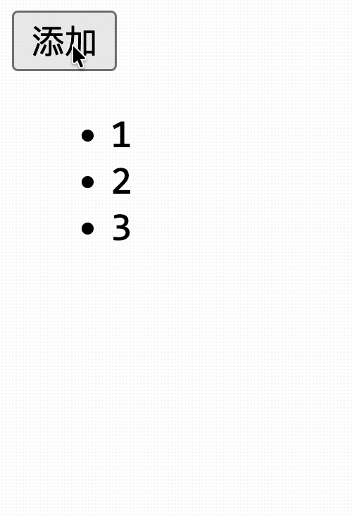
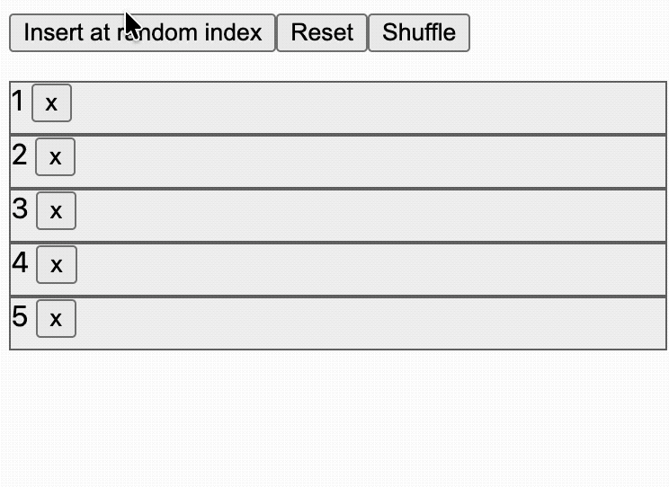
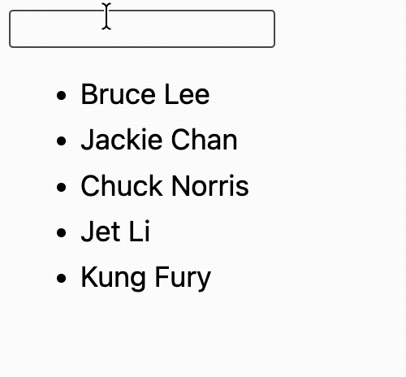

# [0094. TransitionGroup](https://github.com/tnotesjs/TNotes.vue/tree/main/notes/0094.%20TransitionGroup)

<!-- region:toc -->

- [1. 🎯 本节内容](#1--本节内容)
- [2. 🫧 评价](#2--评价)
- [3. 🤔 `<TransitionGroup>` 和 `<Transition>` 都有哪些区别？](#3--transitiongroup-和-transition-都有哪些区别)
- [4. 🤔 列表的进入 / 离开动画要怎么写？](#4--列表的进入--离开动画要怎么写)
- [5. 🤔 列表重排时会“跳”，移动动画怎么补上？](#5--列表重排时会跳移动动画怎么补上)
- [6. 🤔 `moveClass` 和 JavaScript 钩子各自适合什么场景？](#6--moveclass-和-javascript-钩子各自适合什么场景)
  - [6.1. 官方示例](#61-官方示例)
- [7. 🤔 使用 `<TransitionGroup>` 时都有哪些坑点需要注意？](#7--使用-transitiongroup-时都有哪些坑点需要注意)
  - [7.1. 忘了写稳定 `key`](#71-忘了写稳定-key)
  - [7.2. 误以为 `<TransitionGroup>` 和 `<Transition>` 完全一样](#72-误以为-transitiongroup-和-transition-完全一样)
  - [7.3. 只写 enter / leave，没写 move](#73-只写-enter--leave没写-move)
  - [7.4. 没处理离开项的定位](#74-没处理离开项的定位)
  - [7.5. 需要容器却忘了 `tag`](#75-需要容器却忘了-tag)
- [8. 🤔 为什么列表重排时会“跳”，Vue 内部是如何使用 FLIP 技术解决该问题的？【深入原理】](#8--为什么列表重排时会跳vue-内部是如何使用-flip-技术解决该问题的深入原理)
  - [8.1. 为什么“跳”](#81-为什么跳)
  - [8.2. `<TransitionGroup>` 用 FLIP 技术解决](#82-transitiongroup-用-flip-技术解决)
    - [实际时序](#实际时序)
    - [关键细节](#关键细节)
- [9. 🔗 引用](#9--引用)

<!-- endregion:toc -->

## 1. 🎯 本节内容

- 组件区别
- 列表过渡
- 元素移动
- moveClass
- JS 钩子
- 渐进延迟
- tag 容器
- key 要求

## 2. 🫧 评价

`<TransitionGroup>` 的核心不多，但非常容易写出“能运行、却不丝滑”的列表动画。你需要重点理解它和 `<Transition>` 的差异、为什么列表重排需要额外的移动动画，以及为什么每一项必须提供稳定的 `key`。

## 3. 🤔 `<TransitionGroup>` 和 `<Transition>` 都有哪些区别？

`<TransitionGroup>` 是给 `v-for` 列表准备的过渡组件，用来处理这三类变化：

- 列表项进入
- 列表项离开
- 列表项顺序变化

基础示例：

```html
<TransitionGroup name="list" tag="ul">
  <li v-for="item in items" :key="item.id">{{ item.label }}</li>
</TransitionGroup>
```

`<TransitionGroup>` 和 `<Transition>` 很像，但有几个关键差异必须记牢：

- `<TransitionGroup>` 面向列表，不是单节点切换
- 默认不会渲染额外容器；如果你需要容器，可以通过 `tag` 指定
- 列表中的每一项都必须有唯一 `key`
- 过渡 class 会加在列表项本身，而不是容器上
- `mode` 在这里不可用，因为它不是互斥切换
- `<Transition>` 有 6 个类名，`<TransitionGroup>` 有 7 个，多一个 `*-move` 用来处理元素移动动画
- ……

选择建议：

- 单节点切换，用 `<Transition>`
- 列表增删改排，用 `<TransitionGroup>`

## 4. 🤔 列表的进入 / 离开动画要怎么写？

最基础的写法和 `<Transition>` 很接近，仍然是 `name + CSS class`。

```html
<template>
  <button @click="addItem">添加</button>

  <TransitionGroup name="list" tag="ul">
    <li v-for="item in items" :key="item">{{ item }}</li>
  </TransitionGroup>
</template>

<script setup>
  import { ref } from 'vue'

  const items = ref([1, 2, 3])

  const addItem = () => {
    items.value.push(items.value.length + 1)
  }
</script>

<style scoped>
  .list-enter-active,
  .list-leave-active {
    transition: all 0.5s ease;
  }

  .list-enter-from,
  .list-leave-to {
    opacity: 0;
    transform: translateX(30px);
  }
</style>
```



这里的进入和离开 class 规则与 `<Transition>` 基本一致，只是作用对象变成了列表中的每一项。

## 5. 🤔 列表重排时会“跳”，移动动画怎么补上？

这是 `<TransitionGroup>` 最关键的知识点。

列表里插入或删除某一项时，周围元素的位置通常会立刻重排。如果你只写 enter / leave 动画，其他项会直接跳到新位置，看起来很生硬。

要让“位置变化”也有动画，你需要为移动中的元素提供 `*-move` 规则。

```css {1,13-17}
.list-move, /* 对移动中的元素应用的过渡 */
.list-enter-active,
.list-leave-active {
  transition: all 0.5s ease;
}

.list-enter-from,
.list-leave-to {
  opacity: 0;
  transform: translateX(30px);
}

/* 确保将离开的元素从布局流中删除
  以便能够正确地计算移动的动画。 */
.list-leave-active {
  position: absolute;
}
```

这里有两个重点：

- `list-move` 用来处理“留下来的元素移动到新位置”的动画。
- 离开的元素通常要设置 `position: absolute`，让它脱离文档流，否则 Vue 很难正确计算其余元素的移动轨迹。

也就是说，列表动画不只是“新项进来、旧项出去”，还包括“中间项如何平滑挪位”。

下面是来自 Vue 官方提供的完整示例：[Vue.js 官方 Examples - 实战 - 带过渡动效的列表][4]

::: code-group

```html [index.html]
<!--
通过内建的 <TransitionGroup> 实现“FLIP”列表过渡效果。
https://aerotwist.com/blog/flip-your-animations/
-->

<script type="module">
  import { shuffle as _shuffle } from 'lodash-es'
  import { createApp, ref } from 'vue'

  createApp({
    setup() {
      const getInitialItems = () => [1, 2, 3, 4, 5]
      const items = ref(getInitialItems())
      let id = items.value.length + 1

      function insert() {
        const i = Math.round(Math.random() * items.value.length)
        items.value.splice(i, 0, id++)
      }

      function reset() {
        items.value = getInitialItems()
        id = items.value.length + 1
      }

      function shuffle() {
        items.value = _shuffle(items.value)
      }

      function remove(item) {
        const i = items.value.indexOf(item)
        if (i > -1) {
          items.value.splice(i, 1)
        }
      }

      return {
        items,
        insert,
        reset,
        shuffle,
        remove,
      }
    },
  }).mount('#app')
</script>

<div id="app">
  <button @click="insert">Insert at random index</button>
  <button @click="reset">Reset</button>
  <button @click="shuffle">Shuffle</button>

  <transition-group tag="ul" name="fade" class="container">
    <li v-for="item in items" class="item" :key="item">
      {{ item }}
      <button @click="remove(item)">x</button>
    </li>
  </transition-group>
</div>
```

```css [style.css]
.container {
  position: relative;
  padding: 0;
  list-style-type: none;
}

.item {
  width: 100%;
  height: 30px;
  background-color: #f3f3f3;
  border: 1px solid #666;
  box-sizing: border-box;
}

/* 1. 声明过渡效果 */
.fade-move,
.fade-enter-active,
.fade-leave-active {
  transition: all 0.5s cubic-bezier(0.55, 0, 0.1, 1);
}

/* 2. 声明进入和离开的状态 */
.fade-enter-from,
.fade-leave-to {
  opacity: 0;
  transform: scaleY(0.01) translate(30px, 0);
}

/* 3. 确保离开的项目被移除出了布局流
      以便正确地计算移动时的动画效果。 */
.fade-leave-active {
  position: absolute;
}
```

:::



## 6. 🤔 `moveClass` 和 JavaScript 钩子各自适合什么场景？

如果默认的 `name-move` 不够用，你可以通过 `moveClass` 自定义移动 class：

```html
<!-- 默认情况下 Vue 会用 {name}-move
 通过 moveClass 可以改成你自己定义的类名 -->
<TransitionGroup name="list" move-class="card-move">
  <div v-for="item in items" :key="item.id">{{ item.title }}</div>
</TransitionGroup>
```

这适合已有动画命名体系，或者你要接第三方 CSS 库时统一类名。

如果你要做“渐进延迟列表动画”，JavaScript 钩子会更灵活。官方示例就是通过元素上的 `data-index` 给每一项添加不同延迟。

选择建议：

- 简单的纯列表过渡，用 CSS
- 复杂的有顺序感、节奏感、时间轴需求的过渡效果，用 JS 钩子

### 6.1. 官方示例

::: code-group

```html {28,37} [App.vue]
<script setup>
  import { ref, computed } from 'vue'
  import gsap from 'gsap'

  const list = [
    { msg: 'Bruce Lee' },
    { msg: 'Jackie Chan' },
    { msg: 'Chuck Norris' },
    { msg: 'Jet Li' },
    { msg: 'Kung Fury' },
  ]

  const query = ref('')

  const computedList = computed(() => {
    return list.filter((item) => item.msg.toLowerCase().includes(query.value))
  })

  function onBeforeEnter(el) {
    el.style.opacity = 0
    el.style.height = 0
  }

  function onEnter(el, done) {
    gsap.to(el, {
      opacity: 1,
      height: '1.6em',
      delay: el.dataset.index * 0.15,
      onComplete: done,
    })
  }

  function onLeave(el, done) {
    gsap.to(el, {
      opacity: 0,
      height: 0,
      delay: el.dataset.index * 0.15,
      onComplete: done,
    })
  }
</script>

<template>
  <input v-model="query" />
  <TransitionGroup
    tag="ul"
    :css="false"
    @before-enter="onBeforeEnter"
    @enter="onEnter"
    @leave="onLeave"
  >
    <li
      v-for="(item, index) in computedList"
      :key="item.msg"
      :data-index="index"
    >
      {{ item.msg }}
    </li>
  </TransitionGroup>
</template>
```

```json {5} [Import Map]
{
  "imports": {
    "vue": "https://play.vuejs.org/vue.runtime.esm-browser.js",
    "vue/server-renderer": "https://play.vuejs.org/server-renderer.esm-browser.js",
    "gsap": "https://unpkg.com/gsap?module"
  },
  "scopes": {}
}
```

:::



## 7. 🤔 使用 `<TransitionGroup>` 时都有哪些坑点需要注意？

最常见的坑基本就这几类：

### 7.1. 忘了写稳定 `key`

- 没有唯一 `key`，Vue 无法正确识别谁进、谁出、谁在移动，动画结果会非常混乱。

### 7.2. 误以为 `<TransitionGroup>` 和 `<Transition>` 完全一样

- 两者很像，但 `<TransitionGroup>` 没有 `mode`，也不是处理单节点互斥切换的。

### 7.3. 只写 enter / leave，没写 move

- 这会导致列表项重排时瞬移，看起来像掉帧。

### 7.4. 没处理离开项的定位

- 如果离开项还留在布局流里，其他项的位移计算会受影响，动画容易抖。

### 7.5. 需要容器却忘了 `tag`

- 如果没有显式写 `tag`，默认情况下它不渲染容器，有些场景下即便没有容器也能正常工作，但这并非最佳实践。
- 如果你依赖语义标签或布局容器，比如 `ul`、`div`，记得显式写 `tag`。

## 8. 🤔 为什么列表重排时会“跳”，Vue 内部是如何使用 FLIP 技术解决该问题的？【深入原理】

核心源码位置：vuejs/core => `packages/runtime-dom/src/components/TransitionGroup.ts`

### 8.1. 为什么“跳”

DOM 节点移动是原子操作，没有中间状态。Vue 的 diff 算法在更新时会直接把 DOM 节点挪到新位置，浏览器同步布局，上一帧还在位置 A，这一帧就到了位置 B，用户看到的就是“跳”。

### 8.2. `<TransitionGroup>` 用 FLIP 技术解决

核心思路：先记录旧位置，DOM 更新后计算位移差，用 `transform` 把元素“拉回”旧位置，再通过 transition 让它动画归位。

#### 实际时序

```
render 函数执行（DOM 更新前）
  └── F: positionMap 记录每个元素的旧位置

Vue diff（DOM 更新，节点瞬间移到新位置）

onUpdated（同步执行）
  ├── 清理上一次未完成的 transition 回调
  ├── L: 记录每个元素的新位置
  ├── I: 计算位移，写入 transform 拉回旧位置 + transitionDuration: 0s
  ├── forceReflow()  ← 强制重排，让 transform 立即生效
  └── P: 添加 .xxx-move 类，清除 transform 和 transitionDuration
        → 浏览器检测到样式变化，触发 transition

transitionend 事件
  └── 移除 .xxx-move 类
```

::: tip FLIP 是四个步骤的首字母缩写：

- First => 记录元素的“起始”位置
- Last => 记录元素的“终点”位置
- Invert => 用 transform 把元素从终点“倒回”起点（视觉上没动）
- Play => 移除 transform，“播放”动画，元素从起点正向归位到终点

名字的巧思在于：它是“翻转”常规思路做的动画。

常规思路是“从旧位置动画到新位置”，但 DOM 已经跳到新位置了，无法倒回去。FLIP 的做法反了过来——先承认新位置，再用 transform 假装还在旧位置，最后播放“归位”动画。

整个过程恰好是把一个“瞬间跳变”翻转（flip）成了一段“平滑滑动”。

:::

#### 关键细节

1. 旧位置在 render 中记录（DOM 更新前）

```ts
// render 函数里，DOM 还没动
positionMap.set(child, getPosition(child.el as HTMLElement))
```

不是在 `onUpdated` 里记录，时序上必须在 diff 之前。

2. 整个流程是同步的，靠 `forceReflow` 而不是 `requestAnimationFrame`

```ts
// I: 写入 transform，拉回旧位置
const movedChildren = prevChildren.filter(applyTranslation)

// 强制重排，让浏览器立刻计算出 transform 的效果
forceReflow(instance.vnode.el as Node)

// P: 同步添加 move class，清除 transform → 触发 transition
movedChildren.forEach((c) => {
  addTransitionClass(el, moveClass)
  style.transform = style.webkitTransform = style.transitionDuration = ''
})
```

`forceReflow` 强制浏览器在当前同步代码中完成一次布局计算，确保“拉回旧位置”的 transform 已经生效，紧接着移除 transform 时浏览器才会检测到变化并触发 transition。

3. 禁止过渡用 `transitionDuration = '0s'`，不是 `transition: 'none'`

```ts
s.transitionDuration = '0s'
```

`0s` 只改时长，保留其他 transition 属性；`none` 会覆盖整个 transition 简写，不够精确。

4. 计算 translate 时补偿 CSS scale

```ts
const rect = el.getBoundingClientRect()
let scaleX = el.offsetWidth ? rect.width / el.offsetWidth : 1
let scaleY = el.offsetHeight ? rect.height / el.offsetHeight : 1
s.transform = `translate(${dx / scaleX}px,${dy / scaleY}px)`
```

`getBoundingClientRect` 返回的是缩放后的像素值。如果父元素有 `transform: scale(0.5)`，直接用这个值算 translate 会偏大两倍，必须除以 scale 补偿。

## 9. 🔗 引用

- [Vue.js 官方文档 - TransitionGroup][1]
- [Vue.js 官方文档 - Transition][2]
- [Vue.js 官方文档 - `<TransitionGroup>` API][3]
- [Vue.js 官方 Examples - 实战 - 带过渡动效的列表][4]

[1]: https://cn.vuejs.org/guide/built-ins/transition-group.html
[2]: https://cn.vuejs.org/guide/built-ins/transition.html
[3]: https://cn.vuejs.org/api/built-in-components.html#transitiongroup
[4]: https://cn.vuejs.org/examples/#list-transition
