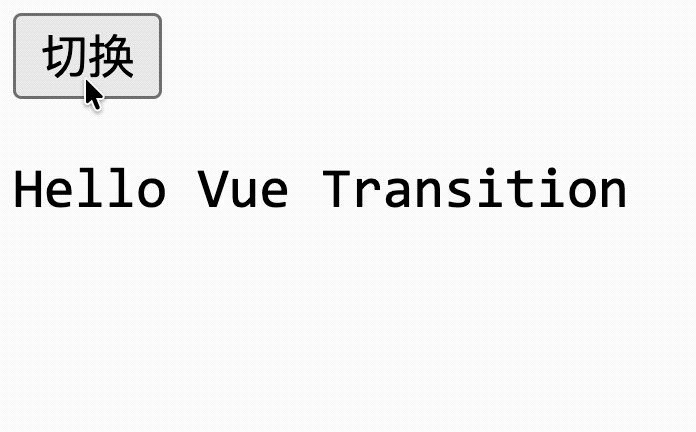
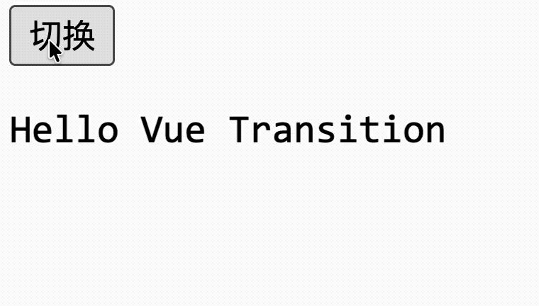

# [0095. Transition](https://github.com/tnotesjs/TNotes.vue/tree/main/notes/0095.%20Transition)

<!-- region:toc -->

- [1. 🎯 本节内容](#1--本节内容)
- [2. 🫧 评价](#2--评价)
- [3. 🤔 `<Transition>` 解决的是什么问题？](#3--transition-解决的是什么问题)
- [4. 🤔 一次最基本的进入 / 离开过渡要怎么写？](#4--一次最基本的进入--离开过渡要怎么写)
- [5. 🤔 六个过渡类名（CSS Transition）分别是什么？分别在什么阶段生效？](#5--六个过渡类名css-transition分别是什么分别在什么阶段生效)
- [6. 🤔 `<Transition>` 常用的 Props 都有哪些？](#6--transition-常用的-props-都有哪些)
  - [6.1. `name`](#61-name)
  - [6.2. `mode`](#62-mode)
  - [6.3. `appear`](#63-appear)
  - [6.4. `key`](#64-key)
- [7. 🤔 `<Transition>` 常用的 Events 都有哪些？在什么场景下会用到这些钩子？](#7--transition-常用的-events-都有哪些在什么场景下会用到这些钩子)
  - [7.1. 钩子列表](#71-钩子列表)
  - [7.2. CSS 优先原则](#72-css-优先原则)
  - [7.3. 用 JS 来控制动画](#73-用-js-来控制动画)
- [8. 🤔 如何实现过渡效果的复用？](#8--如何实现过渡效果的复用)
  - [8.1. `<Transition>` 组件化](#81-transition-组件化)
  - [8.2. 配合动态组件使用](#82-配合动态组件使用)
- [9. 🤔 使用 `<Transition>` 时有哪些注意点？](#9--使用-transition-时有哪些注意点)
  - [9.1. 性能问题](#91-性能问题)
  - [9.2. 同一时间只处理一个直接子节点](#92-同一时间只处理一个直接子节点)
  - [9.3. 嵌套过渡导致误判过渡提前结束的问题](#93-嵌套过渡导致误判过渡提前结束的问题)
    - [场景分析](#场景分析)
    - [解决方案](#解决方案)
  - [9.4. 同时使用 CSS `transition` 和 `animation` 导致误判过渡结束的问题](#94-同时使用-css-transition-和-animation-导致误判过渡结束的问题)
    - [问题根源](#问题根源)
    - [什么时候会出问题](#什么时候会出问题)
    - [`type` 的作用](#type-的作用)
- [10. 🔗 引用](#10--引用)

<!-- endregion:toc -->

## 1. 🎯 本节内容

- 作用场景
- 基本写法
- 六个类名
- 命名过渡
- 模式切换
- JS 钩子
- key 过渡
- 性能优化
- 常见坑点

## 2. 🫧 评价

`<Transition>` 属于非常实用的内置组件，尤其在弹层、切页、动态组件切换时很常见。使用时应该优先考虑使用 CSS 来实现过渡效果，只有在需要更复杂的动画控制时才考虑走 JS 动画的方式。

## 3. 🤔 `<Transition>` 解决的是什么问题？

`<Transition>` 用来给“进入 DOM”或“离开 DOM”的元素或组件添加过渡效果，它把「瞬间出现/消失」的 DOM 变化，变成「有时间跨度的视觉过渡过程」。

它能接住的典型触发场景有这些：

- `v-if` 切换
- `v-show` 切换
- 动态组件 `<component :is="...">` 切换
- 带 `key` 的节点替换

先记住一个核心前提：`<Transition>` 处理的是“切换显示与隐藏”，不是普通样式动画。也就是说，得先有节点的进入、离开或替换，它才有用武之地。

另外它有一个非常重要的结构限制：默认插槽里只能有一个直接子元素或一个单根组件。

```html
<Transition>
  <p v-if="visible">hello</p>
</Transition>
```

如果你往里面塞多个并列根节点，它就不知道该给谁套过渡流程了。

## 4. 🤔 一次最基本的进入 / 离开过渡要怎么写？

最常见的写法是 `v-if + <Transition> + CSS class`。

```html
<template>
  <button @click="visible = !visible">切换</button>

  <Transition>
    <p v-if="visible">Hello Vue Transition</p>
  </Transition>
</template>

<script setup>
  import { ref } from 'vue'

  const visible = ref(true)
</script>

<style scoped>
  .v-enter-active,
  .v-leave-active {
    transition: transform 0.3s ease;
  }

  .v-enter-from {
    transform: translateY(-10px);
  }

  .v-leave-to {
    transform: translateY(-10px);
  }
</style>
```



这个例子里，Vue 会在元素进入和离开时自动加上对应 class，你只负责写 CSS。

- 如果检测到元素上有 CSS `transition` 或 `animation`，Vue 就会等待对应结束事件。
- 如果你还监听了 JS 钩子，它也会在合适阶段调用。

要是两者都没有，DOM 会在下一帧直接插入或移除，看起来就像没有动画。

## 5. 🤔 六个过渡类名（CSS Transition）分别是什么？分别在什么阶段生效？


`<Transition>` 会在过渡的不同阶段自动添加/移除以下 CSS 类：

进入阶段有 3 个 class：

- `v-enter-from`：进入前的起始状态
- `v-enter-active`：整个进入阶段都有效
- `v-enter-to`：进入后的结束状态

离开阶段也有 3 个：

- `v-leave-from`：离开前的起始状态
- `v-leave-active`：整个离开阶段都有效
- `v-leave-to`：离开后的结束状态

最常见的心智模型可以这样记：

- `from` 决定“从哪儿开始”
- `active` 决定“动画以什么节奏跑”
- `to` 决定“要到哪儿结束”

例如一个滑入淡出的效果：

```html
<template>
  <button @click="visible = !visible">切换</button>

  <!-- 自定义过渡类名为 slide-fade 替换默认的 v- 前缀 -->
  <Transition name="slide-fade">
    <p v-if="visible">Hello Vue Transition</p>
  </Transition>
</template>

<script setup>
  import { ref } from 'vue'

  const visible = ref(true)
</script>

<style scoped>
  /* 进入和离开完全可以使用不同的时长和速度曲线。 */
  .slide-fade-enter-active {
    transition: all 0.3s ease-out;
  }

  .slide-fade-leave-active {
    transition: all 0.8s cubic-bezier(1, 0.5, 0.8, 1);
  }

  .slide-fade-enter-from,
  .slide-fade-leave-to {
    opacity: 0;
    transform: translateX(20px);
  }
</style>
```



## 6. 🤔 `<Transition>` 常用的 Props 都有哪些？

| Prop | 类型 | 说明 |
| --- | --- | --- |
| `name` | `string` | 用于自动生成过渡类名前缀 |
| `appear` | `boolean` | 是否在初始渲染时也应用过渡 |
| `type` | `'transition' \| 'animation'` | 指定以哪种方式确定过渡时长 |
| `mode` | `'out-in' \| 'in-out' \| 'default'` | 过渡模式 |
| `duration` | `number \| { enter: number, leave: number }` | 显式指定过渡时长（ms） |
| `css` | `boolean` | 设为 `false` 则禁用 CSS 过渡检测 |

其中 `name`、`mode`、`appear` 和 `key` 这几个属性较为常见，它们分别用于解决不同问题。

### 6.1. `name`

当你不想使用默认的 `v-` 前缀时，可以给过渡命名：

```html
<Transition name="fade">
  <p v-if="visible">hello</p>
</Transition>
```

这样 class 就会变成：

- `fade-enter-from`
- `fade-enter-active`
- `fade-enter-to`
- `fade-leave-from`
- `fade-leave-active`
- `fade-leave-to`

这在同一个页面里有多套动画时非常有用。

### 6.2. `mode`

过渡模式 `mode` 用来控制新旧元素过渡的时序。

当你在互斥元素之间切换时，如果不加模式，进入和离开往往是同时发生的。这可能导致布局冲突。

```html
<Transition mode="out-in">
  <button v-if="saved">Edit</button>
  <button v-else>Save</button>
</Transition>
```

- `mode="out-in"` 的意思是：先等旧节点离开，再让新节点进入，这个最常用。
- `mode="in-out"` 的意思是：先让新节点进入，再让旧节点离开，这个在实际项目里比较少见。

### 6.3. `appear`

如果你希望组件“首次渲染”时也执行过渡，可以加 `appear`：

```html
<Transition appear>
  <div>首次加载时也有动画</div>
</Transition>
```

### 6.4. `key`

有时你看起来是在“更新文本”，但 Vue 只是复用了同一个元素，这时不会触发过渡。给节点加 `key` 后，Vue 会把它当成新旧两个元素进行替换。

```html
<template>
  <Transition>
    <span :key="count">{{ count }}</span>
  </Transition>
</template>
```

这在数字滚动、标题切换、状态标签切换时非常常见。

## 7. 🤔 `<Transition>` 常用的 Events 都有哪些？在什么场景下会用到这些钩子？

### 7.1. 钩子列表

| 事件名 | 触发时机 | 回调参数 |
| --- | --- | --- |
| `before-enter` | 元素插入 DOM 之前 | `el` |
| `enter` | 元素插入 DOM 过程中（执行过渡） | `el, done` |
| `after-enter` | 元素插入 DOM 之后（过渡完成） | `el` |
| `enter-cancelled` | 进入过渡被取消（如 `v-if` 再次变为 `false`） | `el` |
| `before-leave` | 元素离开 DOM 之前 | `el` |
| `leave` | 元素离开 DOM 过程中（执行过渡） | `el, done` |
| `after-leave` | 元素离开 DOM 之后（过渡完成） | `el` |
| `leave-cancelled` | 离开过渡被取消（如 `v-if` 再次变为 `true`） | `el` |
| `appear` | 初始渲染过渡（`appear` prop 为 `true`）过程中 | `el, done` |
| `before-appear` | 初始渲染过渡之前 | `el` |
| `after-appear` | 初始渲染过渡之后 | `el` |
| `appear-cancelled` | 初始渲染过渡被取消 | `el` |

注意：`enter` 和 `leave` 的 `done` 回调只在添加 `:css="false"` 时需要手动调用，否则由 CSS 事件自动触发。

### 7.2. CSS 优先原则

当 CSS 已经够用时，优先 CSS。

如果你有更加复杂的动画需求，或者想在动画过程中做一些额外的逻辑处理，这时就可以用 `<Transition>` 的 Events 钩子了。

### 7.3. 用 JS 来控制动画

`<Transition>` 的 Events 主要适合这些场景：

- 你要接入 GSAP（GreenSock Animation Platform）、Anime.js 这类动画库
- 你要按业务逻辑精细控制动画时机
- 你要做渐进式序列动画或复杂时间轴

```html
<Transition
  @before-enter="onBeforeEnter"
  @enter="onEnter"
  @after-enter="onAfterEnter"
  @before-leave="onBeforeLeave"
  @leave="onLeave"
  @after-leave="onAfterLeave"
>
  <div v-if="visible">hello</div>
</Transition>
<!-- 
function onBeforeEnter(el) {}

// 典型用法：配合第三方库（如 GSAP）
function onEnter(el, done) {
  // el: DOM 元素
  // done: 必须调用，通知 Vue 过渡结束
  gsap.fromTo(el,
    { opacity: 0, y: 20 },
    { opacity: 1, y: 0, duration: 0.5, onComplete: done }
  )
}

function onAfterEnter(el) {}

function onBeforeLeave(el) {}

function onLeave(el, done) {
  done()
}

function onAfterLeave(el) {}
-->
```

如果你打算完全用 JavaScript 驱动动画，最好显式加上 `:css="false"`：

```html
<Transition :css="false" @enter="onEnter" @leave="onLeave">
  <div v-if="visible">hello</div>
</Transition>
```

这样 Vue 就不会再去探测 CSS 过渡，也能避免 CSS 规则误伤 JS 动画。在这种模式下，`done` 回调就很关键，你必须在合适时机调用它，否则过渡不会被正确结束。

## 8. 🤔 如何实现过渡效果的复用？

### 8.1. `<Transition>` 组件化

如果你想让某套动画在多个地方复用，可以把 `<Transition>` 再包成一个普通组件。

```html
<template>
  <Transition name="fade" mode="out-in">
    <slot />
  </Transition>
</template>
```

### 8.2. 配合动态组件使用

`<Transition>` 不只用于元素，也常用于动态组件切换：

```html
<Transition name="fade" mode="out-in">
  <component :is="activeComponent" />
</Transition>
```

这类用法和路由页面切换结合得非常多。

## 9. 🤔 使用 `<Transition>` 时有哪些注意点？

### 9.1. 性能问题

动画优先考虑 `transform` 和 `opacity`，因为它们通常不会触发布局重排，浏览器优化空间也更大。像 `height`、`margin` 这种会牵动布局的属性，成本更高，能不用尽量不用。

### 9.2. 同一时间只处理一个直接子节点

`<Transition>` 的插槽在同一时刻只接受一个直接子节点。这个“同一时刻”是关键。不是说你只能写一个元素，而是任何一帧画面里，插槽里只能有一个活跃的直接子元素。

最典型的场景是 `v-if` / `v-else` 切换：

```html
<Transition mode="out-in">
  <p v-if="type === 'a'">A</p>
  <p v-else>B</p>
</Transition>
```

逻辑上存在两个 `<p>`，但同一时刻只有一个会出现在 DOM 中。`type === 'a'` 时只有 A，切换后 A 离场、B 入场，任何时刻都不并存。

反面例子：

```html
<!-- 两个直接子节点同时存在 -> 违反限制 -->
<Transition>
  <p>hello</p>
  <p>world</p>
</Transition>
```

这里两个 `<p>` 同时出现在插槽里，`<Transition>` 不知道该对谁做过渡，在使用时会报错提示 `<Transition> expects exactly one child element or component.`。

小结：

- `<Transition>` 一次只管一个元素的生和死，不处理同时并存的多个元素。
- 需要对多个并列元素做过渡，你应该考虑用 `<TransitionGroup>`。

### 9.3. 嵌套过渡导致误判过渡提前结束的问题

嵌套过渡如果有延迟，可能要手动通过 `duration` 指定总时长。

#### 场景分析

`<Transition>` 靠监听 `transitionend` 事件来判断动画是否结束。但 `transitionend` 有一个特性：它会在每个 CSS 属性结束时分别触发一次。

嵌套过渡时，如果内外层动画的 CSS 属性、时长、延迟不一致，Vue 可能收到一个内部子元素冒泡上来的 `transitionend`，就误判外层动画已经结束了，提前调用 `done()`。

```html
<Transition name="outer">
  <div v-if="show">
    <Transition name="inner">
      <span>content</span>
    </Transition>
  </div>
</Transition>
```

```css
.outer-enter-active {
  transition: opacity 1s ease 0.5s; /* 有 0.5s 延迟，总时长 1.5s */
}
.inner-enter-active {
  transition: transform 0.3s ease; /* 0.3s，无延迟 */
}
```

分析时间线：

```
时间线：
0.0s ── outer opacity 动画开始
0.3s ── inner transform 结束 → 冒泡 transitionend 到 outer
         Vue 收到事件，以为 outer 动画完成了 ← 误判！
0.5s ── outer 的 delay 才刚结束，动画才真正开始
1.5s ── outer 动画真正结束（但 Vue 早已调用了 done）
```

#### 解决方案

手动告诉 Vue 总时长是多少：

```html
<Transition name="outer" :duration="1500">
  <div v-if="show">
    <Transition name="inner">
      <span>content</span>
    </Transition>
  </div>
</Transition>
```

`:duration` 会覆盖自动检测，Vue 不再依赖 `transitionend` 事件，而是用定时器在 1500ms 后直接调用 `done()`。

也可以对 enter 和 leave 分别指定：

```html
<Transition :duration="{ enter: 1500, leave: 800 }"></Transition>
```

`duration` 是给 Vue 的“倒计时器”，让它知道该等多久，而不依赖可能被干扰的 CSS 事件。

### 9.4. 同时使用 CSS `transition` 和 `animation` 导致误判过渡结束的问题

同时使用 CSS `transition` 和 `animation` 时，必要时通过 `type` 明确告诉 Vue 应该监听哪种结束事件。

#### 问题根源

同一个元素上如果同时定义了 `transition` 和 `animation`，浏览器会触发两种结束事件：

- `transitionend` => CSS transition 结束时触发（每个属性触发一次）
- `animationend` => CSS animation 结束时触发

Vue 默认的策略是：谁先结束就听谁的。它会比较两种方式的总时长，取更长的那个事件来判断过渡完成。

但这个“自动检测”在某些情况下会出错。

#### 什么时候会出问题

```css
.enter-active {
  transition: opacity 1s; /* 1s 后触发 transitionend */
  animation: slide-in 0.3s; /* 0.3s 后触发 animationend */
}
```

时间线分析：

```
时间线：
0.3s ── animationend 触发（animation 结束）
1.0s ── transitionend 触发（transition 结束）

Vue 的自动选择：两者都出现，谁的时长长？transition（1s）
→ Vue 等 transitionend，在 1s 时调用 done()  ← 正确
```

这种情况 Vue 猜对了。看起来自动检测挺靠谱？多数情况确实如此。但问题出在检测算法依赖 `getComputedStyle` 读取时长信息，而有些写法会导致读取不准或者读取不到。

- 时长写在简写属性里（`transition: all 1s`）
- 通过 `@keyframes` 嵌套了 `animation-delay` 的复杂组合
- `transition` 的多个属性时长不同，总时长分散在多个值中

一旦自动计算的时长排序出错，Vue 就会监听错误的那个事件，在错误的时间点调用 `done()`。

#### `type` 的作用

直接告诉 Vue 以谁为准，跳过自动检测：

```html
<template>
  <!-- 以 transition 的结束事件为准 -->
  <Transition type="transition" name="fade-slide">
    <p v-if="show">content</p>
  </Transition>

  <!-- 以 animation 的结束事件为准 -->
  <Transition type="animation" name="fade-slide">
    <p v-if="show">content</p>
  </Transition>
</template>

<style scoped>
  .fade-slide-enter-active {
    transition: opacity 0.3s ease;
    animation: slide-up 1s ease;
  }
</style>
```

- `type="animation"` -> Vue 只监听 `animationend`，等 1s
- `type="transition"` -> Vue 只监听 `transitionend`，等 0.3s
- 不设 -> Vue 自动检测，取时长长的那个（多数情况够用，但不保证）

`type` 是在两种动画手段共存时，明确告诉 Vue “你该听谁的结束信号”，避免自动检测的不确定性。

## 10. 🔗 引用

- [Vue.js 官方文档 - Transition][1]
- [Vue.js 官方文档 - `<Transition>` API][2]
- [MDN - Using CSS transitions][3]
- [MDN - Using CSS animations][4]

[1]: https://cn.vuejs.org/guide/built-ins/transition.html
[2]: https://cn.vuejs.org/api/built-in-components.html#transition
[3]: https://developer.mozilla.org/en-US/docs/Web/CSS/CSS_Transitions/Using_CSS_transitions
[4]: https://developer.mozilla.org/en-US/docs/Web/CSS/CSS_Animations/Using_CSS_animations
